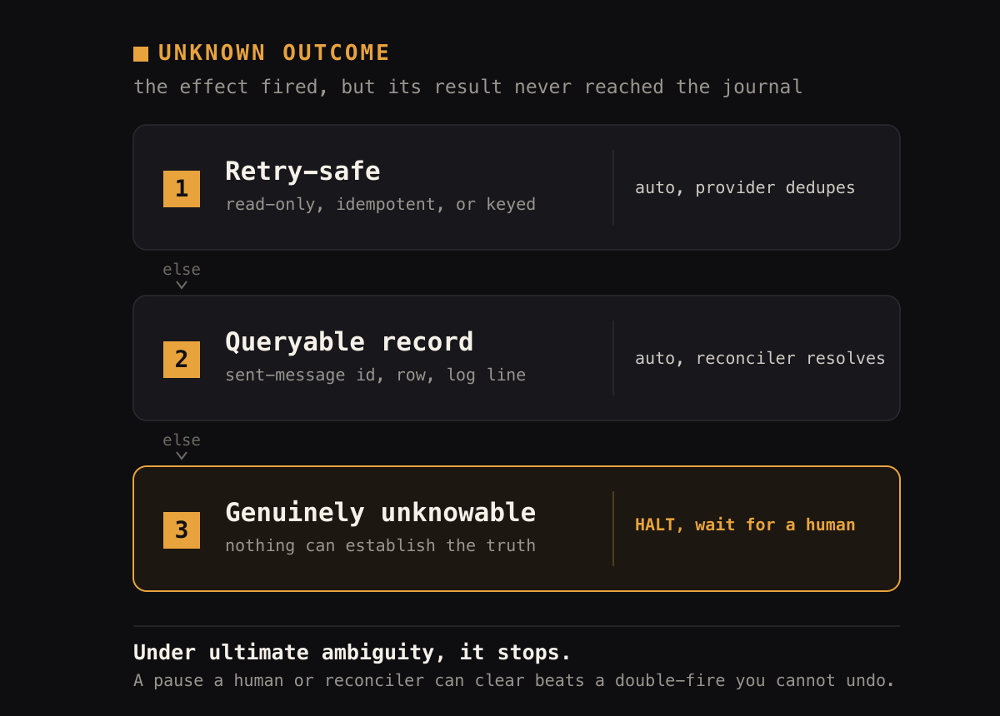
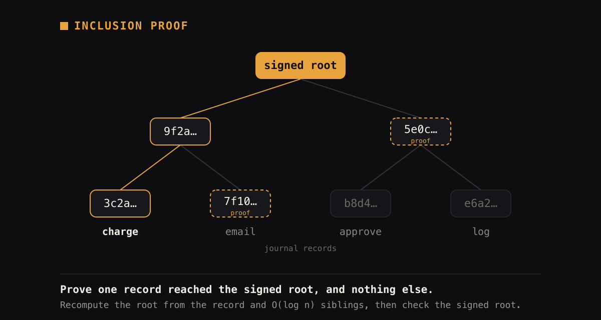

**English** · [简体中文](docs/i18n/README.zh-CN.md) · [Русский](docs/i18n/README.ru.md) · [हिन्दी](docs/i18n/README.hi.md) · [العربية](docs/i18n/README.ar.md)

<p align="center">
  
</p>

<p align="center">
  <strong>Build durable AI agents in Go. Side effects that fire at most once.</strong>
  <br>
  &nbsp;&nbsp;<em>A pause you can clear beats a double-fire you can't.</em>&nbsp;&nbsp;
</p>

One append-only journal, four guarantees no other agent framework pairs in a single library:

- **Side effects fire at most once**, even across a crash. Not at-least-once you have to make idempotent.
- **Thousands of concurrent durable runs in one process.** A library you import, not a cluster you operate.
- **A cryptographically verifiable audit trail.** RFC 6962 Merkle proofs, checkable offline without trusting the vendor.
- **Provably convergent shared state.** Machine-checked, not eventual-consistency hope.

You get all four from one mechanism, not four integrated systems, as a plain-Go library. Built for agents that move money, touch records, or act under audit.

**Built for ambient agents.** An ambient agent runs unattended: it sleeps until a trigger (a
schedule or an event) wakes it, works over hours or days, and pauses to ask a human only when it
needs judgment, with nobody watching each step. That is exactly when at-most-once, HA resume, and a
verifiable trail stop being nice-to-haves; a background agent that acts unobserved has to be safe to
crash, safe to re-trigger, and provable after the fact. Bide ships the durable lifecycle for
this: durable `Sleep`/`WaitUntil` timers, a pluggable `Waker` for time- or event-driven wakeups, and
durable `Interrupt`/`AnswerInterrupt` for typed human-in-the-loop, all on the same journal. You bring the
trigger source and the oversight UI; the runtime keeps every run correct across sleeps, crashes, and
node handoffs.

Status: **working v0**, live-verified end-to-end. Requires **Go 1.27**.

<p align="center"></p>

## One journal, four guarantees

Everyone ships an agent loop; ours is ~40 lines. What matters is the substrate underneath it: a
durable, append-only journal that all four guarantees are *derived from*, so you get them from
one mechanism instead of integrating four systems.

### 1 · At most once, not at least once (measured, not claimed)

Temporal, DBOS, trpc-agent-go, ADK, eino all resume by **re-running**: activities/steps must be
idempotent, so a non-idempotent side effect (a charge, an email, a shipment) can fire twice
across a crash. We built a **fair** crash-injection benchmark ([`chaos/`](chaos), cross-SDK
results in [`benchmarks/`](benchmarks/README.md)) that drives a non-idempotent `charge` through
every crash point. The number *is* the product:

```
Bide      maxFired=1    ✓ at-most-once held
trpc-agent-go  maxFired=6    ✗ double-charged
adk-go         maxFired=4    ✗
langchaingo    maxFired=64   ✗
eino           maxFired=64   ✗
```

`maxFired` is the most times one side effect actually executed. **1 is correct; higher is a
double-charge.** The competitor adapters are verified *not* to be strawmen (each has a fairness
test proving its resume genuinely works). The piece none of them have: a durable **attempt
marker** written before a non-idempotent write, and **halt-on-unknown-outcome** on resume: if a
write's result was never journaled, the run stops for a human decision instead of guessing.

### When the outcome is unknown, it stops

The hard case in at-most-once is not the crash you can see, it is the one you cannot: a side
effect whose call left the process but whose result never reached the journal. The attempt marker
lets a resumed run tell "never started" from "started, outcome unknown," and it resolves the
unknown case by a fixed hierarchy, never a guess:

<p align="center">
  
</p>

Which tier a tool lands in is set by its declared `Safety`: mark it read-only or idempotent and
an unknown outcome auto-retries; declare none of those and it
halts. Retry-safety is opt-in; the pause is the default when you have not opted in, so a library
whose whole point is "never double-fire" defaults to safe rather than to guessing.

Most unknowns never reach a person: an idempotency key lets the provider dedupe a safe retry, and
for systems without one (email, internal services) a reconciler resolves the step from the record
it left (`agent.ResolveHaltRef`). The human is the floor, not the default.

> [!IMPORTANT]
> **The rule underneath it:** when an action moves money, touches a record, or happens under audit
> and the outcome is genuinely unknowable, stopping is the correct result. A pause a human or a
> reconciler can clear beats a double-charge no one can take back.

### 2 · Durable execution as a library, not a cluster

Temporal has the guarantees but needs a server + a worker fleet to operate. Here they come from
a **store adapter you already run** (SQLite locally, Postgres in prod). A hello-world imports the
**standard library only**: no Temporal, no gRPC, no vector DB dragged into your binary (enforced
by `architecture_test.go`). Import it; don't operate it.

And because it is a Go library, one process keeps a very large number of these durable runs in
flight at once. Agent work is I/O-bound (waiting on model and tool calls), which goroutines absorb
without a cluster. The [`cmd/bench`](cmd/bench/README.md) harness measures it: 20,000 runs, 5,000 in
flight at a time, each blocking ~100ms on the model, finish in **about half a second (~470ms) of
wall-clock on a 10-core Apple silicon Mac (measured at v0.7.0), and about one second on a standard 4-vCPU CI runner**,
on a few thousand goroutines and tens of MB (`go run ./cmd/bench -runs 20000 -concurrency 5000
-latency 50ms`; reproducible with the [Benchmark workflow](.github/workflows/bench.yml)). The win is throughput and operational simplicity, not lower latency than the model
(the provider owns per-call latency); at high fan-out the durable store's write throughput is the
ceiling, not goroutines. Every concurrent run keeps all four guarantees. Reliability under that
load is built in: per-attempt **timeouts**, retry with backoff that **classifies** transient vs
terminal errors, **hedged** model calls (race a backup, take the first, for tail latency and
provider failover), and a **rate limiter** for model and tool calls
([middleware](middleware), [docs/guides/reliability.md](docs/guides/reliability.md)).

For high availability, any node resumes any run from the shared store, and competing drivers
coordinate through a per-run **lease** (`agent.Lease`): normally one process drives a run at a time,
and a crashed holder's lease expires so another node's `agent.RecoverLoop` takes it over. A holder
that stalls past its lease can wake still driving, but it cannot fire a side effect a second time:
at-most-once rests on the attempt claim, not on the lease. Like guarantee 1, this is verified, not
asserted: concurrent-worker mutual exclusion, crash-and-takeover, and at-most-once under concurrent
drivers on the in-memory store (`agent/ha_e2e_test.go`), and on Postgres across real processes that
the tests kill, stall past their lease and restart (`store/postgres/ha_multiproc_test.go`; the
Postgres backend implements the lease with a DB-clock upsert).

### 3 · A cryptographically verifiable audit spine, from the same journal

<p align="center"></p>

The journal that makes resume safe *is* the audit record, and it is committed with the **same
cryptography Certificate Transparency uses** ([RFC 6962](https://datatracker.ietf.org/doc/html/rfc6962),
checked against the published reference vectors). The distinction that matters for a regulated
buyer: this is **verifiable, not merely logged**. A third party checks a proof *without trusting
you, your database, or your logs*:

- **Inclusion proof**: prove one specific action happened (this charge, this approval) in
  O(log n), revealing no other record (only its position and the run's size). Selective
  disclosure for an auditor.
- **Consistency proof**: prove the history was only ever appended to, never rewritten or
  reordered.
- **Signed tree head + continuous anchoring**: `AuditedStore` signs a commitment per step and
  publishes it out-of-band to an external transparency log; tampering becomes provable, not just
  suspected.
- **Who acted, under what authority**: the same leaf can commit to the acting identity (actor, on
  whose behalf, under which signed grant) and enforce delegated authority as a governed invariant,
  so a proof shows not just what happened but who was authorized for it. Bring your own IdP; this
  makes the authorized action provable, it does not replace authentication.

**Proofs you verify, not logs you trust.** Everyone else offers *observability* (logs you
trust because the vendor is SOC2); this is a *cryptographic proof you check yourself*. Produce a
portable `ProofBundle` for one action (`audit.ProveToolCall`), or a whole-run `EvidencePackage`
(`audit.Evidence`) bundling every material action's proof into one file, and hand it to an auditor
who verifies it offline with `bide-audit verify` / `verify-evidence` or a stdlib-only verifier that
never imports the SDK. **No other agent framework has this at all.** The same spine carries the rest of the
accountability layer, all verifiable offline: proof-carrying runs (one `RunCertificate` attesting a
whole run's policy compliance), signed capability grants with attenuating delegation, authority
earned from a clean audit trail, and governed k-of-n quorum. → [docs/guides/audit.md](docs/guides/audit.md)

### 4 · Provably convergent shared state (gsm)

The governed-state tier: multiple processes replaying the same durable log **converge on
identical state**, backed by a **machine-checked proof**. The **gsm** convergence engine's
normalization rewrite system is confluent, so the order steps replay in cannot change the
result. The proof is axiom-free and CI-verified on Coq 8.18 and 8.20 (`Print Assumptions`
reports "Closed under the global context"): [the Coq/Rocq
proof](https://github.com/blackwell-systems/normalization-confluence/tree/main/coq)
([](https://github.com/blackwell-systems/normalization-confluence/actions/workflows/verify.yml)).
And the proof does not just sit next to the code: gsm's own per-machine verdict is
**re-certified by two independent checkers extracted from that proof** (one recomputes
convergence from the emitted step tables, the other straight from the rules), so a bug in gsm's
Go verifier cannot let a non-convergent machine pass. Rules are expressed as **inspectable
combinator data** rather than opaque closures, which is what makes them serializable, portable,
and re-checkable; verification can also run **footprint-local** (`BuildCompositional`) to certify
machines whose global state space is too large to enumerate. This is how independent agents share
state without a single writer. The claim is precise: *order-independent convergence of the
replay*, proven, not "agents always agree." The federated result is mechanized in full, including
asynchronous (chaotic) order-independence.

Made concrete at scale: an integration test drives up to **10,000,000 governed agents, 2,048 at a
time,** through *random, invariant-violating* orders (every run breaches a capped invariant and is
compensated), and asserts that every agent converges to the same valid normal form *and* produces
an audit proof that verifies offline, in one process with a flat ~3 MB live heap (~13 min,
~12.5k agents/s). This is a framework-level test (stub model, in-memory store): it exercises the
governance and audit machinery at scale, not a live LLM or a production database. See
[docs/testing/testing.md](docs/testing/testing.md).

### vs. durable-execution and agent runtimes

| | **Bide** | Temporal / DBOS | ADK · eino · trpc · langchaingo |
|---|---|---|---|
| Non-idempotent side effect on crash | **At most once (halts on unknown outcome)** | At least once; activities/steps must be idempotent | At least once; re-runs (**measured 4–64×**) |
| Deployment | **Library + a DB you already run** | Server + worker fleet | Library |
| Tamper-evident audit | **RFC 6962 Merkle spine (same journal)** | Not built in | None |
| Convergent shared state | **Provable (gsm)** | N/A | None |

### The craft underneath

Beyond the four guarantees, the details that make it pleasant to build on:

- **Plain Go by default, with an optional typed flow builder.** You write `if`/`for`/functions and
  the graph is a *derived* view (`RenderMermaid`, `Topology`), not something you are forced to author.
  When you do want authored topology, the `plan` builder gives it to you and lowers to the same
  runtime. See [Graphs](#graphs).
- **Claude reasoning survives round-trips.** Extended-thinking signatures are preserved; most
  SDKs drop them, silently breaking thinking + tool use.
- **Provider-aware tool schemas.** One reflected schema, emitted per dialect (OpenAI strict
  mode, etc.), not one generic schema that strict mode and Gemini reject.
- **Any model, one adapter.** Native Claude, native Gemini, and any OpenAI-compatible endpoint
  (OpenAI, Ollama, DeepSeek, Groq, OpenRouter, vLLM, Azure, xAI…) via `WithBaseURL`.
- **Multi-node failover, coordinated.** Any node resumes any run (Postgres, no single-writer lock);
  a per-run lease keeps competing recoverers and live workers from double-driving, and
  `agent.RecoverLoop` takes a crashed holder's runs over on lease expiry.

## Graphs

Most agent frameworks make a graph the *foundation*: the thing you must author and the thing that
executes, with nodes, edges, a state object, and sometimes a visual builder on top. Bide inverts
that. The same authoring surfaces are available, up to and including a visual builder, but as layers
you choose over a plain-Go journal substrate, never as the base. The reason is precise rather than
ideological.

A graph adds no expressive power. Anything a graph computes, ordinary control flow computes: a
computation graph is a control-flow graph, and sequence, selection, and iteration suffice to express
any of them. There is no agent behavior you can build as a node-and-edge graph that you cannot write
with `if`, `for`, and functions. What a graph adds is not capability but *reification*: a first-class
representation of the flow you can inspect, visualize, statically validate, and author outside the
code. That is genuinely useful, but it is a tooling layer, not a foundation, and it is not required
to build agents.

So the substrate here is plain Go, and the guarantees (durability, at-most-once, the verifiable
trail) come from the journal, not from a graph. The graph still exists as a *derived* view:
`RenderMermaid` reconstructs it from what actually ran.

If you want a graph to author, that layer already exists: the **`plan`** package is a constrained,
type-checked flow builder that compiles down to this runtime and inherits at-most-once and the audit
trail for free. You wire typed nodes (`Step`, `Tool`, `Model`, `Switch`, fan-in `Join`, bounded
`LoopBack`) into a `Flow`, or author the same topology as declarative config (`plan.Load`) that a
higher layer such as a visual builder can emit. It stays a layer you choose, not the base: a
graph-first framework cannot offer the reverse, because for it the graph is the foundation rather
than an option.

For an accountability runtime the direction also matters. An authored graph is a diagram you trust;
a derived graph is reconstructed from the journal, so it is exactly what ran. The `plan` layer ties
the two together: `Topology()` and `RenderMermaid()` expose the declared shape, and `Conform()`
cryptographically checks that a run followed the topology it declared, the same verify, do not trust
stance as the rest of the system. The rule that keeps any such layer from forking the runtime is
that a new surface may add a way to author, never a way to execute: every layer lowers to the one
journal-backed runtime. See [docs/guides/flows.md](docs/guides/flows.md).

### Three ways to author, one runtime

The same order-triage flow, three ways. Plain Go is the default: write ordinary control flow, and name the steps the journal must make crash-safe.

<!-- docsnip: setup ctx context.Context; store agent.Durable; order Order; type Order struct{}; type Receipt struct{}; type Assessment struct{ Rush bool }; type Reservation struct{}; func classify(Order) (Assessment, error); func reserve(Assessment) (Reservation, error); func finalize(Reservation) (Receipt, error); func decline(Assessment) (Receipt, error) -->
```go
// classify, then branch: rush orders reserve-then-finalize, the rest decline.
assess, _ := agent.Step(ctx, store, "order-42", "classify",
    func(ctx context.Context) (Assessment, error) { return classify(order) },
    agent.StepSafety(agent.Safety{ReadOnly: true})) // safe to re-run after a crash

var receipt Receipt
if assess.Rush {
    res, _ := agent.Step(ctx, store, "order-42", "reserve", // a side effect: at most once
        func(ctx context.Context) (Reservation, error) { return reserve(assess) })
    receipt, _ = agent.Step(ctx, store, "order-42", "finalize",
        func(ctx context.Context) (Receipt, error) { return finalize(res) })
} else {
    receipt, _ = agent.Step(ctx, store, "order-42", "decline",
        func(ctx context.Context) (Receipt, error) { return decline(assess) })
}
```

When you want that same flow as a first-class, inspectable artifact, the `plan` builder wires typed nodes into a `Flow` that lowers to the same runtime:

<!-- docsnip: setup type Order struct{}; type Receipt struct{}; type Assessment struct{ Rush bool }; type Reservation struct{} -->
```go
b := plan.New[Order, Receipt]("order-triage")
classify := b.Step("classify", func(ctx context.Context, o Order) (Assessment, error) { ... })
reserve  := b.Step("reserve",  func(ctx context.Context, a Assessment) (Reservation, error) { ... }) // non-idempotent
finalize := b.Step("finalize", func(ctx context.Context, r Reservation) (Receipt, error) { ... })
decline  := b.Step("decline",  func(ctx context.Context, a Assessment) (Receipt, error) { ... })

b.Switch(classify,
    plan.When(func(a Assessment) bool { return a.Rush }, reserve).Named("rush"),
    plan.Else(decline),
)
b.Edge(reserve, finalize)

flow, err := b.Build() // inherits at-most-once and the audit trail
```

Or author that same topology as declarative config a higher layer (a visual builder) can emit, loaded with `plan.Load`:

```json
{
  "version": 1,
  "flow": "order-triage",
  "entry": "classify",
  "nodes": [
    {"name": "classify", "block": "classify"}, {"name": "reserve", "block": "reserve"},
    {"name": "finalize", "block": "finalize"}, {"name": "decline", "block": "decline"}
  ],
  "wiring": [
    {"switch": "classify", "when": [{"pred": "rush", "to": "reserve"}], "else": "decline"},
    {"edge": ["reserve", "finalize"]}
  ]
}
```

<!-- docsnip: setup type Order struct{}; type Receipt struct{}; configBytes []byte; reg *plan.Registry -->
```go
flow, err := plan.Load[Order, Receipt](configBytes, reg) // same topology, same Digest()
```

All three lower to the one journal-backed runtime, so at-most-once, HA resume, and the verifiable trail come for free whichever surface you pick.

## Ambient runs: durable sleep, wake, and interrupt

The four guarantees above are the substrate; this is the lifecycle they enable. An ambient run does
not sit in a synchronous chat loop. It sleeps, wakes on a trigger, and pauses for a human, and every
one of those transitions is a durable, at-most-once step on the journal, so the run survives crashes
and node handoffs between them.

- **Sleep until a deadline.** `Sleep`/`WaitUntil` pause a run and journal its wake time, so the pause
  outlives a restart. Re-invoking at the wake time resumes exactly once.
- **Wake on time or event.** A pluggable `Waker` (in-process `MemWaker` by default) re-invokes a due
  run; the trigger source is yours (an in-process loop, a cron, a queue, an inbound webhook), so the
  same substrate drives both scheduled and event-driven agents. A wake that cannot be scheduled
  fails the run (wrapping `ErrStorage`) rather than leave it asleep with nothing to wake it, and
  `RecoverLoop` retries it.
- **Interrupt for a human, durably.** `Interrupt[T]`/`AnswerInterrupt` pause a run at any point to request a
  typed decision and resume with the human's answer as a journaled step (see
  [Human-in-the-loop](#human-in-the-loop)). Approve/deny is the boolean special case.

You supply the trigger source and the oversight surface; the runtime keeps the run correct across
every sleep, wake, interrupt, crash, and handoff. Runnable in `examples/signals` (deliver an event
into a waiting run), `examples/interrupt` (human-in-the-loop pause/resume), and `examples/recover`
(durable resume). See the [signals and ambient guide](docs/guides/signals.md).

## Guarantee 1, in code: it won't double-charge

<!-- docsnip: setup ctx context.Context; a *agent.Agent; runID string; input string; type ChargeArgs struct{}; type Receipt struct{} -->
```go
// A tool that moves money is a write: not ReadOnly, not Idempotent.
charge := agent.Func("charge_card", "Charge the customer", agent.Safety{},
	func(ctx context.Context, in ChargeArgs) (Receipt, error) { /* ... */ })

// If the process crashes after the charge fires but before its result is journaled,
// resume does NOT run it again: it returns *OutcomeUnknown so you confirm, not double-charge:
_, err := a.Run(ctx, runID, input)
if halt, ok := errors.AsType[*agent.OutcomeUnknown](err); ok {
	// halt.Op.ToolName == "charge_card": outcome unknown, a human decides, no double side effect.
}
```

<p align="center"></p>

## Quickstart

Requires Go 1.27 (the core uses generic methods). If `go version` is older, upgrade or set
`GOTOOLCHAIN=go1.27.0`.

The core package is `agent`, imported from `github.com/bide-ai/bide/agent`
(as the block below shows).

```go
package main

import (
	"context"
	"fmt"
	"os"

	"github.com/bide-ai/bide/agent"
	"github.com/bide-ai/bide/model/openai"
	"github.com/bide-ai/bide/store/sqlite"
)

type WeatherArgs struct {
	City string `json:"city" desc:"city name"`
}
type Weather struct {
	TempF int    `json:"temp_f"`
	Sky   string `json:"sky"`
}

func main() {
	// Any OpenAI-compatible endpoint (here OpenRouter); swap the base URL for Ollama, etc.
	model := openai.New(os.Getenv("OPENROUTER_API_KEY"),
		openai.WithBaseURL("https://openrouter.ai/api/v1"),
		openai.WithModel("openai/gpt-4o-mini"))

	// A tool is a typed Go function; its schema is derived automatically.
	weather := agent.Func("get_weather", "Current weather for a city",
		agent.Safety{ReadOnly: true},
		func(_ context.Context, in WeatherArgs) (Weather, error) {
			return Weather{TempF: 68, Sky: "sunny"}, nil
		})

	// Durable on-disk store: a crash mid-run resumes from here.
	store, _ := sqlite.Open("agent.db")
	defer store.Close()

	a := agent.New(model, store, weather).
		WithSystemPrompt("You are a concise weather assistant.")
	out, _ := a.Run(context.Background(), "run-1", "Weather in SF? Use the tool.")
	for _, p := range out.Parts {
		if t, ok := p.(agent.Text); ok {
			fmt.Println(t.Text)
		}
	}
}
```

Run the live smoke example: `OPENROUTER_API_KEY=sk-... go run ./examples/smoke`

A `Func` tool decodes its arguments **strictly**, so the tool reads exactly what the model sent.
A call that is missing a required field (one the schema lists as required: not a pointer, and no
`omitempty` or `omitzero` in its json tag) or sends it as `null` (unless its schema admits any
value, as for `any` or `json.RawMessage`), uses a name that is not a field (an unknown name, or a
case variant such as `"CITY"` for `city`), repeats a name, has data after the object, or holds
invalid UTF-8 or an escaped lone surrogate is an `ErrToolArgs` error. That error goes back to the
model as the call's result, so the model can correct the call. `encoding/json` would fill in zero
values, match names case-insensitively, drop unknown names, and keep the last duplicate. Give each
argument field the json tag the model sees in the schema.

`Run` returns just the final message. For a run summary (token usage for the whole run,
including cache and sub-agents; model-turn count; wall-clock duration) use `RunResult` (and `RunSagaResult`):

<!-- docsnip: setup ctx context.Context; a *agent.Agent; runID string; input string -->
```go
res, err := a.RunResult(ctx, runID, input)
// res.Message, res.Usage, res.Spend, res.Turns, res.Duration, res.RunID
```

## Streaming

`Run` blocks and returns the final answer. To watch the agent work (token deltas, turn
boundaries, tool start/finish), use `Stream`. It drives the **same loop** (`Run` is literally
`Stream(...).Final()`), so durability, resume, and side-effect safety are identical:

<!-- docsnip: setup ctx context.Context; a *agent.Agent; runID string; input string -->
```go
stream := a.Stream(ctx, runID, input)
for ev := range stream.Events() {
	switch e := ev.(type) {
	case agent.ModelEvent: // live token/reasoning/tool-call deltas
		if d, ok := e.Event.(agent.TextDelta); ok {
			fmt.Print(d.Text)
		}
	case agent.ToolStarted:
		fmt.Printf("\n[calling %s]\n", e.Name)
	case agent.ToolCompleted:
		fmt.Printf("[%s done]\n", e.Name)
	}
}
answer, err := stream.Final() // terminal message + error (incl. a Pause: *ApprovalPending, *OutcomeUnknown, ...)
```

Events: `TurnStarted`, `ModelEvent` (the token feed), `TurnRestarted`, `AssistantTurn`, `ToolStarted` /
`ToolCompleted`, `ApprovalRequired`, `Finished`. Range `Events()` for a UI then call `Final()`,
or call `Final()` alone to behave exactly like `Run` (it drains events for you). `ToolStarted`
fires immediately before a tool is called, so a call cancelled before it starts (and recorded as
not started) emits neither `ToolStarted` nor `ToolCompleted`.

Two things worth knowing, both consequences of durability:
- **Token deltas arrive below the middleware chain** (Retry / Cost still see whole
  assembled messages), and **only on a fresh model call**. One request of a turn streams at a
  time. When a middleware such as Retry calls the model again after an attempt that already
  streamed deltas, or the turn's response is not the one that streamed (a Hedge backup won, a
  fallback or a cache answered), `TurnRestarted` marks those deltas as discarded, and the
  response the turn records follows: clear the turn's text when it arrives. Middleware has no
  streaming code for this; the agent does it.
- **On resume, the journaled transcript is re-emitted** as `AssistantTurn{Replayed: true}` +
  `ToolCompleted` before live progress, so a fresh UI reconstructs the whole story after a
  crash, and a replayed turn produces no token deltas (it was already decided).

`StreamSaga` is the streaming counterpart of `RunSaga`.

## Typed output

`RunTyped[T]` returns a typed `T` instead of a free-form message. It injects a synthetic
`final_answer` tool whose JSON schema is derived from `T` (via the `schema` package) and steers
the model to call it once its work is done, so a tool-using agent can do real work and *then*
answer typed. Provider-agnostic (built on native tool calling, not a provider's JSON mode).

<!-- docsnip: setup ctx context.Context; a *agent.Agent; runID string -->
```go
type Weather struct {
	City  string `json:"city"`
	TempF int    `json:"temp_f"`
}

w, err := agent.RunTyped[Weather](ctx, a, runID, "weather in SF?")
// w.City == "SF", w.TempF == 68
```

It's a package function, not a method (Go methods can't add type parameters). The answer is the
arguments `final_answer` accepted, decoded strictly like any `Func` tool's (a loose call goes back
to the model to correct), as the tool received them after any tool middleware. The tool journals
them as its result, so the answer is **resume-safe**: a crash mid-run recovers the typed answer
from the log on resume. The first `final_answer` call the tool accepts ends the run.
Only if the model never makes one (it replies in plain JSON text instead) does `RunTyped` parse
the text of the run's final turn. `T` must be a JSON object (a struct, a pointer to one, or a map),
since providers take tool arguments only as an object; any other `T` is `ErrConfig`.

On OpenAI-compatible providers with strict structured outputs, `RunTypedNative[T]` uses the
provider's native JSON-schema response format instead of the tool (schema enforced provider-side,
no tool round-trip); the Anthropic adapter does not support it and returns `ErrConfig`, so use
`RunTyped` there for provider-agnostic output.

## Sampling

Generation controls are provider-neutral and set once; each adapter maps them onto its wire
format (and drops what it can't do, e.g. Anthropic has no `seed`):

<!-- docsnip: setup model agent.Model; store agent.Durable; tools []agent.Tool -->
```go
a := agent.New(model, store, tools...).
	WithSampling(agent.Temperature(0), agent.MaxTokens(500), agent.TopP(0.9), agent.Seed(42))
```

Fields are optional by design: an unset field uses the provider default, so an explicit
`Temperature(0)` is distinct from "not specified." Request-level `MaxTokens` overrides an
adapter's construction-time default.

## Prompt caching

An agent loop resends a large constant prefix (system prompt + tool schemas) every turn.
Anthropic prompt caching bills those repeats at the cache-read rate:

<!-- docsnip: setup key string -->
```go
model := anthropic.New(key, anthropic.WithPromptCache())
```

This places `cache_control` breakpoints on the system block and the tool definitions. OpenAI
caches prefixes automatically (no flag needed). Either way, cache effectiveness surfaces in
`agent.Usage` (`CacheReadTokens`, served from cache, and `CacheWriteTokens`, written to it),
so cost accounting, tracing, and the run's token budget see the real numbers.

## Sessions (multi-turn)

`Run` is one turn. A `Session` is a durable multi-turn conversation: each `Send` is a full agent
run (tools, resume, side-effect safety) seeded with the transcript so far, so the agent remembers
earlier turns.

<!-- docsnip: setup ctx context.Context; a *agent.Agent -->
```go
s, _ := a.Session(ctx, "user-42")   // reopens + rebuilds the transcript from the store
a1, _ := s.Send(ctx, "what's the capital of France?")
a2, _ := s.Send(ctx, "and its population?")   // sees turn 1 in context
```

The transcript is journaled turn-by-turn under the session id, so a restarted process
`a.Session(ctx, "user-42")` rebuilds it and continues. The id must not contain `>`. Turn N runs under `"<id>>@turn/N"` (its own
durable journal handles crash-resume *within* a turn); conversational memory is the question/answer
transcript: a turn's intermediate tool calls stay in that turn and don't leak into later ones. If
a turn pauses (approval / `Interrupt`), `Send` returns that error; resolve it and call `Send` again
with the same input to resume. Until then, `Send` with a different message returns `ErrConfig`: the
open turn belongs to its message. For inbound messages that may be redelivered, `SendOnce(ctx, id,
text)` answers each message id once. Several handles on one session never lose a turn or answer
one message with another's reply. A turn resumed after a crash is seeded with the same transcript
it started with, even if other messages were answered in between.

## Auditability (tamper-evident journal)

The durable journal already records every step of a run. The `audit` package commits to that
history with a hash chain, so a run's execution is verifiable:

<!-- docsnip: setup ctx context.Context; store agent.Durable; runID string; priv ed25519.PrivateKey -->
```go
head, _ := audit.Head(ctx, store, runID)                     // SHA-256 chain over the stored journal bytes
sig, _ := audit.Sign(head, audit.Ed25519Signer{Priv: priv}) // anchor it: sign / publish out-of-band
```

Any modify / insert / delete / reorder of a record changes the head. **Security model:** this
gives integrity unconditionally, and tamper-evidence *when you anchor the head out-of-band* (a chain
in the same DB an attacker controls can be rewritten and rehashed); see the package doc. It's the
compliance/enterprise seam: provable at-most-once side effects *plus* a verifiable record of exactly
what the agent did.

For **selective disclosure**, `audit.Root` / `Prove` / `VerifyInclusion` build an **RFC 6962**
(Certificate Transparency) Merkle tree, so you can prove one record is part of a committed run
via an O(log n) inclusion proof, *without revealing the other records* (e.g. show an auditor a
single charge happened, exposing no other customers or prompts). And `ProveConsistency` /
`VerifyConsistency` prove an earlier root is an **append-only prefix** of a later one: that history
was only appended, never rewritten or reordered (the transparency-log guarantee). The implementation
is checked against the published RFC 6962 test vectors.

`SignTreeHead` produces the CT-style **Signed Tree Head** (format `bide.audit.sth.v5`), `{Kind, RunID,
Size, Root, TimestampNanos}` signed together with its scheme under any `audit.Signer`: Ed25519,
ML-DSA-65 (post-quantum), or a hybrid of both. That is the artifact you publish. Leaves commit to the
bytes the journal stores for each record, verbatim, so a proof carries those bytes (`record_bytes`) and
a record written by a newer release with fields this one does not know still verifies. The full flow: sign an STH, later disclose a single record with an
inclusion proof an auditor checks against the signed root, and prove append-only growth between two STHs.
See [docs/guides/audit.md](docs/guides/audit.md) for the model, the API, and the end-to-end compliance flow.

## RAG & memory (bring your own)

Bide ships **no vector store, embedder, or memory backend**: it gives you the *seam* and
you plug in the store you already run. Implement one interface against your infra:

<!-- docsnip: api agent -->
```go
type Retriever interface {
	Retrieve(ctx context.Context, query string, k int) ([]agent.Doc, error)
}
```

Then wire it in one of two ways:

<!-- docsnip: setup model agent.Model; store agent.Durable; myStore agent.Retriever -->
```go
// Agentic RAG: the model searches on demand:
a := agent.New(model, store, agent.RetrievalTool(myStore, 5))

// Classic RAG: top-k auto-injected as context on each user turn:
a.Use(agent.WithRetrieval(myStore, 5))
```

Conversational memory is already built in (`Session`); dynamic context goes through
`WithSystemPromptFunc`; this seam covers semantic / long-term memory. Concrete store adapters (if
ever needed) would be separate modules, never in the core. See
[docs/guides/rag-memory.md](docs/guides/rag-memory.md).

## Resume safety, in one table

```go
agent.Safety{ReadOnly: true}          // no side effects → always safe to re-run
agent.Safety{Idempotent: true}        // safe to retry (dedupes downstream)
agent.Safety{}                        // a write → HALT on unknown outcome, don't double-fire
agent.WithApproval(agent.SingleApproval()) // not Safety: a tool option that pauses for human approval before executing
```

Before a non-idempotent side effect the loop records a durable *attempt marker*, so
resume can tell "never ran" (safe to run) from "ran and crashed" (halt): precisely, not
conservatively.

This is **proven, not asserted.** `dst_test.go` is a deterministic simulation test: a
fault-injecting store crashes at *every* write point (and across hundreds of randomized
multi-crash schedules), and the harness asserts a non-idempotent side effect fires **at most
once** every time, with the run always ending completed or halted, never double-firing.

The harness is exported (`chaos/`) and pointed at other SDKs in `benchmarks/`. The measured result:
**Bide `maxFired=1` (PASS); trpc-agent-go `maxFired=6`; langchaingo `maxFired=64` (both FAIL).**
trpc's checkpoint/resume genuinely works (verified: resuming a completed run is a no-op); its
double-fire is the documented LangGraph "nodes must be idempotent" window. langchaingo has no
durability at all, so retries re-run everything. Bide's attempt-marker closes the window entirely.

`WithMaxTurns(n)` caps model turns per run so a model that keeps calling tools can't loop forever:
hitting it returns `ErrMaxTurns` (which is `errors.Is` `ErrBudget`). `WithTokenBudget(n)` caps the
tokens a run may use, cached input included: once the run has used `n`, it makes no further model
call and returns `ErrBudgetExceeded`. The budget covers the run's whole agent tree: its sub-agents'
model calls count against it, parallel ones included. Each call's usage is journaled with its turn,
so both limits are rebuilt from the journal and hold across a crash and resume.

## Human-in-the-loop

Three flavors. **Approve/deny**: a tool marked `WithApproval(SingleApproval())` pauses *before* running; the
human decision is a bool:

<!-- docsnip: setup ctx context.Context; a *agent.Agent; store agent.Durable; runID string; input string -->
```go
_, err := a.Run(ctx, runID, input)
if pend, ok := errors.AsType[*agent.ApprovalPending](err); ok {
	// ... get a human decision ...
	agent.Approve(ctx, store, pend.RunID, pend.ToolUseID, true)
	out, _ := a.Run(ctx, pend.RootRunID, input) // resumes past the pause
}
```

**Interrupt/resume**: a tool pauses *at an arbitrary point* and resumes with a *typed* value
(generalizing the bool). Call `agent.Interrupt[T]` inside a retry-safe tool:

<!-- docsnip: setup ctx context.Context; a *agent.Agent; store agent.Durable; runID string; input string; type Options struct{}; type Plan struct{}; chosenPlan Plan -->
```go
tool := agent.Func("choose_plan", "pick a plan", agent.Safety{ReadOnly: true},
	func(ctx context.Context, in Options) (Plan, error) {
		pick, err := agent.Interrupt[Plan](ctx, "plan", in) // pauses the run; in is shown to the human
		if err != nil {
			return Plan{}, err // *InterruptPending propagates out of Run
		}
		return pick, nil // on resume, pick is the human's typed answer
	})

_, err := a.Run(ctx, runID, input)
if intr, ok := errors.AsType[*agent.InterruptPending](err); ok {
	// ... show intr.Prompt, get a typed answer ...
	agent.AnswerInterrupt(ctx, store, intr.RunID, intr.Name, chosenPlan)
	out, _ := a.Run(ctx, intr.RootRunID, input) // resumes; Interrupt now returns chosenPlan
}
```

Both are durable: the decision/value is a journaled step, so it survives a crash. Interrupt
must be in a retry-safe tool (`ReadOnly`/`Idempotent`): on resume the tool re-runs until the
interrupt resolves, so everything before the `Interrupt` call must be safe to repeat.

**m-of-n approval**: when one sign-off is not enough, require k signed decisions from a named set
of n approvers. Each approver signs the exact call (tool and arguments); the gate proceeds at k
approvals, denies once k is unreachable, and otherwise pauses with the running tally. A forged or
mistaken decision is ignored without locking its approver out:

<!-- docsnip: setup ctx context.Context; model agent.Model; store agent.Durable; pend *agent.ApprovalPending; type RefundArgs struct{}; doRefund func(context.Context, RefundArgs) (string, error); keysByApprover agent.ApproverVerifierFor; signer audit.Signer -->
```go
refund := agent.Func("refund", "refund the order", agent.Safety{}, doRefund,
	agent.WithApproval(&agent.ApprovalPolicy{Need: 2, Approvers: []string{"ops", "finance", "risk"}}))
a := agent.New(model, store, refund).WithApproverVerifiers(keysByApprover)

// each approver, out of band, signs the paused call they were shown:
sig, _ := signer.Sign(agent.ApprovalDecisionBytes(pend.Subject(), "finance", true))
agent.SubmitDecision(ctx, store, agent.Decision{RunID: pend.RunID, ToolUseID: pend.ToolUseID,
	ApproverID: "finance", Approved: true, Alg: signer.Alg(), Signature: sig})
```

`audit.ApprovalEvidence` and `audit.VerifyApprovals` (or `bide-audit verify-approvals`) then prove
offline that k named approvers signed off on this exact call *before* it ran (each decision counts
only under the signature scheme journaled with it, which must be its approver key's), under the expected
policy, from evidence that cannot leave a decision out unnoticed. Each approver needs a key of their
own: a policy two of whose approvers resolve to one key is refused with `ErrConfig`, since whoever
holds that key could sign as both. See the [approval guide](docs/guides/hitl-approval.md); runnable across
separate processes in `examples/approval`.

## Errors

Failures are classified with sentinel errors matched by `errors.Is`, the standard-library
idiom, no custom error framework. Two tiers: a **category** (the coarse class) and a
**condition** (a specific cause) that wraps its category, so a match works at whichever level
you need:

<!-- docsnip: setup ctx context.Context; a *agent.Agent; runID string; input string; func backOffAndRetry(); func fixToolWiring(); func alertOps() -->
```go
_, err := a.Run(ctx, runID, input)
switch {
case errors.Is(err, agent.ErrModel):       // any provider fault (HTTP status, decode, stream)
	backOffAndRetry()
case errors.Is(err, agent.ErrUnknownTool):  // a specific condition (implies agent.ErrTool)
	fixToolWiring()
case errors.Is(err, agent.ErrStorage):      // durable-store I/O
	alertOps()
}
```

Categories: `ErrConfig`, `ErrModel`, `ErrTool`, `ErrStorage`, `ErrProtocol`, `ErrBudget`.
Conditions (each wraps a category): `ErrUnknownTool`, `ErrToolArgs`, `ErrToolOutcomeUnknown` (wrap `ErrTool`),
`ErrToolReinvoked`, `ErrInvalidApproval`, `ErrAlreadyDecided` (wrap `ErrConfig`),
`ErrNoRecordedOutput`, `ErrIncompleteResponse` (wrap `ErrModel`), `ErrTruncatedToolArgs` (wraps
`ErrProtocol`), `ErrStreamProtocol` and `ErrNegativeUsage` (wrap `ErrProtocol` and `ErrModel`), `ErrBudgetExceeded`,
`ErrMaxTurns` (wrap `ErrBudget`). `ErrToolNotCalled` wraps no category: it marks a tool call known
never to have reached its tool (a tool middleware's denial wraps it). Provider adapters also return `*RateLimited` (HTTP 429, with a
`RetryAfter` hint) and `*APIError` (other non-2xx, with the `StatusCode`), both wrapping
`ErrModel`. Every error the
toolkit returns (including from the model, MCP, store, and governance adapters) carries a category,
so `errors.Is` is reliable across the whole surface.

The **control-flow signals** are richer than a category, so they stay concrete types. A paused or
halted run returns an `agent.Pause`, a sealed interface with exactly five kinds: `*ApprovalPending`
(approval needed), `*InterruptPending` (waiting for human input), `*TimerPending` (durable timer
pending), `*SignalPending` (waiting for an external signal or channel message), and
`*OutcomeUnknown` (unsafe to resume; its `Cause` is `HaltCrashed` or `HaltContended`; a `plan` flow's
node runs as a `Step` and halts as one, named by its node key `node:<name>`, and `Flow.ResolveHalt`
clears it). Test for one
with `agent.IsPause(err)`, read it with `agent.AsPause(err)` (its `Paused()` names the run to answer
and the run to re-invoke), or match a kind with `errors.As`. The others are `*SagaAborted` (rolled
back) and `*HaltTooYoung` (from `ResolveHaltRef`, when `WithMinHaltAge` has not elapsed yet). A
paused or halted run is not a "failure" category; inspect the struct for its run, operation, or
compensation details. Cancellation surfaces as the usual `context.Canceled` /
`context.DeadlineExceeded`, and a drive cancelled because its run lease was lost (`agent.Lease`) as
`ErrLeaseLost`; like cancellation, it carries no category.

## Middleware & observability

Two independent `func(Handler) Handler` chains at the two boundaries that matter: the model
call (`Use`) and each tool call (`UseTool`). First added = outermost. Both are *mutating and
short-circuiting*: rewrite what goes in, transform what comes out, or return without calling
`next`.

<!-- docsnip: setup model agent.Model; store agent.Durable; tools []agent.Tool; import oteltrace "go.opentelemetry.io/otel/trace"; tracer oteltrace.Tracer -->
```go
var cost middleware.CostMeter
a := agent.New(model, store, tools...).
	WithTokenBudget(100_000). // per run, rebuilt from the journal on resume
	Use(
		middleware.Retry(3, middleware.WithBackoff(200*time.Millisecond, 10*time.Second)),
		middleware.Cost(&cost, middleware.Rates{InputPer1M: 3, OutputPer1M: 15}),
	).
	UseTool(middleware.ToolLog(log.Printf), middleware.ToolCache(), middleware.ToolRetry(3))

// opt-in OTel gen_ai.* spans (provider and model from agent.ModelInfoOf); the core has no OTel dependency:
a.Use(trace.Model(tracer))
a.UseTool(trace.Tool(tracer)) // execute_tool span per call; nests across the sub-agent boundary
// ... after the run: cost.Snapshot() (answer and spend, in tokens and USD)
```

`Retry` does exponential backoff with jitter and honors a `Retry-After` on a provider 429 (the
adapter returns a typed `*agent.RateLimited`); `Cost` accumulates USD from token usage (incl.
cache-read/write) into a `CostMeter` you read after the run.

A model middleware is a `func(next agent.ModelHandler) agent.ModelHandler`. It receives an
`agent.ModelCall` (the `Request`, the target `Model`, `RunID` and `Turn`) and returns an
`agent.ModelResponse` (the `Message`, its `Usage`, and the `Finish` reason). The call is a value:
change a copy and pass it on (`c := call; c.Model = backup` is all `Hedge` does). Work that belongs
to each request actually sent, rather than to the call, goes in a hook, which runs once around every
request of every retried attempt and hedged target below it:

<!-- docsnip: setup import "log" -->
```go
// Log every request a turn sends, with its number within the turn.
func LogRequests(next agent.ModelHandler) agent.ModelHandler {
	return func(ctx context.Context, call agent.ModelCall) (agent.ModelResponse, error) {
		return next(ctx, call.AddHook(agent.ModelCallHook{
			After: func(_ context.Context, c agent.ModelCall, a agent.ModelAttempt) {
				log.Printf("run %s turn %d request %d: %d tokens, err %v", c.RunID, c.Turn, c.Attempt(), a.Response.Usage.TotalTokens(), a.Err)
			},
		}))
	}
}
```

Hooks are append-only, and the run's own spend accounting is not a hook, so no middleware can hide a
request from `WithTokenBudget` or `Result.Spend`. Outside an agent, `agent.CallModel(ctx, model,
req, mw...)` sends one call through the same chain.

Because `trace.Tool` runs inside the loop, its span sits in the context handed to the tool, so
when a tool is itself a sub-agent, the sub-agent's run and its own spans nest as children. The
trace crosses the sub-agent boundary automatically (a gap in ADK / AgenticGoKit / trpc-agent-go).

Tool middleware runs *inside* the durable step, so a short-circuit result (a `ToolCache` hit) is
journaled like any tool result, and so is a policy denial that wraps `agent.ErrToolNotCalled`; resume
replays it and never re-runs the middleware or the tool. A denial must wrap `agent.ErrToolNotCalled`:
one that does not leaves a side effect's outcome unknown, records nothing, and the run halts. `ToolRetry` and `ToolCache` act only on tools whose `Safety` allows it
(retry-safe, and `ReadOnly`, respectively), and the agent runs a tool that is not retry-safe at
most once per call whatever the middleware does. Write your own with the `agent.ToolMiddleware` signature:

<!-- docsnip: setup func authorized(context.Context, string) bool -->
```go
// Deny a tool by policy: the tool never executes; the model sees the error and reacts.
// A denial must wrap agent.ErrToolNotCalled: without it the agent cannot tell the tool did
// not run, so a side effect's outcome is unknown and the run halts.
func RequireTag(tag string) agent.ToolMiddleware {
	return func(next agent.ToolHandler) agent.ToolHandler {
		return func(ctx context.Context, call agent.ToolCall) (json.RawMessage, error) {
			if !authorized(ctx, tag) {
				return nil, fmt.Errorf("tool %q denied: %w", call.Use.Name, agent.ErrToolNotCalled)
			}
			return next(ctx, call) // mutate call.Use.Args before, transform the result after
		}
	}
}
```

<p align="center"></p>

## Modules

Bide is a multi-module repo: a dependency-light **core** (`github.com/bide-ai/bide`,
the loop, schema, middleware, model adapters, the `plan` flow builder, `audit`; deps are just `x/sync` and `x/text`) plus one
module per heavy adapter (`mcp`, `trace`, `store/sqlite`, `store/postgres`, `govern/redislog`,
`govern/sqlitelog`, `govern/postgreslog`, `codec/gcf`) and the `govern` module, which carries gsm and stays v0.x until gsm
is stable. Import an adapter and you pull its dependency tree; import only the core
and you don't. A core-only consumer's external-module surface is 2, not 54. See
[docs/reference/module-structure.md](docs/reference/module-structure.md).

## Architecture

Hexagonal by construction: the core defines the ports (`Model`, `Store`, `Tool`,
`Middleware`); adapters plug in at the edges. Dependencies point inward; the core imports
no adapter and no infrastructure, guarded by `architecture_test.go`.

```
agent (root)     durable loop · Journal/Store · Message/Part · Tool/Safety · middleware types · RenderMermaid
plan             optional typed flow builder + declarative config; lowers to the loop (Topology · Conform)
model/anthropic  native Claude (thinking + signatures)
model/openai     any OpenAI-compatible endpoint
model/gemini     native Gemini (generativelanguage / Vertex via WithBaseURL)
schema           reflect Go types → inline JSON Schema + OpenAIStrict
middleware       Retry, RateLimit, Cost, Hedge
trace            opt-in OTel gen_ai.* spans
store/sqlite     on-disk durable resume (single binary, no cluster)
store/postgres   HA durable resume (any node resumes any run)
govern           Tier-2: federated governed state + quorum for agents that must agree (gsm-backed; own module)
```

## Federated governance: agents that agree, provably (Tier-2)

The durable core keeps *one* agent's work crash-safe. The `govern` tier handles the other hard
case: **many independently-run agents that have to agree**, across process, team, or organizational
boundaries, with no central coordinator and no single writer. It gives two verifiable forms of
agreement, and in both the point is *verify, don't trust*: a party checks the outcome from public
artifacts without trusting anyone else's agent.

**Agreement on shared state (convergence).** Describe the shared state as a registry (variables +
invariants + events); gsm proves *at build time* that every interleaving of agent actions reaches
the same valid state, or refuses to build and shows you a counterexample. Runtime is O(1) table
lookups; state is event-sourced and crash-recoverable. It scales from a single shared registry up
through **federations** (cross-boundary constraints: trees, multi-source DAGs with resolvers,
monotone cyclic *meshes*), composes via `Embed`, and can even **synthesize** the compensation for
you (declare the rules, get a convergent governor, or a proof that none exists). Agents plug in
through `FederatedEventTool`, so an LLM tool call becomes a governed event.

**Agreement on a decision (quorum).** k-of-n named voters (each a model, provider, or principal)
cast a normalized decision; every vote is a journaled, at-most-once step that records who voted how,
and the k-of-n gate is a gsm invariant over the vote count, so "k agreed" is machine-checked over
every possible tally. `bide-audit verify-quorum` re-checks the tally and every vote from public
artifacts, reproducing the plurality rule without trusting the producer. The claim is precise: a
quorum proves *that k voters agreed* and lowers single-model risk; it does not certify the decision
is correct (correlated errors are not independence), and only normalized decisions can be quorumed,
not free-form prose.

<!-- docsnip: setup ctx context.Context; machine *gsm.Machine; import "github.com/blackwell-systems/gsm"; log govern.EventLog -->
```go
gov, _ := govern.NewPersistent(ctx, machine, log, "order-42", machine.NewState())
tool := govern.EventTool(gov, govern.EventToolConfig{Name: "pay", Description: "mark the order paid", Event: "pay"})
// hand `tool` to the agent: concurrent agents sharing `gov` converge, durably.
```

> Full guide, capability ladder, and the runnable demos (`examples/govern/mesh`, `examples/govern/compose`,
> `examples/govern/quorum`) in **[the governance guide](docs/guides/governance.md)**.

<p align="center"></p>

## Guides

New here? Start with **[Getting started](docs/getting-started.md)**, use the **[docs index](docs/README.md)** for the full map, and see **[Concepts](docs/CONCEPTS.md)** for the vocabulary (journal, at-most-once, lease, Waker, gsm, ProofBundle). The precise durability guarantee is stated in **[the guarantee](docs/GUARANTEE.md)** and its bounds in **[known limitations](docs/KNOWN-LIMITATIONS.md)**.

**Authoring**

- **[Flows](docs/guides/flows.md)**: the `plan` typed flow builder. Author topology (`Step`/`Tool`/`Model`/`Switch`/`Join`/`LoopBack`) that lowers to the same journal, then prove a run followed it (`Conform`). Runnable: `examples/plan`.
- **[Durable steps](docs/guides/durable-steps.md)**: compose your own durable work: `Step`, `Parallel`/`Task` fan-in, sagas (`RunSaga`), and durable timers (`Sleep`/`WaitUntil`). Runnable: `examples/parallel`.
- **[Reliability](docs/guides/reliability.md)**: per-attempt timeouts, classified retry, hedged model calls, rate limiting, and cost tracking, and how they compose. Runnable: `examples/hedge`.
- **[Signals and ambient](docs/guides/signals.md)**: external events into a run: durable timers and the `Waker`, human-in-the-loop (`Interrupt`/`AnswerInterrupt`), and durable signals (at-least-once in, exactly-once applied). Runnable: `examples/signals`, `examples/interrupt`.
- **[Models](docs/guides/models.md)**: the Anthropic, OpenAI-compatible, and Gemini adapters: `WithBaseURL`, sampling, prompt caching, typed errors, and multimodal image input.
- **[MCP](docs/guides/mcp.md)**: connect an MCP server as a runtime tool source, with side-effect-safe resume; a trusted server's tool annotations can mark tools safe to re-run.
- **[Observability](docs/guides/observability.md)**: OTel gen_ai spans in one line (`trace.Instrument`): span taxonomy, sub-agent nesting, token-to-cost, and the content-capture privacy default. Runnable: `examples/observability`.
- **[Messaging](docs/guides/messaging.md)**: drive an agent from an inbound webhook (Slack, Telegram, SMS, Discord), redelivery-safe: a retried webhook replays instead of double-firing. Runnable: `examples/webhook`.
- **[Debugging and recovery](docs/guides/debugging.md)**: deterministic replay (`Replay`), event reconstruction (`ReplayEvents`), Mermaid run diagrams, and crash recovery (`Recover`) that re-drives interrupted runs.

**Accountability and governance**

- **[Audit](docs/guides/audit.md)**: proof-carrying runs. A run ships one portable `RunCertificate`, checkable offline with `bide-audit verify-run`. Runnable: `examples/govern/proof-carrying-run`.
- **[Delegation](docs/guides/delegation.md)**: signed capability grants a sub-agent can only narrow (`Grant`/`SignGrant`), verified offline (`VerifyDelegationChain`), plus authority earned from a clean trail. Runnable: `examples/govern/delegation`, `examples/govern/authority`.
- **[Security model](docs/guides/security-model.md)**: the exact scope of the cryptographic guarantees (integrity, authenticity, tamper-evidence, non-repudiation, selective disclosure) and what is out of scope (confidentiality). Read before relying on the trail.
- **[Governance](docs/guides/governance.md)**: the Tier-2 governed-state substrate (gsm). Describe shared state as a registry, and `Build()` proves every interleaving converges or returns a counterexample. Runnable: `examples/govern/mesh`, `examples/govern/compose`.
- **[Human approval (human-in-the-loop)](docs/guides/hitl-approval.md)**: durable human sign-off before a tool runs, from 1-of-1 to signed m-of-n (`ApprovalPolicy`, `SubmitDecision`), with offline proof that k named approvers approved before the action (`audit.ApprovalEvidence`, `audit.VerifyApprovals`). Runnable: `examples/approval`.
- **[Quorum](docs/guides/quorum.md)**: governed k-of-n model agreement (`govern.Quorum`), the tally anchored in the journal and re-checkable offline (`bide-audit verify-quorum`). Runnable: `examples/govern/quorum`.

**Reference and internals**

- **[Extension points](docs/reference/extension-points.md)**: the ports and adapters (`Model`, `Store`, `Tool`, `Compensator`, `Retriever`, `Anchor`, `EventStore`), with an implement-your-own-store walkthrough.
- **[How bide is verified](docs/testing/verification.md)**: no fix without a failing test, mutation checks, crash and cancellation sweeps, forced interleavings, conformance suites, TLA+ model checking of the coordination protocols, and what CI enforces.
- **[Testing and evidence](docs/testing/testing.md)**: what is tested and how, the chaos crash-injection benchmark, differential oracles, RFC 6962 conformance, and the provable-versus-statistical boundary in the `eval` package.
- **[Journal compaction](docs/design/compaction.md)** (design note): compacting an unbounded journal without breaking the audit spine's inclusion and consistency proofs.

## Contact

Questions, feedback, or interest in using bide: **dayna@blackwell-systems.com**. Security issues go through [SECURITY.md](SECURITY.md) (private reporting).
