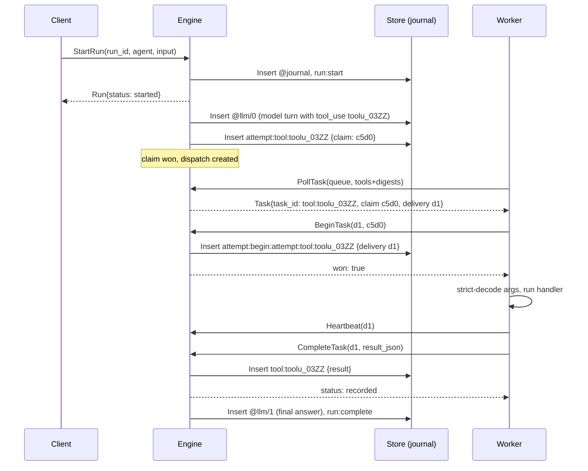
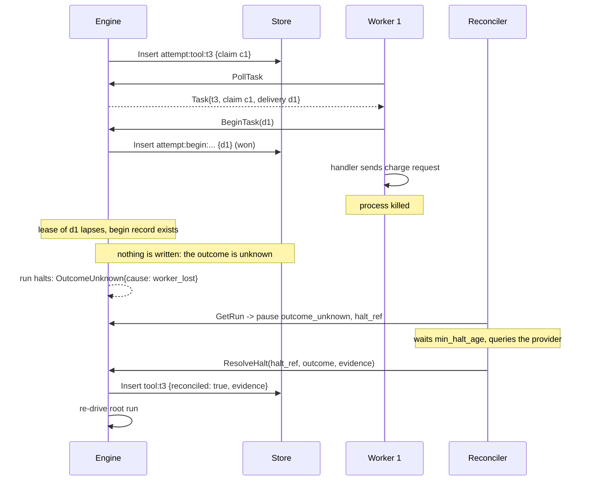
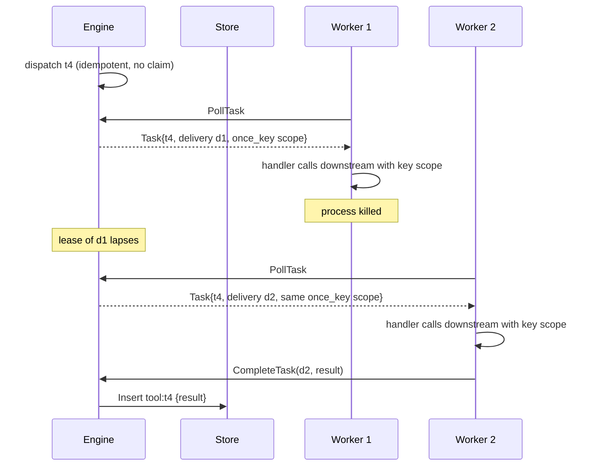
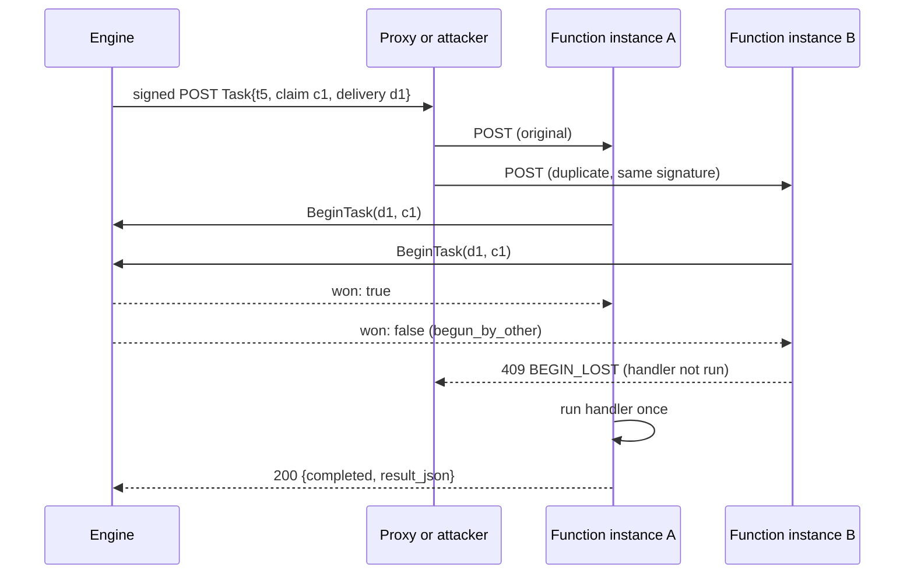
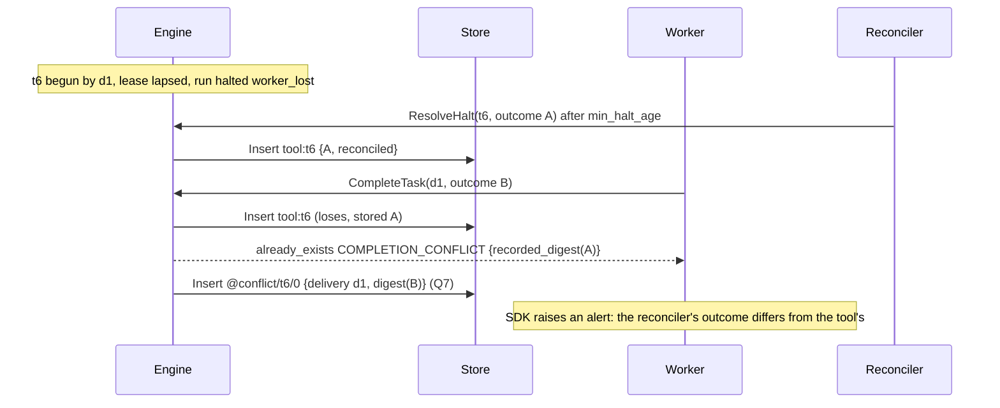
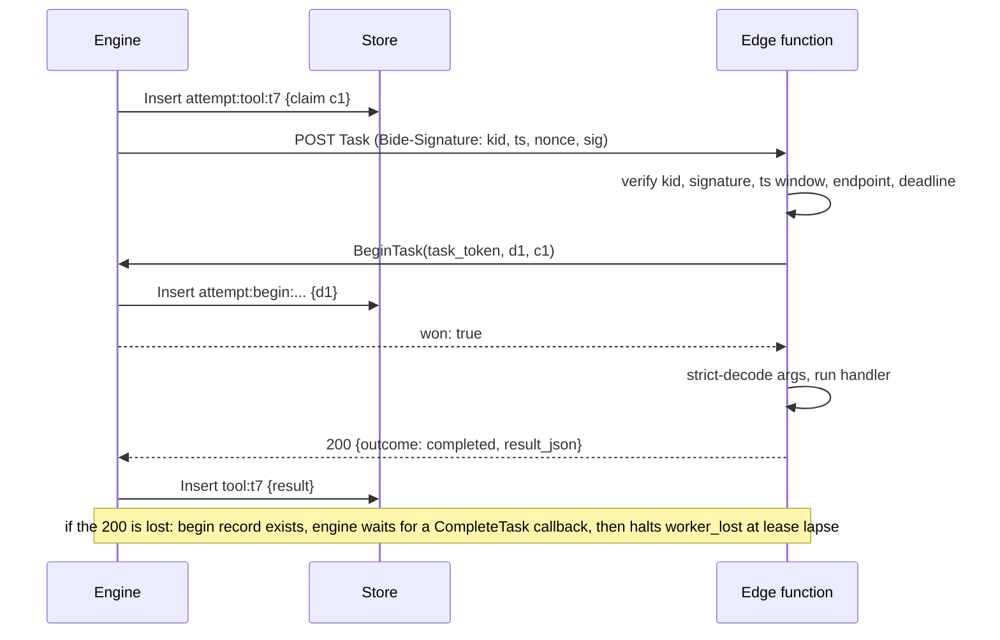
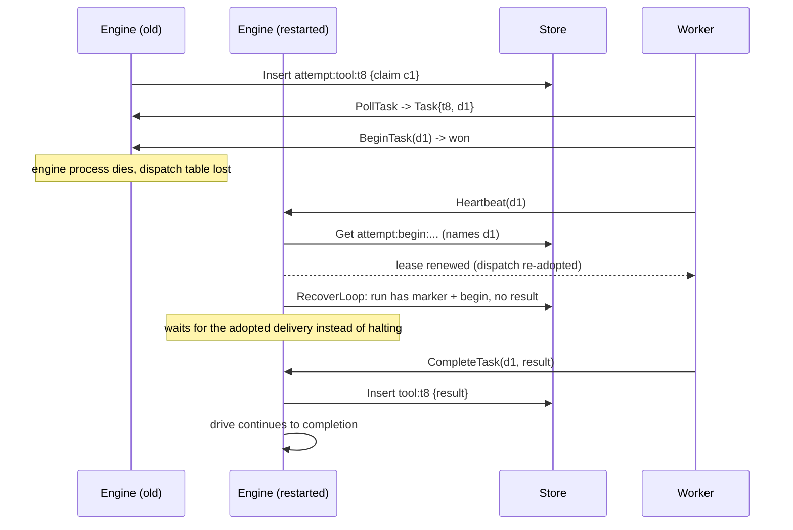

# Design: the bide protocol (`bide.protocol.v1`)

Status: **proposal, under review.** Nothing here is implemented. The engine is unchanged until
this document is approved, and the protocol is implemented only after the engine hardening in the
pre-1.0 API redesign (the "v2 redesign" below) has landed, because the protocol is specified
against that redesign's Run API, pause contract, `ToolSpec`, journal format header and proof
formats.

## 0. Scope

The bide protocol lets programs written in other languages (a Python SDK first, TypeScript next)
use a bide engine without reimplementing any of its guarantees. It has two named parts:

- **The client API**: start runs, read and stream them, cancel them, answer their pauses
  (approvals, m-of-n signed decisions, signals, interrupts, halts), register tools, agents and push
  endpoints, and export audit evidence.
- **The worker API**: deliver tasks (tool calls, and optionally model calls) to workers, either by
  **pull** (a long-lived worker long-polls) or by **push** (the engine POSTs a signed task to a
  serverless or edge function whose HTTP response carries the result), and accept their
  completions.

The Go engine is the **only writer** of the journal, attempt claims, leases and proofs. An SDK
never holds durable state: everything the protocol needs to survive a crash lives in the engine's
journal, and every protocol message that changes a run is translated into a journal operation
that already exists (or is marked below as engine work).

Out of scope for v1: SDK-side durable steps (`Step`, `Parallel`) inside a worker's tool,
pauses raised inside a worker's tool (`Interrupt`, `Sleep`, `Await`), channels (`Enqueue`, `Ack`),
flows (`plan`) defined from an SDK, and governance (`govern`). Section 18 lists them as open
questions.

### 0.1 Markers used in this document

- **[redesign]**: required by the approved v2 redesign, not on `main` yet. The protocol depends on
  it and adds nothing to it.
- **[engine work]**: new engine behavior this proposal requires. Section 17 collects every item.
- Journal writes are written as `Insert` (insert-if-absent, the redesign's `Store` port). On `main`
  the same writes go through `Durable.Do`, which has the same single-winner semantics.
- Everything else describes the engine as it is on `main` today (commit 16c2e8a). Source files are
  cited as `agent/<file>`.

### 0.2 Conventions

The key words MUST, MUST NOT, REQUIRED, SHALL, SHOULD, SHOULD NOT, RECOMMENDED, MAY and OPTIONAL
are to be interpreted as described in RFC 2119 and RFC 8174 when, and only when, they appear in all
capitals. Examples are JSON as it appears on the wire. Field names are snake_case everywhere.

---

## 1. Roles

| Role | Speaks | Holds durable state | Examples |
|---|---|---|---|
| **Engine** | serves the client API and the worker API; calls push endpoints | yes: the journal (through a `Store`), run leases, the advisory dispatch table (5.6) | `bide serve` [engine work], or a Go program embedding the engine's server package |
| **Client** | client API | no | a web backend starting runs; a CLI; a browser through its backend |
| **Worker** | worker API (pull) | no | a Python process with `@tool` functions, long-polling |
| **Push endpoint** | receives signed task POSTs; calls back the worker API with a task token | no | a Cloudflare Worker, a Vercel or Lambda function |
| **Approver** | client API (`SubmitDecision`), holds a signing key | its own key only | a human through an approval UI; a policy service |
| **Reconciler** | client API (`ResolveHalt`) | no | an operator console; an automated job that reads the provider's records |
| **Auditor** | nothing (offline) | no | `bide-audit` verifying exported evidence |

A single SDK process MAY act as a client and a worker at once. The engine MAY run as several
processes over one store; section 5.6 says how tasks are routed among them.

---

## 2. Design principles and the invariants the protocol preserves

The protocol is a transport for the engine's existing guarantees (docs/GUARANTEE.md), not a new
execution model. Each invariant below is stated normatively and tied to the journal operation that
enforces it.

**I1. Claim before dispatch.** For a call whose effective safety is `side_effect` (not `read_only`,
not `idempotent`), the engine MUST have won the attempt claim (`attempt:tool:<enc id>`, or
`attempt:retry:<n>:tool:<enc id>` for a re-attempt; `agent/keys.go`) before any byte of the task
leaves the engine. The claim is an `Insert`-if-absent whose stored `claim` field equals the
engine's fresh claim ID (`ClaimAttempt`, `agent/step.go`).

**I2. One live dispatch per claim, and at most one execution per claim.** The engine MUST NOT
create a second dispatch for a claim. Transport can still duplicate a task (a pull response lost
and never observed, a push retried by a proxy, a replayed push). The protocol therefore adds a
**begin record** (section 9.4) [engine work]: before its handler runs a `side_effect` task, a
worker MUST win `BeginTask`, which inserts `attempt:begin:<marker key>` naming its delivery. Only
the winner executes. The engine re-attempts an effect only after it has itself won that same key
as *abandoned*, which proves no worker began; it then records not-started (#65,
`attempt:not-started:<marker>`) and claims the next attempt. So a claim is executed at most once,
and an effect is re-attempted only when it provably never started.

**I3. Idempotent completion; conflicting completion rejected.** The call's outcome is the record
`tool:<enc id>` (`ToolResultStep`), inserted if absent. A completion whose outcome is byte-equal to
the recorded one MUST succeed (`status: "already_recorded"`). A completion whose outcome differs
MUST be rejected with `already_exists` and condition `COMPLETION_CONFLICT`, carrying a digest of the
recorded outcome. The engine never overwrites a record (store requirement A6 [redesign]).

**I4. A lost worker is an unknown outcome, handled per tool safety exactly as in-process.** When a
dispatch's lease lapses without an outcome:

- `read_only` or `idempotent`: the engine re-dispatches, as an in-process resume re-runs a
  retry-safe call.
- `side_effect` with no begin record: the engine abandons the attempt, records not-started and
  re-attempts it under a new claim (#65 behavior, reached through I2).
- `side_effect` with a begin record: the outcome is unknown. The engine records nothing and the run
  halts (`OutcomeUnknown`, cause `worker_lost` [engine work], section 7.5), exactly as an in-process
  call that returned `ErrToolOutcomeUnknown` leaves its marker without a result. A late completion
  from the delivery that began is still accepted while no outcome is recorded, as an in-process
  result that arrives after the tool's deadline is recorded ("a known outcome is never discarded",
  v2 item 7).

**I5. No SDK-side durability.** An SDK MUST NOT be required to persist anything for correctness.
All deduplication an SDK does (for example, dropping a duplicate delivery it is already running) is
an optimization; correctness comes from I1 to I3. An SDK process can be killed at any instruction.

**I6. The journal is the only truth.** The advisory dispatch table, worker registrations, SSE
cursors and task leases are derived state. Losing all of them (an engine restart) MUST NOT change
any run's outcome: a restarted engine rebuilds dispatches by re-driving runs (`RecoverLoop`), and
re-adopts in-flight deliveries from their heartbeats and completions (section 13.8).

**I7. Replay and proofs are untouched.** Everything a remote tool or a delegated model call
contributes to a run is journaled by the engine in the same record shapes as an in-process call
(`StepToolResult`, `StepModel`), so `Replay` needs no workers and `bide-audit` verifies evidence
from remote runs with no protocol knowledge. The begin record is an ordinary journal leaf, so an
evidence package shows which authenticated worker executed each side effect.

**I8. Nothing live is trusted as recorded.** Configuration that is live in-process stays live over
the protocol (tool set, safety of calls not yet claimed, approval policy of undecided calls,
limits); everything the journal records stays authoritative (v2 item 1 journaling rule; GUARANTEE
"What a resume reads from the journal").

---

## 3. Versioning

### 3.1 The protocol tag

The protocol version is the string **`bide.protocol.v1`**. It appears:

- in the header `Bide-Protocol: bide.protocol.v1` on every request and response of both APIs;
- in the field `protocol` of every task message and every push request body;
- as the Protobuf package `bide.protocol.v1` of the schema (section 4.2).

### 3.2 Compatibility rules within v1

1. Changes within v1 MUST be additive: new fields, new RPCs, new values of a closed set, new event
   types, new error conditions, new features. Field numbers and names are never reused. CI enforces
   this with `buf breaking` at the `WIRE_JSON` level against the last released schema [engine work].
2. A receiver MUST ignore unknown fields.
3. A receiver MUST treat an unknown value of a closed set as follows, per field: an unknown **event
   type** is skipped (6.4); an unknown **task kind** is refused by the worker with outcome
   `not_started`, condition `UNSUPPORTED_TASK` (9.6); an unknown **pause kind** is surfaced to the
   application as an opaque pause that can only be answered by a newer SDK; an unknown **error
   condition** is handled by its category. No other closed-set field may gain a value that changes
   what an older peer must do for safety; such a change is a new protocol version.
4. Semantics that an older peer would get wrong if it ignored a new field (for example a new
   safety level) MUST be gated behind a negotiated feature (3.3) or a new protocol version.
5. A new protocol version (`bide.protocol.v2`) is required for any change that removes a field,
   changes a field's meaning, or changes an invariant of section 2. An engine SHOULD serve the
   current and the previous protocol version for at least one minor release, the same N-1 window
   the redesign recommends for journal formats (v2 section 12, D1).

### 3.3 Negotiation

Every SDK MUST call `MetaService/Hello` before any other call on a new connection pool, and SHOULD
cache the answer for the pool's lifetime.

Request:

```json
{
  "protocols": ["bide.protocol.v1"],
  "sdk": "bide-python/0.1.0",
  "role": "worker",
  "features": ["push_async_ack", "model_delegation", "model_deltas"]
}
```

Response:

```json
{
  "protocol": "bide.protocol.v1",
  "features": ["push_async_ack", "model_delegation"],
  "engine": {
    "version": "v0.9.0",
    "journal_formats": ["bide.journal.v1-dev.1"],
    "proof_formats": ["bide.audit.proof.v3", "bide.audit.evidence.v5", "bide.audit.sth.v5"]
  },
  "limits": {
    "max_message_bytes": 4194304,
    "max_poll_wait": "30s",
    "task_lease_ttl": "30s",
    "heartbeat_interval": "10s",
    "clock_skew": "300s"
  }
}
```

- The engine picks the first protocol in the SDK's list that it serves. If none, it answers
  `unimplemented` with condition `PROTOCOL_UNSUPPORTED` and `supported` listing its own.
- `features` in the response is the intersection. A peer MUST NOT use a feature not in it.
- Every later request still carries `Bide-Protocol`. A request whose header names a protocol the
  engine does not serve fails with `unimplemented`/`PROTOCOL_UNSUPPORTED` before any effect.

Pre-1.0: until the engine's 1.0 tag, engines advertise `bide.protocol.v1-dev.<n>` and accept only an
exact match, mirroring the journal's dev tag (v2 item 3). See open question Q8.

### 3.4 Relation to journal and proof format versions

The three version axes are independent and none implies another:

| Axis | Tag | Pinned where | Who reads it |
|---|---|---|---|
| protocol | `bide.protocol.v1` | per connection (Hello) | SDKs, engine |
| journal format | `bide.journal.v1-dev.N`, later `bide.journal.v1` [redesign] | per run, in the `@journal` header | engine only |
| proof formats | `bide.audit.proof.v3`, `bide.audit.evidence.v5`, `bide.audit.sth.v5`, ... [redesign] | per artifact, in its `format` field | auditors (`bide-audit`), never SDKs |

Rules that follow:

- **Journal keys in the protocol are opaque.** `task_id` (`tool:<enc id>`, `@llm/<n>`) and
  `attempt.key` are journal keys under the run's pinned format. An SDK MUST NOT parse them, build
  them, or compare them across runs. It MAY log them and MUST echo them verbatim.
- A run keeps its journal format for life (v2 item 3), so its task IDs keep their spelling across
  engine upgrades within the compatibility window.
- `GetRun` reports the run's `journal_format`. An engine that cannot write a run's format answers
  every call that would write to it with `failed_precondition`/`JOURNAL_VERSION` (the protocol form
  of `*JournalVersionError`), before any write.
- Evidence and proofs cross the protocol as opaque bytes (`ExportEvidence`, 6.6). The protocol never
  re-encodes them, and SDKs MUST NOT either: the leaves commit to raw stored bytes (v2 item 8).

---

## 4. Transport and encoding

### 4.1 Decision: Protobuf schema, Connect protocol, JSON on the wire

**Source of truth:** a Protobuf schema (`proto/bide/protocol/v1/*.proto`) [engine work], served by
the engine through the **Connect protocol** (connect-go). **Normative wire encoding for SDKs:**
Connect unary over HTTP/1.1 or HTTP/2, `Content-Type: application/json`, bodies in the proto3 JSON
mapping with original (snake_case) field names. Run streaming uses Server-Sent Events (6.4).

Why this and not the alternatives:

- **Works everywhere `fetch` works.** A Connect unary call is a plain `POST /<package>.<Service>/<Method>`
  with a JSON body and a JSON response. It needs no HTTP/2 trailers, so it runs from Cloudflare
  Workers, Vercel Edge, Deno, Lambda, browsers (through the client's backend) and `curl`. Raw gRPC
  needs trailers and HTTP/2 end to end, which edge runtimes and browsers do not give. The same
  connect-go handler also serves gRPC and gRPC-Web, so Go and JVM users can use gRPC tooling with no
  second server.
- **One schema, checked evolution.** Field numbers plus `buf breaking` make section 3.2's rules a CI
  gate rather than a review convention. OpenAPI has no equivalent wire-compatibility check that
  covers renames and type changes as precisely, and its `oneOf` handling in generators is uneven,
  which matters because tasks, pauses and events are unions.
- **Generators exist for the first two SDKs.** `protobuf-es` and `connect-es` (TypeScript) and the
  Python protobuf runtime generate types from the schema. An SDK MAY also hand-write its types
  against the JSON mapping; the conformance suite (section 16) is the arbiter, not the generator.
- **OpenAPI is still published.** An OpenAPI 3.1 document is generated from the schema for tooling
  and documentation. It is non-normative (open question Q1).

Costs accepted:

- **JSON payloads that must keep their bytes travel as strings.** Tool arguments, tool results,
  signal and interrupt payloads, structured outputs and evidence are JSON text whose bytes matter:
  the journal keeps a `json.RawMessage` byte for byte except insignificant whitespace
  (`EncodeRecord`, `agent/record.go`), and approvers sign a digest of the canonical arguments with
  number literals kept verbatim (`ApprovalDecisionBytes`, `agent/approval.go`). `google.protobuf.Struct`
  would turn every number into a float64 and reorder keys. So such fields are `string` fields
  holding JSON text, named with a `_json` suffix (`args_json`, `result_json`). The SDK parses them;
  applications never see the string form.
- **int64 fields are JSON strings** in the proto3 mapping (token counts). Parsers MUST accept both a
  string and a number. Times use `google.protobuf.Timestamp` (RFC 3339 string) and durations
  `google.protobuf.Duration` (`"30s"`).
- **Closed sets are strings, not Protobuf enums**, with the exact values the Go engine uses
  (`"stop"`, `"tool_use"`, `"crashed"`, `"read_only"`). This matches the redesign's rule that closed
  sets are typed strings (v2 section 1.1), keeps journal values and wire values identical, and
  avoids enum names such as `FINISH_REASON_STOP` on the wire. Each field documents its set.

### 4.2 Services and paths

| Service | Part | Methods |
|---|---|---|
| `bide.protocol.v1.MetaService` | both | `Hello`, `GetSigningKeys` |
| `bide.protocol.v1.RunService` | client | `StartRun`, `GetRun`, `StreamRun`, `CancelRun`, `SendSessionMessage`, `ExportEvidence` |
| `bide.protocol.v1.PauseService` | client | `Approve`, `SubmitDecision`, `Signal`, `AnswerInterrupt`, `ResolveHalt` |
| `bide.protocol.v1.RegistryService` | client | `PutTools`, `GetTools`, `PutAgent`, `GetAgent`, `PutPushEndpoint` |
| `bide.protocol.v1.WorkerService` | worker | `PollTask`, `BeginTask`, `Heartbeat`, `CompleteTask`, `FailTask`, `ReportModelDeltas` |

A unary method is `POST /bide.protocol.v1.<Service>/<Method>`. `StreamRun` is additionally served as
SSE at `GET /v1/runs/{run_id}/events` (6.4). Push requests go from the engine to an endpoint's URL
(section 11).

### 4.3 Authentication

The engine MUST authenticate every request. It supports:

- **API keys**: `Authorization: Bearer bide_<kind>_<random>`, where the key is bound server-side to
  one tenant and a set of roles: `client`, `worker`, `approver`, `reconciler`, `admin`. A method not
  allowed to the key's roles fails with `permission_denied`. Keys are stored hashed; the engine
  never logs them.
- **mTLS** (RECOMMENDED for long-lived workers): the client certificate's SPIFFE ID or subject is
  mapped to a tenant and roles in engine configuration. mTLS and an API key MAY be combined.
- **Task tokens**: every task carries a `task_token`, a short-lived bearer credential valid only for
  `BeginTask`, `Heartbeat`, `CompleteTask`, `FailTask` and `ReportModelDeltas` of that one delivery,
  expiring at the task deadline plus the late-completion grace (9.8). Push endpoints use it to call
  back, so an edge function needs no long-lived engine credential. A pull worker MAY use either its
  API key or the task token for those calls.

The authenticated principal of a worker (key ID or certificate identity) is recorded in the begin
record and in the result record [engine work], so evidence shows who executed each effect.

Browsers MUST NOT hold worker, reconciler or admin credentials. A browser talks to the client API
only through the application's backend, or with a client-role token the backend mints that is
scoped to one tenant and a run-ID prefix and expires within minutes (open question Q11).

### 4.4 Tenancy

- Every API key and certificate maps to exactly one tenant ID, matching `[a-z0-9][a-z0-9-]{0,62}`.
- **Run IDs carry the tenant.** Every run ID a tenant uses MUST begin with `<tenant>/`. The engine
  refuses any other with `permission_denied`/`TENANT_MISMATCH`. This is the redesign's run-ID prefix
  convention with `RunFilter.Prefix` (D4 [redesign]). The protocol uses the full journal run ID
  everywhere, with no hidden prefixing, because the run ID is bound into approval signatures
  (`ApprovalDecisionBytes`) and into proofs: what the approver signs and what the auditor reads must
  be the same string the client sent.
- Run IDs otherwise follow `ValidateRunID`: non-empty, and no `>`, which only engine-derived run IDs
  carry (a sub-agent's run `<parent>><enc tool id>`, `SubRunID`; a session's turn run
  `<session>>@turn/<n>`; `agent/keys.go`). Derived run IDs appear in tasks and pauses, and a client
  may answer a pause on one, but a client cannot start one.
- Tool registrations, agents, push endpoints and task queues are namespaced by tenant. The engine
  MUST NOT deliver a task to a worker or endpoint of another tenant, and MUST NOT accept a
  completion, heartbeat or pause answer for a run of another tenant.

### 4.5 Common headers

| Header | Direction | Meaning |
|---|---|---|
| `Bide-Protocol` | both | the protocol tag (3.1) |
| `Bide-Request-Id` | request | OPTIONAL caller-chosen ID echoed in logs and errors |
| `Bide-Engine-Id` | response | the engine process that answered (for routing diagnostics) |
| `Retry-After` | response | seconds, on `unavailable` and `resource_exhausted` |

---

## 5. Common types

### 5.1 Message

The engine's `Message` wire form (`agent/message.go`), unchanged:

```json
{
  "role": "user",
  "parts": [
    {"type": "text", "text": "Refund order 1234"},
    {"type": "image", "mime": "image/png", "data": "iVBORw0KGgo="}
  ]
}
```

Part types: `text`, `reasoning` (`text`, `signature`, `redacted`), `tool_use` (`id`, `name`,
`args`, `signature`), `tool_result` (`tool_use_id`, `result`, `is_error`), `image` (`mime`, `data`
base64, or `url`). Inside a `Message`, `args` and `result` are embedded JSON values, not strings: a
`Message` travels as a `string message_json` field holding exactly this JSON, for the byte-fidelity
reason of 4.1. Roles: `system`, `user`, `assistant`, `tool`.

### 5.2 Usage

```json
{"input_tokens": "812", "output_tokens": "96", "cache_read_tokens": "0", "cache_write_tokens": "0"}
```

`Usage` covers recorded responses; `spend` covers every request billed, including discarded
attempts (#69; `Result.Usage` and `Result.Spend` are whole-run and include sub-agents).

### 5.3 Safety, approval policy, effective safety

```json
{"safety": {"read_only": false, "idempotent": false},
 "approval": {"need": 2, "approvers": ["finance", "legal"]}}
```

- `safety` is the redesign's plain-data `Safety{ReadOnly, Idempotent}` [redesign]. On `main`,
  `Safety` still carries `IdempotencyKey` and `RequiresApproval`; the protocol never carries those.
  `IdempotencyKey` is removed by the redesign (a tool derives its own keys, or uses the once key,
  9.5).
- `approval` is `ApprovalPolicy{Need, Approvers}` [redesign splits it from Safety]. `{"need": 1,
  "approvers": []}` is `SingleApproval()`: one `Approve` decision, no approver set. Any other policy
  MUST pass `ApprovalPolicy.Validate` (approvers non-empty, valid UTF-8, distinct under NFKC case
  folding, `1 <= need <= len(approvers)`), else `PutTools` fails with `invalid_argument`/`CONFIG`.
- **Effective safety** is the closed set `read_only | idempotent | side_effect`, computed by the
  engine for one call: `read_only` if `read_only`, else `idempotent` if `idempotent`, else
  `side_effect`. A call whose attempt marker exists is `side_effect` whatever the tool is declared as
  by then (GUARANTEE, "a call keeps the safety it fired under"). Tasks carry the effective safety,
  and workers MUST honor it rather than their own spec (9.4).

### 5.4 Pause

The union of the redesign's pause types (v2 item 6 [redesign]), tagged by `kind`:

| `kind` | Go type | Fields |
|---|---|---|
| `approval` | `ApprovalPending` | `ref`, `tool_use_id`, `tool_name`, `args_json`, `subject`, `quorum` |
| `interrupt` | `InterruptPending` | `ref`, `name`, `prompt_json` |
| `signal` | `SignalPending` | `ref`, `name` |
| `timer` | `TimerPending` | `ref`, `name`, `fire_at` |
| `outcome_unknown` | `OutcomeUnknown` | `ref`, `halt_ref`, `attempted_at`, `cause` |

`ref` is `RunRef{run_id, root_run_id}`: `run_id` is the journal the answer goes to (a sub-run's for a
gate inside a sub-agent), `root_run_id` the run the engine re-drives. Example:

```json
{
  "kind": "approval",
  "ref": {"run_id": "acme/order-1234>toolu_01H8", "root_run_id": "acme/order-1234"},
  "tool_use_id": "toolu_02QQ",
  "tool_name": "issue_refund",
  "args_json": "{\"order\":\"1234\",\"amount_cents\":1250}",
  "subject": {
    "run_id": "acme/order-1234>toolu_01H8",
    "tool_use_id": "toolu_02QQ",
    "tool_name": "issue_refund",
    "args_json": "{\"order\":\"1234\",\"amount_cents\":1250}"
  },
  "quorum": {"need": 2, "approvers": ["finance", "legal"], "approved": 1, "denied": 0,
             "approved_by": ["finance"], "pending": ["legal"],
             "records": ["approval:toolu_02QQ:finance:9f2c..."]}
}
```

`quorum` is `ApprovalTally` verbatim (`agent/approval.go`), absent for a 1-of-1 gate. `halt_ref` is
`HaltRef{run_id, op: {kind: "tool"|"step", id, tool_name}}` [redesign]. `cause` is a `HaltCause`:
`crashed`, `contended` [redesign], or `worker_lost` [engine work] (7.5).

A paused run is not journaled as paused (the redesign documents that a paused run reports
`Started`). The engine computes pauses by driving the run, so after an engine restart a pause
reappears only once `RecoverLoop` has re-driven the run (13.8).

### 5.5 Error

Every error response is a Connect error whose details include one `bide.protocol.v1.ErrorInfo`.
The engine MUST also put the same `ErrorInfo`, in its proto3 JSON form, in the detail's `debug`
field, so an SDK that does not decode binary Protobuf can read it.

```json
{
  "code": "failed_precondition",
  "message": "run acme/order-1234 was started with a different input; resume it with that input",
  "details": [{
    "type": "bide.protocol.v1.ErrorInfo",
    "value": "CgZjb25maWcS...",
    "debug": {
      "category": "config",
      "condition": "RUN_START_MISMATCH",
      "run_id": "acme/order-1234",
      "retryable": false
    }
  }]
}
```

`category` is one of bide's category sentinels (`agent/errors.go`): `config`, `model`, `tool`,
`storage`, `protocol`, `budget`, or empty for conditions that carry no category (the engine's
`ErrLeaseLost`, and [redesign] `ErrRunCancelled`, `ErrNotResumable`, `audit.ErrNotVerified`). Section 14 maps every
condition.

### 5.6 The advisory dispatch table

A task exists as a **dispatch**: `(tenant, task_queue, run_id, task_id, delivery_id, lease)`. The
engine node that drives the run (it holds the run's lease) creates dispatches. In a single-node
engine the table is in memory. In a multi-node engine it is a table in the same database as the
journal, outside the journal (`bide_dispatch`) [engine work], so a `PollTask` served by any node can
hand out any node's dispatch, and a completion received by any node is written straight to the
journal.

The table is advisory (I6): it is never read to decide an outcome. Deleting every row is safe: the
next drive of each run recreates the dispatches its journal implies (a call with no result and no
marker; a call with a marker and no begin record, which is abandoned and re-attempted; a call with a
begin record and no result, which waits for its worker, 12.7).

---

## 6. Client API: runs

### 6.1 StartRun

Starts a run, or returns the existing run with that ID. Idempotent through `run:start` (#70; the
journal record the first drive writes).

Request:

```json
{
  "run_id": "acme/order-1234",
  "agent": "support",
  "input_json": "{\"role\":\"user\",\"parts\":[{\"type\":\"text\",\"text\":\"Refund order 1234\"}]}",
  "options": {
    "max_turns": 12,
    "token_budget": "200000",
    "system_prompt": "You are the refunds agent.",
    "tools": ["lookup_order", "issue_refund"],
    "saga": false,
    "output": {"mode": "tool", "schema_json": "{\"type\":\"object\",\"properties\":{\"refunded\":{\"type\":\"boolean\"}},\"required\":[\"refunded\"]}"}
  },
  "principal": {"on_behalf_of": "user:42", "authority_ref": "ticket:SUP-991"},
  "wait": {"until": "pause_or_end", "timeout": "20s"}
}
```

| Field | Required | Meaning |
|---|---|---|
| `run_id` | yes | 4.4 |
| `agent` | yes | the name of an agent registered with `PutAgent` (8.3) |
| `input_json` | yes | a `Message` (5.1). On `main` `RunStart.Input` is a string; the redesign makes it a `Message` [redesign] |
| `options.*` | no | per-run settings, journaled in `run:start` (`RunSettings`, `Tools`, `Saga`, `Typed` [redesign]) |
| `principal` | no | `OnBehalfOf`, `AuthorityRef`, journaled in `run:start.principal` [redesign] |
| `wait.until` | no | `none` (default): return once `run:start` is written. `pause_or_end`: long-poll until the drive pauses, halts, fails or finishes, or `wait.timeout` (max `limits.max_poll_wait`) |

Semantics:

1. The engine validates the run ID (4.4) and the agent, then writes `@journal` (if new
   [redesign]) and `run:start` if absent, then drives the run asynchronously under a run lease
   (`Lease`, `agent/lease.go`).
2. If `run:start` exists and the request matches it, the call succeeds with `created: false` and the
   run's current state. This makes a retried `StartRun` (lost response, client restart) safe.
3. If `run:start` exists and differs in input, saga flag, output mode or schema, tool filter, system
   prompt, sampling, tool choice or principal, the call fails with `failed_precondition`, category
   `config`, condition `RUN_START_MISMATCH`, and nothing is written (#70; v2 item 1 rule 3).
4. `max_turns` and `token_budget` may differ from the recorded ones: that is an amendment,
   journaled as `run:limits:<n>` [redesign], and takes effect (v2 item 1 rule 2). The response
   reports `amended: true`.
5. A finished run returns its recorded result whatever `options` say (GUARANTEE case 4).

Response (`Run`, shared with `GetRun`):

```json
{
  "run": {
    "run_id": "acme/order-1234",
    "agent": "support",
    "journal_format": "bide.journal.v1-dev.1",
    "status": "started",
    "activity": "paused",
    "pause": {"kind": "approval", "ref": {"run_id": "acme/order-1234", "root_run_id": "acme/order-1234"},
              "tool_use_id": "toolu_02QQ", "tool_name": "issue_refund",
              "args_json": "{\"order\":\"1234\",\"amount_cents\":1250}",
              "subject": {"run_id": "acme/order-1234", "tool_use_id": "toolu_02QQ",
                          "tool_name": "issue_refund", "args_json": "{\"order\":\"1234\",\"amount_cents\":1250}"}},
    "result": null,
    "usage": {"input_tokens": "1650", "output_tokens": "210"},
    "spend": {"input_tokens": "1650", "output_tokens": "210"},
    "records": 7,
    "updated_at": "2026-09-29T14:03:11.204Z"
  },
  "created": true,
  "amended": false
}
```

- `status` is `RunState` from `Status` [redesign]: `not_started`, `started`, `completed`, `aborted`,
  `cancelled`. It comes from the journal and is authoritative.
- `activity` is advisory engine state [engine work]: `running`, `paused`, `halted`,
  `waiting_for_worker` (a dispatch has no eligible worker, 10.1), `failed` (the last drive ended in
  an error with no terminal record; `error` holds it), `idle` (no drive since the engine started).
  It can be stale after an engine restart until the run is re-driven.
- `result` is present when `status` is `completed`: `{"message_json", "output_json", "usage",
  "spend", "turns"}` (`Result` [redesign]). For `aborted`, `result` is absent and `error` carries the
  saga abort. For `cancelled`, `error` carries condition `RUN_CANCELLED` with no category.

Errors: `invalid_argument`/`protocol`/`INVALID_RUN_ID`, `INVALID_MESSAGE`; `not_found`/`config`/
`UNKNOWN_AGENT`; `permission_denied`/`TENANT_MISMATCH`; `failed_precondition`/`config`/
`RUN_START_MISMATCH`, `JOURNAL_VERSION`; `unavailable`/`storage` (retryable; the request may be
retried unchanged, since step 2 makes it idempotent).

### 6.2 GetRun

Request `{"run_id": "acme/order-1234", "wait": {"until": "change", "after_records": 7, "timeout": "20s"}}`.
Returns `{"run": Run}`. With `wait.until = "change"`, the call long-polls until the run's record count
exceeds `after_records` or its `activity` changes. `not_found`/`RUN_NOT_FOUND` for a run with no
`run:start` (a run that only received a mistyped `Signal`, v2's `ErrNotStarted` case, is also
`not_found`).

### 6.3 SendSessionMessage

Maps `Session.Send` and `Session.SendOnce` (`agent/session.go`; `Session.Send(ctx, Message)` after
the redesign). Request:

```json
{"session_id": "acme/chat-77", "agent": "support",
 "input_json": "{\"role\":\"user\",\"parts\":[{\"type\":\"text\",\"text\":\"and the other order?\"}]}",
 "once_key": "msg-5f1c", "wait": {"until": "pause_or_end", "timeout": "20s"}}
```

With `once_key`, a redelivered message maps to the same turn run (`sessionEventRunID`) and returns
its recorded answer. Without it, each call is a new turn. The response is `{"run": Run}` for the
turn's run, whose `run_id` is the derived turn run ID (`<session>>@turn/<n>` or
`<session>>@event/<enc key>`). Sessions are driven by the engine only: a client MUST NOT call
`StartRun` on a turn run ID.

### 6.4 StreamRun (SSE)

`GET /v1/runs/{run_id}/events` with `Accept: text/event-stream`, `Authorization`, `Bide-Protocol`,
and optionally `Last-Event-ID`. Also served as the Connect server-streaming method
`RunService/StreamRun` with the same event payloads. `run_id` in the path is percent-encoded.

Each SSE message is:

```
id: j:5
event: tool_completed
data: {"v":1,"run_id":"acme/order-1234","type":"tool_completed","tool_completed":{"tool_use_id":"toolu_01H8","name":"lookup_order","result_json":"{\"status\":\"paid\"}","is_error":false}}
```

The event list for v1. Each maps to an `AgentEvent` (`agent/stream_agent.go`; `RunEvent`
[redesign]) or to a run-level fact:

| `type` | Durable | Source | Payload |
|---|---|---|---|
| `turn_started` | no | `TurnStarted` | `seq` |
| `model_delta` | no | `ModelEvent` | one of `text`, `reasoning {text, signature, redacted}`, `tool_call {index, id, name, args_fragment}` |
| `turn_restarted` | no | `TurnRestarted` | `seq`. The consumer MUST discard deltas since the last `turn_started` or `turn_restarted` |
| `assistant_turn` | yes | `AssistantTurn` | `message_json`, `replayed` |
| `tool_started` | no | `ToolStarted` | `tool_use_id`, `name`, `args_json` |
| `tool_completed` | yes | `ToolCompleted` | `tool_use_id`, `name`, `result_json`, `is_error` |
| `approval_required` | no | `ApprovalRequired` | `tool_use_id`, `name`, `args_json`, `quorum` |
| `paused` | no | the drive returned a pause | `pause` (5.4) |
| `halted` | no | the drive returned `OutcomeUnknown` | `pause` with kind `outcome_unknown` |
| `finished` | yes | `Finished` | `message_json`, `output_json` |
| `run_failed` | no | the drive ended in an error | `error` (`ErrorInfo`) |
| `run_cancelled` | yes | `run:cancelled` [redesign] | `reason` |
| `run_aborted` | yes | `run:aborted` | none |
| `dispatch_waiting` | no | a dispatch has no eligible worker [engine work] | `task_id`, `tool` |

Rules:

1. **Ignore unknown types.** A consumer MUST skip an event whose `type` it does not know, and MUST
   NOT treat that as an error. The engine adds event types within v1 (3.2).
2. **Durable events** are the ones `ProjectEvents` derives from the journal (`AssistantTurn`,
   `ToolCompleted`), plus the terminal records. Their SSE `id` is `j:<index>`, the record's position
   in `Load` order (positions are computed at read time, v2 item 4). They are delivered exactly once
   and in journal order per stream, and a reconnect with `Last-Event-ID: j:<k>` resumes after
   position `k`. A stream opened with no `Last-Event-ID` starts at position 0, so a late subscriber
   sees the whole durable history first (replayed events carry `replayed: true` where the type has
   it).
3. **Live events** (`turn_started`, `model_delta`, `tool_started`, ...) are best effort. Their `id` is
   `l:<drive>:<n>`. They are not replayed after a reconnect, and a consumer MUST NOT derive state it
   needs from them alone. A `Last-Event-ID` of the form `l:...` resumes durable events after the last
   durable ID the engine sent before it on that stream [engine work: the engine keeps the mapping for
   the stream's lifetime; otherwise it restarts at `j:0`].
4. `data` always carries `v: 1` (the event schema version within the protocol version) and
   `run_id`. Events from a sub-agent's run are not forwarded in v1 (open question Q9).
5. The engine sends an SSE comment (`: ping`) at least every 15 s. The stream ends after a terminal
   event (`finished`, `run_cancelled`, `run_aborted`) or when the drive pauses, halts or fails. A
   consumer that wants to follow a run across pauses reconnects with its last `Last-Event-ID`.
6. `EventSource` cannot send an `Authorization` header, so SDKs MUST use a fetch-based SSE reader.
   Credentials MUST NOT go in the query string.

### 6.5 CancelRun

Request `{"run_id": "acme/order-1234", "reason": "customer withdrew"}`. The engine writes
`run:cancelled {reason}` [redesign D1]. A driver never starts a new claim after seeing it; calls in
flight finish and record their results, so the engine sets `cancel` in heartbeat responses (10.3)
only for a saga (below), never to abort a side effect that has begun. `CancelRun` on a saga run is
an abort: the engine rolls it back (compensations run as tasks, open question Q6). Response
`{"run": Run}`. Idempotent: a second call returns the same state; a different `reason` is ignored
and the first is kept (the record is insert-if-absent). Cancelling a finished run fails with
`failed_precondition`/`RUN_FINISHED`.

### 6.6 ExportEvidence

Request `{"run_id": "acme/order-1234", "kind": "evidence"}`; `kind` is `evidence` (an
`EvidencePackage`), `run_certificate`, or `proof` with `record_names`. Response
`{"format": "bide.audit.evidence.v5", "artifact": "<base64 bytes>"}`. The bytes are exactly what the
audit package produced; the SDK MUST hand them to the application unmodified (3.4). Verification is
offline with `bide-audit` (only exit code 0 means verified, v2 section 9.2).

---

## 7. Client API: pause answers

Every answer writes one journal record through the engine's existing verb, then, unless
`resume: false`, re-drives `ref.root_run_id` [engine work: in the library the caller re-drives;
the server does it]. All answers are idempotent: resubmitting an identical answer succeeds with
`recorded: false`; a different answer to an already answered pause fails with `already_exists`,
condition `ALREADY_ANSWERED`, and carries the recorded answer's digest [engine work: `Signal` and
`Resume` today keep the first record silently, `agent/pause.go`].

Answers go to `run_id`, the journal holding the pause, which for a pause inside a sub-agent is the
sub-run (`PendingApproval.RunID` vs `RootRunID`, `agent/halt.go`).

### 7.1 Approve (1-of-1)

```json
{"run_id": "acme/order-1234", "tool_use_id": "toolu_02QQ", "approved": true, "resume": true}
```

Writes `approval:<enc id>` (`Approve`, `agent/halt.go`). A recorded denial is final (#70). Caller
role: `approver`. An `Approve` never counts toward an m-of-n tally, and a `SubmitDecision` never
satisfies a 1-of-1 gate (docs/design/design-mofn-approval.md, "Path isolation"). Errors:
`not_found`/`tool`/`NO_SUCH_CALL`, `already_exists`/`ALREADY_ANSWERED`.

### 7.2 SubmitDecision (m-of-n, signed)

```json
{
  "run_id": "acme/order-1234",
  "tool_use_id": "toolu_02QQ",
  "approver_id": "legal",
  "approved": true,
  "alg": "ed25519",
  "signature": "3q2+7w...==",
  "resume": true
}
```

- The approver signs `ApprovalDecisionBytes(subject, approver_id, approved)` (`agent/approval.go`):
  `"bide.approval.v2\n"`, then length-prefixed (4-byte big-endian) `run_id`, `tool_use_id`,
  `tool_name`, then SHA-256 of the canonical arguments, then length-prefixed `approver_id`, then one
  byte (1 approve, 0 deny). The canonical arguments are the JSON re-serialized with object keys
  sorted, no insignificant whitespace, no HTML escaping, number literals verbatim; empty arguments
  are `{}`.
- An SDK MUST compute these bytes itself from the pause's `subject`, and MUST show the approver the
  `tool_name` and `args_json` it signs over. It MUST NOT sign bytes supplied by the engine. The
  conformance suite ships golden vectors (16.3).
- The engine always runs the decision check (`ApproveAs` with `WithDecisionCheck`): the call exists,
  the approver is eligible, a verifier resolves for them, and the signature verifies for this exact
  call. Failures: `invalid_argument`/`config`/`INVALID_APPROVAL` (`ErrInvalidApproval`), and
  `already_exists`/`config`/`ALREADY_DECIDED` (`ErrAlreadyDecided`). A valid decision is journaled
  under `approval:<enc id>:<approver>:<digest>` with `approver_alg` [redesign].
- The response carries the new `quorum` tally and `passed` / `unreachable`.
- `alg` is `ed25519` (REQUIRED for SDKs), `ml-dsa-65` or `hybrid-ed25519-mldsa65` (OPTIONAL) (v2
  item 8 [redesign]).

### 7.3 Signal

```json
{"run_id": "acme/order-1234", "name": "payment_confirmed", "payload_json": "{\"txn\":\"t_9\"}", "resume": true}
```

Writes `signal:<name>` (`Signal`, `agent/pause.go`). The engine refuses a signal to a run with no
`run:start` with `not_found`/`RUN_NOT_FOUND` unless `allow_before_start: true` [engine work], so a
mistyped run ID does not create a journal that `Recover` must later skip (v2's `ErrNotStarted`).

### 7.4 AnswerInterrupt

```json
{"run_id": "acme/order-1234", "key": "confirm_address", "value_json": "{\"ok\":true}", "resume": true}
```

Writes `interrupt:<key>` (`Resume[T]` today, `AnswerInterrupt[T]` [redesign]).

### 7.5 ResolveHalt

```json
{
  "halt_ref": {"run_id": "acme/order-1234", "op": {"kind": "tool", "id": "toolu_03ZZ", "tool_name": "charge_card"}},
  "outcome": {"result_json": "{\"charge\":\"ch_77\",\"status\":\"succeeded\"}", "is_error": false,
              "evidence_json": "{\"stripe_charge\":\"ch_77\",\"queried_at\":\"2026-09-29T14:10:00Z\"}"},
  "min_halt_age": "120s",
  "resume": true
}
```

Writes the reconciled result under `tool:<enc id>` with `reconciled: true` and the evidence
(`ResolveHalt`, `agent/halt.go`; `HaltRef`/`Outcome` form [redesign]). Caller role: `reconciler`.

- A halt whose cause is `contended` or `worker_lost` and whose attempt is younger than
  `min_halt_age` fails with `failed_precondition`/`HALT_TOO_YOUNG` (`HaltTooYoung`), because another
  driver or worker may still be running the effect. The engine enforces a server-side floor for
  `worker_lost` equal to the task's deadline plus the late-completion grace (9.8) [engine work].
- **`worker_lost`** [engine work] is a new `HaltCause` value: the claim's delivery began and its
  lease lapsed without an outcome. Unlike `crashed`, the claimant may still be alive and may still
  complete. It is needed because a reconciler's policy differs: for `worker_lost` it should wait for
  the late completion first.
- If a late completion arrives after a `ResolveHalt` wrote a different outcome, the completion is
  rejected (`COMPLETION_CONFLICT`, I3) and the engine emits an audit-visible conflict record
  (open question Q7).

---

## 8. Client API: registration

### 8.1 PutTools

Declares a tenant's tools on a task queue. Registration is declarative and versioned; it is not
tied to worker liveness (liveness is 10.1).

```json
{
  "task_queue": "payments",
  "tools": [
    {
      "name": "charge_card",
      "title": "Charge a card",
      "description": "Charge a saved card for an order.",
      "input_schema_json": "{\"type\":\"object\",\"properties\":{\"customer\":{\"type\":\"string\"},\"amount_cents\":{\"type\":\"integer\"}},\"required\":[\"customer\",\"amount_cents\"],\"additionalProperties\":false}",
      "output_schema_json": "{\"type\":\"object\"}",
      "safety": {"read_only": false, "idempotent": false},
      "approval": {"need": 1, "approvers": []},
      "timeout": "20s"
    }
  ],
  "mode": "merge"
}
```

This is `ToolSpec` [redesign]: `Name, Title, Description, Input, Output, Safety, Approval,
Timeout`. Validation mirrors `New` (v2 item 2): names unique within the queue and valid for every
provider adapter (`toolcfg.Check`), not the reserved `final_answer`, an input schema that is a JSON
object, a valid approval policy, a positive timeout. Failures are `invalid_argument`/`config`.

Each spec gets a **spec digest**: `sha256:` plus the hex SHA-256 of the spec's canonical JSON (keys
sorted, no whitespace, embedded schemas canonicalized the same way). `mode: "merge"` adds or replaces
the named tools; `"replace"` makes the set exactly the listed tools. The response returns every
tool's `spec_digest` and the queue's `tool_set_digest`.

**What happens to in-flight runs when tools change.** The rules are the in-process "live by
design" rules (GUARANTEE), applied at defined points:

1. **Model-visible specs** are read at each model turn. A turn that starts after the change offers
   the new specs; the turn's record journals `ToolsDigest` [redesign], so the audit shows what the
   model saw.
2. **A call's spec is fixed when its dispatch is created**: at claim time for `side_effect`, at
   enqueue for the others. The task carries that `spec_digest` and the effective safety.
3. **Routing**: a dispatch is offered only to workers that declared that exact `spec_digest` for the
   tool (10.1). A worker never runs a call under a spec it does not have.
4. **A stale dispatch** (no worker serves its digest within `dispatch_timeout`, default 60 s,
   because all workers upgraded): a `read_only` or `idempotent` dispatch is re-created under the
   current spec. A `side_effect` dispatch with no begin record is abandoned, recorded not-started
   and re-attempted under the current spec (I2). A dispatch that has begun is never re-specified.
5. **Safety changes** take effect for calls not yet claimed. A call already claimed stays
   `side_effect` (5.3). Relabelling a retry-safe tool as a side effect while one of its calls is in
   flight has #57's known gap (GUARANTEE, last bullet): no marker exists, so a lost delivery is
   re-dispatched.
6. **Approval changes** apply to calls with no recorded decision, under the gate's current policy.
   A recorded denial stays final.
7. **A removed tool**: a pending call with no marker fails with `ErrUnknownTool` (recorded as a tool
   error the model sees, as in-process). A call with a marker and no result halts, whatever the
   registry says.

### 8.2 GetTools

`{"task_queue": "payments"}` returns the specs with digests, the `tool_set_digest`, and for each
tool the live workers and push endpoints serving each digest.

### 8.3 PutAgent

Agents are defined engine-side so the engine can drive runs with no SDK connected (recovery,
timers, approvals answered hours later).

```json
{
  "name": "support",
  "model": {"provider": "anthropic", "model": "claude-sonnet-4-5", "delegate": false},
  "system_prompt": "You are the refunds agent.",
  "tools": [{"task_queue": "payments", "names": ["charge_card", "issue_refund"]},
            {"task_queue": "lookup", "names": ["lookup_order"]}],
  "defaults": {"max_turns": 20, "token_budget": "500000", "max_concurrency": 4},
  "sub_agents": [{"tool_name": "research", "agent": "researcher", "approval": null}]
}
```

- Agent-level settings are live by design (v2 item 1 rule 4): a new version applies to the next
  turn of running runs, and each model record journals `PromptDigest` and `ToolsDigest`.
- `model.delegate: true` routes this agent's model calls to workers (section 12). Otherwise the
  engine calls the provider with credentials held in engine configuration.
- `sub_agents` maps to `SubAgent` tools; their runs are `SubRunID(parent, tool_use_id)` and their
  tool calls produce tasks with that run ID and the root's `root_run_id`.
- In-process Go tools of an embedding program MAY be referenced by name with `task_queue: "@local"`.

### 8.4 PutPushEndpoint

```json
{
  "task_queue": "payments",
  "endpoint_id": "cf-payments",
  "url": "https://payments.example.workers.dev/bide/task",
  "tools": [{"name": "charge_card", "spec_digest": "sha256:4b1e..."}],
  "max_concurrency": 50,
  "response_timeout": "25s",
  "begin_mode": "worker"
}
```

- `url` MUST be `https` (plain `http` only for `localhost` in development mode).
- `begin_mode`: `worker` (default; the function calls `BeginTask` with the task token, 11.3) or
  `engine` (for functions that cannot reach the engine: the engine writes the begin record itself
  immediately before sending; any ambiguous failure of a `side_effect` push is then an unknown
  outcome, 11.5).
- A push endpoint's served digests are its declaration; it is "live" unless the engine's circuit
  breaker has opened on it (11.6).

---

## 9. Worker API: the task message

### 9.1 Annotated example

A task as returned by `PollTask` or carried in a push request:

```json
{
  "protocol": "bide.protocol.v1",
  "kind": "tool",
  "task_id": "tool:toolu_03ZZ",
  "run_id": "acme/order-1234",
  "root_run_id": "acme/order-1234",
  "tool_use_id": "toolu_03ZZ",
  "turn": 3,
  "task_queue": "payments",
  "delivery_id": "dlv_01J9Q2W8X4K6",
  "attempt": {
    "key": "attempt:tool:toolu_03ZZ",
    "claim_id": "c5d0a7e19b2f44e1",
    "generation": 0,
    "begin_required": true
  },
  "tool": {
    "name": "charge_card",
    "spec_digest": "sha256:4b1e0c5f7a...",
    "effective_safety": "side_effect"
  },
  "args_json": "{\"customer\":\"cus_42\",\"amount_cents\":1250}",
  "once_key": {"scope": "acme/order-1234>toolu_03ZZ", "next": 0},
  "identity": {"actor": "engine:prod-eu-1", "on_behalf_of": "user:42", "authority_ref": "ticket:SUP-991"},
  "saga": false,
  "deadline": "2026-09-29T14:03:31.500Z",
  "lease": {"ttl": "30s", "heartbeat_interval": "10s", "expires_at": "2026-09-29T14:03:41.500Z"},
  "task_token": "bide_tt_9sK2...",
  "issued_at": "2026-09-29T14:03:11.500Z"
}
```

| Field | Meaning and source |
|---|---|
| `protocol` | 3.1. A worker MUST refuse a task whose `protocol` it does not speak (`not_started`, `UNSUPPORTED_TASK`) |
| `kind` | `tool` or `model` (section 12). Closed set; unknown kinds are refused, never guessed |
| `task_id` | the journal key of the call's outcome: `ToolResultStep(tool_use_id)` = `tool:<enc id>` for a tool, `@llm/<n>` for a model call. Opaque to SDKs (3.4). A task is identified by the pair `(run_id, task_id)` |
| `run_id` | the journal the call belongs to; a sub-agent's call has a derived run ID `<parent>><enc id>` (`SubRunID`) |
| `root_run_id` | the top-level run (`RunRef.RootRunID`) |
| `tool_use_id` | the model's call ID, raw (unencoded). Untrusted provider data (15.3) |
| `turn` | the model turn that emitted the call |
| `delivery_id` | a fresh random ID per dispatch; every later call about this delivery carries it |
| `attempt` | present only for `side_effect`. `key` is the marker's journal key (`toolAttemptStep`, or `retryAttemptStep(base, generation)` = `attempt:retry:<gen>:tool:<enc id>`), `claim_id` the marker's `claim` field (`Record.Claim`), `generation` the re-attempt number, `begin_required` whether the worker must call `BeginTask` (false only under push `begin_mode: engine`) |
| `tool.effective_safety` | 5.3. The worker MUST follow it even if its local spec says otherwise |
| `args_json` | the arguments the tool receives after the engine's tool middleware (the #67 accepted arguments) as JSON text. The engine has checked it is one JSON value (`ErrTruncatedToolArgs` otherwise); schema conformance is the worker's to check (9.3) |
| `once_key` | 9.5 |
| `identity` | `IdentityFrom(ctx)` after the redesign: the live `Actor` plus the journaled principal [redesign] |
| `saga` | `InSaga(ctx)`: the call runs inside a saga (`RunInfo` [redesign]) |
| `deadline` | now plus `ToolSpec.Timeout` at dispatch; 9.8 |
| `lease` | the delivery lease; 10.3 |
| `task_token` | 4.3 |

### 9.2 Worker obligations, in order

For every task, an SDK MUST, in this order:

1. Check `protocol` and `kind`; refuse unknown ones with `FailTask` outcome `not_started`,
   condition `UNSUPPORTED_TASK`.
2. Check it has a handler for `tool.name` whose local spec digest equals `tool.spec_digest`; else
   `not_started`, condition `SPEC_MISMATCH`.
3. Check `deadline` has not passed; else `not_started`, condition `DEADLINE_EXPIRED`.
4. Drop the task if the same `(run_id, task_id, delivery_id)` is already executing in this process
   (an optimization, I5).
5. If `attempt.begin_required`, call `BeginTask` and proceed only on `won: true`. On `won: false` it
   MUST NOT run the handler and MUST NOT send any outcome for this delivery.
6. Decode `args_json` strictly (9.3). On failure, report outcome `failed`, condition `TOOL_ARGS`.
7. Run the handler with a context exposing the once-key source, identity, `saga`, the deadline and a
   cancellation signal (from heartbeat responses).
8. Report exactly one outcome with `CompleteTask` or `FailTask` (for push, in the HTTP response or
   by a later callback, 11.4).

A `side_effect` task MUST NOT report anything other than `not_started` before a won `BeginTask`, and
MUST NOT report `not_started` after one (the engine rejects it with `failed_precondition`/
`ALREADY_BEGUN` and keeps the outcome unknown).

### 9.3 Strict argument decoding

The engine has no JSON Schema validator; strict acceptance is decoding into the tool's input type
(v2 item 1). `Func` decodes with `strictjson` (`agent/tool.go`, `decodeArgs`), and SDK-registered
tools MUST decode with the same rules, so a model gets the same corrective error from a Python tool
as from a Go one. The decoder MUST reject, as `TOOL_ARGS`:

- a missing required field (a field the input schema lists in `required`);
- `null` for a required field whose schema does not admit `null`;
- a name that is not a field, including a case variant of a field's name;
- a duplicate name;
- data after the value;
- invalid UTF-8, and an escaped lone surrogate;

and MUST treat empty arguments as `{}`. The conformance suite ships the strictjson test vectors as
shared fixtures (16.3). The error message goes back to the model as the tool's error text, so it
MUST describe the problem and MUST NOT echo secrets.

### 9.4 BeginTask and the begin record

`BeginTask` request `{"run_id", "task_id", "delivery_id", "claim_id"}`; response `{"won": true}` or
`{"won": false, "reason": "abandoned" | "begun_by_other"}`.

Engine side [engine work]:

1. Verify the delivery exists (or, after a restart, that `claim_id` equals the stored marker's
   `claim`), the task token or worker credential, and the tenant.
2. `Insert(run_id, "attempt:begin:" + attempt.key, record)` with record kind `begin`
   [engine work: new `StepKind`], fields `delivery_id`, `worker` (authenticated principal),
   `attempted_at` (Unix ms). `won` is whether this call's record is the stored one.
3. The engine's own **abandon** is the same `Insert` with `abandoned: true`. Only a won abandon
   allows the engine to write `attempt:not-started:<marker>` (#65) and claim generation `n+1`.
4. **Only remote markers can be abandoned.** The attempt marker of a remote dispatch carries
   `dispatch: "remote"` [engine work]. A marker without it was written for an in-process call, whose
   effect runs inside the driver with no begin record, so its absence proves nothing: such a marker
   keeps today's rule (a resume halts, cause `crashed` or `contended`). This matters when a tool
   moves from in-process to a worker while one of its calls is in flight. The new marker field is a
   journal format change and bumps the dev tag (v2 item 3).
5. Abandoning is safe even when another engine driver of the same run is live and made the
   dispatch (the case the in-process rule reports as `contended`): the abandon and that driver's
   worker's `BeginTask` race on one key, so either the worker runs and the abandon loses, or the
   abandon wins and no worker runs.

Key design: `attempt:begin:<marker key>` is under the reserved `attempt:` prefix, so no step name can
collide with it. Its third segment is `begin`, which is neither `tool` nor `step`, so it cannot meet a
first attempt's key or a `retryAttemptStep` key (the argument in `agent/keys.go` extends unchanged:
`attemptBase` returns it as is). A `Store` budget consequence: a remote side-effect call costs three
inserts (claim, begin, result) instead of two (v2 section 10.3 table gains a row).

Why not simply rely on the lease: a lease tells the engine a worker is alive, not whether it
started. Without a single-winner record, the engine could not distinguish "the task never reached a
worker" from "a worker is running it", and every transport hiccup on a side-effect call would halt
for a human. With it, the only halts left are the truly ambiguous ones.

### 9.5 Once keys

`NextOnceKey(ctx)` (`agent/oncekey.go`) numbers the exactly-once operations a tool call makes: the
key is the call's scope, `#`, then a counter starting at 0 each time the call runs, so an operation
keeps its key when the call runs again after a crash. For a top-level tool call the scope is
`SubRunID(run_id, tool_use_id)`, which is `<run_id>><enc tool_use_id>` (`withRunScope` in
`agent/loop.go`).

The task carries `once_key.scope` (the engine computes it; the SDK MUST NOT recompute it from
`tool_use_id`, because the encoding is an engine detail) and `once_key.next`, the first counter value
(always 0 in v1). An SDK MUST expose `next_once_key()` returning `scope + "#" + str(n)` for
`n = next, next+1, ...` in call order, reset for every delivery. So every delivery and every
re-attempt of one call yields the same key sequence, and a tool that passes these keys to its
downstream as idempotency keys makes an `idempotent` tool truly so. Concurrency inside a handler MUST
not reorder key requests (the in-process rule: concurrent work runs in `Step`s, which v1 workers do
not have; see Q4).

### 9.6 Outcomes

`CompleteTask` request:

```json
{"run_id": "acme/order-1234", "task_id": "tool:toolu_03ZZ", "delivery_id": "dlv_01J9Q2W8X4K6",
 "claim_id": "c5d0a7e19b2f44e1", "result_json": "{\"charge\":\"ch_77\",\"status\":\"succeeded\"}"}
```

`FailTask` request:

```json
{"run_id": "acme/order-1234", "task_id": "tool:toolu_03ZZ", "delivery_id": "dlv_01J9Q2W8X4K6",
 "claim_id": "c5d0a7e19b2f44e1",
 "error": {"outcome": "unknown", "category": "tool", "condition": "OUTCOME_UNKNOWN",
           "message": "connection reset after request was sent", "retry_after": null}}
```

Response to both: `{"status": "recorded" | "already_recorded" | "not_recorded", "run_activity": "running"}`.

`error.outcome` is the closed set that decides what the engine does:

| `outcome` | Meaning | `side_effect` | `read_only` / `idempotent` |
|---|---|---|---|
| `failed` | the call failed and its effect did not happen, or failed definitively | record `tool:<id>` with `is_error: true` and the error text (through the engine's tool-error redactor); the model sees it. In a saga: `StepSagaFail`, then rollback | same |
| `unknown` | the call may or may not have taken effect (`ErrToolOutcomeUnknown`) | record nothing; the run halts, cause `crashed` (as in-process, `agent/loop.go`) | record `is_error: true`; the model sees it (a retry does no harm) |
| `not_started` | the handler never ran | allowed only before a won `BeginTask`: the engine abandons, records not-started, re-attempts (I2) | the engine re-dispatches after `retry_after` |

Conditions a worker sends (category in brackets): `TOOL_ARGS` [tool], `TOOL_ERROR` [tool, the
default], `OUTCOME_UNKNOWN` [tool], `UNSUPPORTED_TASK` [protocol], `SPEC_MISMATCH` [config],
`DEADLINE_EXPIRED` [tool], `DRAINING` [none], `OVERLOADED` [none], `MODEL_*` (section 12).

The engine validates `result_json` is exactly one JSON value; otherwise it rejects with
`invalid_argument`/`protocol`/`INVALID_RESULT_JSON` and records nothing, and the worker MAY retry
the completion with valid JSON (the effect has happened; the SDK owns serialization).

Completion checks [engine work]: for `side_effect`, the `delivery_id` MUST be the one in the won
begin record; any other is `failed_precondition`/`NOT_BEGUN_BY_DELIVERY`. For the others, any
delivery of the task may complete it, first one wins, and a later differing one gets
`already_exists`/`COMPLETION_CONFLICT`, which an SDK MUST treat as benign for a retry-safe task
(log at debug) and as an alert for a side-effect task.

### 9.7 Result size

`result_json` and `args_json` are bounded by `limits.max_message_bytes` (default 4 MiB). An oversized
result is rejected with `resource_exhausted`/`RESULT_TOO_LARGE` and nothing is recorded; the worker
SHOULD then report `failed` with a short error, so the model can adapt. Large blobs by reference are
open question Q10.

### 9.8 Deadlines

- `deadline` bounds the call as `ToolSpec.Timeout` does in-process (`context.WithTimeout`, v2 item
  7). The SDK SHOULD cancel the handler at the deadline.
- A **result** that arrives after the deadline is still recorded while no outcome is recorded ("a
  known outcome is never discarded"), until `deadline + late_completion_grace` (default 24 h,
  engine configuration). After that the task token expires; the call's outcome can then be entered
  only by `ResolveHalt`.
- An **error** raised after the deadline passed or after a cancel was requested MUST be reported as
  `unknown`, not `failed`: in-process, "a call that returns an error after its context is done
  takes the unknown-outcome path" (#57). A tool may have sent its request before it noticed the
  cancellation.

---

## 10. Worker API: pull delivery

### 10.1 PollTask

Request:

```json
{
  "worker_id": "py-payments-7f9c",
  "task_queue": "payments",
  "tools": [{"name": "charge_card", "spec_digest": "sha256:4b1e0c5f7a..."},
            {"name": "issue_refund", "spec_digest": "sha256:91aa..."}],
  "kinds": ["tool"],
  "max_tasks": 4,
  "wait": "30s"
}
```

- The engine returns up to `max_tasks` dispatches for tools whose `(name, spec_digest)` the worker
  lists, or an empty list when `wait` (capped at `limits.max_poll_wait`) passes. `tools` is the
  worker's liveness declaration: a worker is live for a digest while it has polled within
  `2 * max_poll_wait`.
- A dispatch whose tool is registered (8.1) but has no live worker or endpoint for its digest
  leaves the run's `activity` at `waiting_for_worker` and emits `dispatch_waiting`. The run does not
  fail: an infrastructure outage must not become a tool error the model sees and journals. (After
  `dispatch_timeout` the stale-dispatch rule 8.1 item 4 applies.)
- Handing a dispatch to a poll assigns it: the engine sets the delivery's lease to
  `now + lease.ttl`. A task is assigned to one poll at a time. If the poll response is lost, the
  lease lapses and I4 applies; for `side_effect` no begin record exists, so the attempt is abandoned
  and re-attempted with no halt.
- Response `{"tasks": [Task, ...]}`.

### 10.2 Long-poll behavior

The worker SHOULD keep one outstanding poll per queue per concurrency slot it has free, and MUST
re-poll immediately after a response. On `unavailable` it MUST back off with jitter (start 250 ms,
cap 30 s) and honor `Retry-After`.

### 10.3 Heartbeat

`Heartbeat` request `{"run_id", "task_id", "delivery_id", "progress_json"?}`; response
`{"lease_expires_at": "...", "cancel": {"requested": false, "reason": ""}}`.

- A worker MUST heartbeat every `lease.heartbeat_interval` while a task runs. A heartbeat after the
  lease lapsed on a delivery that has begun renews it (the worker is alive, so the halt, if any was
  raised, is withdrawn by re-driving [engine work]). A heartbeat on a delivery that was abandoned
  returns `failed_precondition`/`DELIVERY_ABANDONED`; since abandon requires no begin record, such a
  worker never ran a side-effect handler.
- `cancel.requested` is set when the in-process equivalent would cancel the tool's context: a saga
  sibling failed, or the run was cancelled during a saga rollback. The SDK MUST propagate it to the
  handler. The handler's later error is reported as `unknown` (9.8).

### 10.4 Draining

A worker shutting down MUST stop polling, SHOULD finish running tasks, and MUST report `not_started`
with condition `DRAINING` for tasks it received and has not begun. It MUST NOT report `not_started`
for a begun task.

---

## 11. Worker API: push delivery

### 11.1 The push request

The engine sends:

```
POST /bide/task HTTP/1.1
Host: payments.example.workers.dev
Content-Type: application/json
Bide-Protocol: bide.protocol.v1
Bide-Signature: v=1, kid=eng-2026-09, alg=ed25519, ts=1790690591500, nonce=Yk3v8b0cQ2m1sP0Z, sig=6kR7...
```

with body `{"protocol": "bide.protocol.v1", "endpoint_id": "cf-payments", "task": Task}`.

### 11.2 Signature

The signed message is the UTF-8 bytes of:

```
bide.push.v1\n
<endpoint_id>\n
<METHOD>\n
<lowercased host><path>\n
<ts, Unix ms>\n
<nonce>\n
<task.deadline, RFC 3339 as sent>\n
<hex SHA-256 of the exact body bytes>
```

- `alg` is `ed25519`. The engine's push keys are separate from audit signing keys and from approver
  keys. Ed25519 is available through WebCrypto on current edge runtimes and in Node, Deno, Bun and
  Python (`cryptography`). HMAC is not offered: a shared secret held by every function would let one
  compromised function forge tasks to every other function with the same secret (Q5).
- The endpoint MUST, before parsing the body as a task:
  1. look up `kid` in its pinned key set (from `MetaService/GetSigningKeys` at deploy time, or
     configured); an unknown `kid` is a rejection;
  2. verify the signature over the reconstructed message;
  3. check `|now - ts| <= clock_skew` (default 300 s);
  4. check `endpoint_id` and host and path match itself, so a request signed for another endpoint
     cannot be replayed to this one;
  5. check `task.deadline` has not passed;
  6. check `nonce` has not been seen within `clock_skew` if it has any shared cache (RECOMMENDED,
     not REQUIRED: stateless isolates may not share one).
- Replay protection does not rest on the nonce cache: a replayed `side_effect` task loses
  `BeginTask` (I2), and a replayed retry-safe task is harmless by declaration. The timestamp and
  deadline bound how long a captured request is useful at all.
- A rejected request gets `401` with no body detail beyond a condition code
  (`BAD_SIGNATURE`, `UNKNOWN_KID`, `STALE`, `WRONG_ENDPOINT`).

**Key rotation.** `GetSigningKeys` returns `{"keys": [{"kid", "alg", "public_key", "not_before",
"not_after"}]}`. The engine publishes a new key at least 7 days before signing with it, signs with
exactly one key at a time, and keeps a retired key listed until every task it signed has passed its
deadline. Endpoints SHOULD refresh the key set daily and MUST accept any listed, unexpired key.
An emergency revocation removes the key from the list; endpoints that pin statically must redeploy.

### 11.3 Begin from a push endpoint

Under `begin_mode: worker` the endpoint calls `BeginTask` on the engine with the task's
`task_token` before running a `side_effect` handler (9.2 step 5). This costs one round trip on
side-effect tasks only, and it is what makes push retries safe.

### 11.4 Response

| Status | Body | Engine action |
|---|---|---|
| `200` | `{"outcome": "completed", "result_json": "..."}` or `{"outcome": "failed" | "unknown" | "not_started", "error": {...}}` | as `CompleteTask` / `FailTask` (9.6) |
| `202` | `{"accepted": true}` (feature `push_async_ack`) | the endpoint will report later through `CompleteTask`/`FailTask` with the task token, and heartbeats; the delivery lease applies as in pull mode |
| `409` | `{"condition": "BEGIN_LOST"}` | the endpoint did not run the handler (another delivery began, or the attempt was abandoned); no action for this delivery |
| `401` | condition | not started; the engine alerts, does not retry to this endpoint until its key set is fixed, and treats the delivery as `not_started` |
| `429`, `503` | optional `Retry-After` | not started, by the endpoint's assertion; retried per 11.5 |
| other, timeout, connection error | none | ambiguous; 11.5 |

A `200` response body is the outcome report: the engine records it exactly as a `CompleteTask`.
If the engine fails to record it (store unavailable), it retries the write; the endpoint does not
need to know.

### 11.5 Retries and ambiguity

- **Connect-phase failure** (DNS, TCP refused, TLS handshake failure before the request is written):
  no byte reached the endpoint, so the delivery is `not_started` without consulting anything.
- **Retry-safe task**: the engine retries with exponential backoff and jitter, a new `delivery_id`
  each time, until the task deadline; then the drive ends with a retryable error and the run shows
  `waiting_for_worker` (10.1).
- **Side-effect task, `begin_mode: worker`, ambiguous failure**: the engine reads
  `attempt:begin:<marker>`. No record: it abandons (a single-winner insert; if the endpoint's late
  `BeginTask` wins instead, the engine waits for its outcome as below), records not-started, claims
  the next generation and pushes again. A begin record naming this delivery: the endpoint is running
  the handler; the engine waits for a callback (`CompleteTask`/`FailTask` with the task token, which
  an endpoint that lost its HTTP response SHOULD attempt) until `deadline + late_completion_grace`,
  and halts with `worker_lost` once the delivery lease lapses without heartbeats.
- **Side-effect task, `begin_mode: engine`**: the engine wrote the begin record before sending, so
  any ambiguous failure is an unknown outcome: halt with `worker_lost`, late completion accepted.
  This mode trades automatic recovery for not needing a callback path.

### 11.6 Endpoint health

The engine keeps a per-endpoint circuit breaker (open after 5 consecutive ambiguous or 5xx
failures, half-open after 30 s). While open, the endpoint is not live for its digests, so dispatches
go to other workers or wait (10.1). `max_concurrency` bounds in-flight pushes per endpoint.

---

## 12. Worker API: model-call delegation (optional)

Feature `model_delegation`. For an agent with `model.delegate: true`, each model turn is a task of
kind `model`, so a worker can call a provider with credentials the engine never holds, or a model
the engine has no adapter for.

### 12.1 The model task

```json
{
  "protocol": "bide.protocol.v1",
  "kind": "model",
  "task_id": "@llm/3",
  "run_id": "acme/order-1234",
  "root_run_id": "acme/order-1234",
  "turn": 3,
  "task_queue": "models",
  "delivery_id": "dlv_01J9Q3...",
  "model_request": {
    "system": "You are the refunds agent.",
    "messages_json": "[{\"role\":\"user\",\"parts\":[{\"type\":\"text\",\"text\":\"Refund order 1234\"}]}]",
    "tools": [{"name": "charge_card", "description": "...", "input_schema_json": "{...}"}],
    "sampling": {"temperature": 0.2, "max_tokens": 1024},
    "tool_choice": {"mode": "auto"},
    "output": null
  },
  "deadline": "2026-09-29T14:04:11.500Z",
  "lease": {"ttl": "30s", "heartbeat_interval": "10s", "expires_at": "2026-09-29T14:03:41.500Z"},
  "task_token": "bide_tt_..."
}
```

A model call has no side effect, so it is dispatched like a `read_only` task: no claim, no begin, and
a lapsed lease re-dispatches it.

### 12.2 The model result

`CompleteTask` with `model_response`:

```json
{"run_id": "acme/order-1234", "task_id": "@llm/3", "delivery_id": "dlv_01J9Q3...",
 "model_response": {
   "message_json": "{\"role\":\"assistant\",\"parts\":[{\"type\":\"tool_use\",\"id\":\"toolu_03ZZ\",\"name\":\"charge_card\",\"args\":{\"customer\":\"cus_42\",\"amount_cents\":1250}}]}",
   "usage": {"input_tokens": "1650", "output_tokens": "88"},
   "discarded_usage": {"input_tokens": "0", "output_tokens": "0"},
   "finish": {"reason": "tool_use", "raw": "tool_use"},
   "model": {"provider": "anthropic", "model": "claude-sonnet-4-5"}
 }}
```

The engine applies exactly the checks it applies to an in-process model's stream before journaling:

- `finish.reason` MUST be one of `stop`, `tool_use`, `length`, `filtered`, or empty (a model that does
  not know counts as a natural stop). `length` becomes `ErrOutputTruncated`, `filtered` becomes
  `ErrOutputFiltered`, anything else `ErrStreamProtocol`; none of those turns is journaled (#68). The
  reason never decides whether tools run: the calls in the message do, and a `tool_use` turn with no
  call is `ErrStreamProtocol` (`agent/model.go`, `Finish`).
- Every `tool_use` part MUST have an ID that is non-empty, valid UTF-8, unique within the turn and
  not used earlier in the conversation (`ErrToolUseIDReused`); arguments MUST be one JSON value
  (`ErrTruncatedToolArgs`); usage MUST be non-negative (`ErrNegativeUsage`).
- On success the engine journals `@llm/<n>` as a `StepModel` record with `message`, `usage`,
  `discarded_usage`, and [redesign] `finish`, `raw_finish`, `model`, `prompt_digest`, `tools_digest`,
  plus [engine work] `delegated: {worker, delivery_id}` marking `model` as worker-reported (an
  auditor must not read it as engine-verified).
- A rejected response is reported to the worker as `invalid_argument` with the matching condition
  (`MODEL_OUTPUT_TRUNCATED`, `MODEL_OUTPUT_FILTERED`, `MODEL_STREAM_PROTOCOL`, `TOOL_USE_ID_REUSED`,
  `NEGATIVE_USAGE`), and the engine treats the turn as a failed model attempt: its usage counts
  toward `spend` (`@spend/<n>`) and the engine's model middleware (retry) decides whether to
  dispatch again.

A worker that cannot reach its provider reports `FailTask` outcome `failed` with category `model`
and a condition mirroring the Go adapters: `RATE_LIMITED` (with `retry_after`), `QUOTA_EXHAUSTED`
(not retried), `API_ERROR` (with `status_code`), `RESPONSE_TOO_LARGE`. The engine maps them onto
`*RateLimited`, `ErrQuotaExhausted`, `*APIError` and `ErrResponseTooLarge`, so `middleware.Retryable`
classifies them as it does in-process.

### 12.3 Streaming deltas

With feature `model_deltas`, the worker MAY call `ReportModelDeltas` (a client-streaming method, or
repeated unary calls carrying a sequence number) with `text`, `reasoning` and `tool_call` fragments.
The engine forwards them as `model_delta` events. When a delegated turn is re-dispatched after its
first delivery streamed deltas, the engine emits `turn_restarted` (the sink is claimed per request,
v2 item 5 [redesign]). Deltas are never journaled; only the final `model_response` is.

### 12.4 Budgets and spend

Token budgets stay engine-side (`WithTokenBudget` counts recorded and discarded usage). The usage of
a delivery that is lost with its worker is never reported, so a run's `spend` can under-count by the
lost deliveries and a budget can be exceeded by at most one model call per lost delivery. This is a
documented limitation of delegation.

---

## 13. Sequence diagrams

### 13.1 Normal tool call (pull, side effect)



### 13.2 Worker crash mid-effect: side-effecting tool



If the crash happens after `PollTask` and before `BeginTask`, the lapsed lease finds no begin
record: the engine inserts the begin key as abandoned (won), writes
`attempt:not-started:attempt:tool:t3`, claims `attempt:retry:1:tool:t3`, and re-dispatches. No halt.

### 13.3 Worker crash mid-effect: retry-safe tool



### 13.4 Duplicate delivery



### 13.5 Conflicting completion



An identical `CompleteTask` sent twice (a retry after a lost response) returns `already_recorded`
the second time.

### 13.6 Approval pause and resume

```mermaid
sequenceDiagram
    participant C as Client
    participant E as Engine
    participant S as Store
    participant A1 as Approver finance
    participant A2 as Approver legal
    participant W as Worker
    C->>E: StartRun(wait: pause_or_end)
    E->>S: Insert @llm/0 (tool_use issue_refund, 2-of-2 policy)
    E-->>C: Run{activity: paused, pause: approval, subject, quorum 0/2}
    A1->>A1: bytes = ApprovalDecisionBytes(subject, "finance", true); sign
    A1->>E: SubmitDecision(finance, sig)
    E->>S: Insert approval:toolu_02QQ:finance:<digest>
    E-->>A1: quorum 1/2
    A2->>E: SubmitDecision(legal, sig)
    E->>S: Insert approval:toolu_02QQ:legal:<digest>
    E->>S: Insert approval-tally:toolu_02QQ (passed)
    E->>S: Insert attempt:tool:toolu_02QQ {claim}
    W->>E: PollTask, BeginTask, CompleteTask
    E->>S: Insert tool:toolu_02QQ
    C->>E: GetRun(wait: change) -> completed
```

### 13.7 Push-mode serverless call



### 13.8 Engine restart



On restart the engine re-drives runs with `RecoverLoop` under run leases. For each call it finds:
no marker, it dispatches afresh; marker without begin, it abandons and re-attempts; marker with
begin and no result, it gives the delivery one `lease.ttl` from restart to heartbeat or complete
before halting `worker_lost` [engine work]. Clients' SSE streams are cut; they reconnect with
`Last-Event-ID` and resume at the next durable event.

---

## 14. Error model

### 14.1 Categories

Every engine error wraps exactly one category (`agent/errors.go`; v2 section 1.3). The protocol
carries it in `ErrorInfo.category`, and SDKs expose one exception class per category with each
condition as a subclass, mirroring `errors.Is` on category and condition:

| Category | Go sentinel | Python | TypeScript |
|---|---|---|---|
| `config` | `ErrConfig` | `bide.ConfigError` | `ConfigError` |
| `model` | `ErrModel` | `bide.ModelError` | `ModelError` |
| `tool` | `ErrTool` | `bide.ToolError` | `ToolError` |
| `storage` | `ErrStorage` | `bide.StorageError` | `StorageError` |
| `protocol` | `ErrProtocol` | `bide.ProtocolError` | `ProtocolError` |
| `budget` | `ErrBudget` | `bide.BudgetError` | `BudgetError` |
| none | `ErrLeaseLost`, `ErrRunCancelled`, `ErrNotResumable` | `bide.BideError` subclasses without a category | same |

All derive from `bide.BideError`, which carries `category`, `condition`, `run_id`, `retryable` and
the Connect `code`.

### 14.2 Conditions

| Condition | Category | Connect code | Go source | Python exception |
|---|---|---|---|---|
| `RUN_START_MISMATCH` | config | `failed_precondition` | `holdToStart` `ErrConfig` | `RunStartMismatch(ConfigError)` |
| `UNKNOWN_AGENT` | config | `not_found` | [engine work] | `UnknownAgent(ConfigError)` |
| `INVALID_APPROVAL` | config | `invalid_argument` | `ErrInvalidApproval` | `InvalidApproval(ConfigError)` |
| `ALREADY_DECIDED` | config | `already_exists` | `ErrAlreadyDecided` | `AlreadyDecided(ConfigError)` |
| `HALT_TOO_YOUNG` | config | `failed_precondition` | `*HaltTooYoung` | `HaltTooYoung(ConfigError)` |
| `SPEC_MISMATCH` | config | `failed_precondition` | [engine work] | `SpecMismatch(ConfigError)` |
| `JOURNAL_VERSION` | protocol | `failed_precondition` | `ErrJournalVersion` [redesign] | `JournalVersionError(ProtocolError)` |
| `UNKNOWN_TOOL` | tool | `not_found` | `ErrUnknownTool` | `UnknownTool(ToolError)` |
| `TOOL_ARGS` | tool | (worker-reported) | `ErrToolArgs` | `ToolArgsError(ToolError)` |
| `OUTCOME_UNKNOWN` | tool | (worker-reported) | `ErrToolOutcomeUnknown` | `OutcomeUnknown(ToolError)` |
| `TOOL_ERROR` | tool | (worker-reported) | a tool's own error | `ToolError` |
| `COMPLETION_CONFLICT` | tool | `already_exists` | [engine work] | `CompletionConflict(ToolError)` |
| `NOT_BEGUN_BY_DELIVERY`, `ALREADY_BEGUN`, `DELIVERY_ABANDONED` | protocol | `failed_precondition` | [engine work] | `DeliveryStateError(ProtocolError)` |
| `INVALID_RUN_ID`, `INVALID_MESSAGE`, `INVALID_RESULT_JSON` | protocol | `invalid_argument` | `checkRunID`, [engine work] | `InvalidRequest(ProtocolError)` |
| `PROTOCOL_UNSUPPORTED`, `UNSUPPORTED_TASK` | protocol | `unimplemented` | [engine work] | `ProtocolUnsupported(ProtocolError)` |
| `MODEL_OUTPUT_TRUNCATED` | model | `invalid_argument` | `ErrOutputTruncated` | `OutputTruncated(ModelError)` |
| `MODEL_OUTPUT_FILTERED` | model | `invalid_argument` | `ErrOutputFiltered` | `OutputFiltered(ModelError)` |
| `MODEL_STREAM_PROTOCOL` | model, protocol | `invalid_argument` | `ErrStreamProtocol` | `StreamProtocol(ModelError, ProtocolError)` |
| `TOOL_USE_ID_REUSED` | model, protocol | `invalid_argument` | `ErrToolUseIDReused` | `ToolUseIdReused(ModelError, ProtocolError)` |
| `NEGATIVE_USAGE` | model, protocol | `invalid_argument` | `ErrNegativeUsage` | `NegativeUsage(ModelError, ProtocolError)` |
| `RATE_LIMITED`, `QUOTA_EXHAUSTED`, `API_ERROR`, `RESPONSE_TOO_LARGE` | model | (worker-reported) | `*RateLimited`, `ErrQuotaExhausted`, `*APIError`, `ErrResponseTooLarge` | `RateLimited`, `QuotaExhausted`, `APIError`, `ResponseTooLarge` (all `ModelError`) |
| `MAX_TURNS`, `BUDGET_EXCEEDED` | budget | `resource_exhausted` | `ErrMaxTurns`, `ErrBudgetExceeded` | `MaxTurnsExceeded`, `BudgetExceeded` (`BudgetError`) |
| `STORAGE` | storage | `unavailable` | `ErrStorage` | `StorageError` (retryable) |
| `RUN_CANCELLED` | none | `failed_precondition` | `ErrRunCancelled` [redesign] | `RunCancelled(BideError)` |
| `RUN_NOT_FOUND`, `NO_SUCH_CALL` | none | `not_found` | [engine work] | `NotFound(BideError)` |
| `ALREADY_ANSWERED` | none | `already_exists` | [engine work] | `AlreadyAnswered(BideError)` |
| `TENANT_MISMATCH` | none | `permission_denied` | [engine work] | `PermissionDenied(BideError)` |

`ErrStreamProtocol`, `ErrToolUseIDReused` and `ErrNegativeUsage` wrap two categories in Go (model and
protocol); `ErrorInfo.category` carries `model` (the one retry classification keys on) and
`ErrorInfo.also` carries `["protocol"]`. Python models the pair with multiple inheritance;
TypeScript exposes `categories: string[]`.

### 14.3 Pauses are results, not exceptions

A pause is a normal state of a run. `StartRun`, `GetRun` and `SendSessionMessage` return it in
`run.pause`, never as an error. SDKs SHOULD offer a convenience (`run.result()`) that raises a
`RunPaused` subclass (`ApprovalPending`, `InterruptPending`, `SignalPending`, `TimerPending`,
`OutcomeUnknownHalt`) for callers who want the Go `errors.As` style, and each such exception MUST
carry the pause object so it can be answered.

### 14.4 Retry rules for SDKs

- `unavailable` and `resource_exhausted`: retry with backoff, honoring `Retry-After`. Every client
  API write in this protocol is idempotent (`StartRun` through `run:start`; answers through their
  insert-if-absent keys; `CancelRun` through `run:cancelled`), so an SDK MAY retry any of them
  unchanged.
- `CompleteTask` and `FailTask` MUST be retried until they get a definitive answer or the task token
  expires: the outcome exists only in the worker's memory until the engine records it.
- Everything else is not retried.

---

## 15. Security considerations

### 15.1 Forged push requests

A forged task could make a function execute an arbitrary side effect with attacker-chosen
arguments. Defense: Ed25519 signatures with engine-held private keys and pinned public keys (11.2);
the signed message binds endpoint, host, path, time, nonce, deadline and the body digest. An endpoint
MUST verify before acting and MUST reject on any failure. A forged task also cannot win `BeginTask`
for a claim that does not exist, because the engine checks the claim against the journal (9.4); so
even a signature bypass cannot execute a side effect the engine did not claim, provided the endpoint
uses `begin_mode: worker`.

### 15.2 Replayed tasks

Inside the signature window a captured request verifies again. For `side_effect` tasks the begin
record makes the replay lose (13.4). For retry-safe tasks a replay re-runs a call declared safe to
re-run; the timestamp window, deadline and optional nonce cache bound the cost. After the deadline,
every replay is refused. Task tokens expire at `deadline + late_completion_grace` and are bound to one
delivery.

### 15.3 Argument injection

Arguments are model output and therefore attacker-influenced (prompt injection reaches them).
- SDKs MUST decode strictly into declared types (9.3) and MUST NOT evaluate, template or
  shell-interpolate arguments. Tools are responsible for their own authorization of the values.
- `tool_use_id` comes from the provider. The engine never places it unencoded in a key or run ID
  (`encodeID`), and SDKs MUST NOT use it in file paths, URLs or headers.
- The engine never puts argument text in HTTP headers or URLs; it travels only in JSON bodies.
- Error texts from workers reach the model and the journal. The engine runs its tool-error redactor
  over them (`toolErrorText`, `agent/redact.go`, removes URL credentials), and SDKs SHOULD redact
  their own secrets before reporting.
- Approval `subject` is recomputed by the approver's SDK and shown in full, so an approver cannot be
  shown arguments that differ from what it signs.

### 15.4 Tenant isolation

Credentials map to one tenant (4.3). Run IDs carry the tenant prefix and are checked on every call
(4.4). Dispatch routing, polling, completion, heartbeats and pause answers all check the tenant of
the run against the caller's. Task tokens are bound to one tenant, run, task and delivery. Store
isolation beyond the prefix (separate databases per tenant) is a deployment choice the protocol does
not change.

### 15.5 Credentials never sent to the engine for tools

A worker's tool credentials (payment keys, database passwords) stay in the worker. No protocol
message carries them, and the engine never asks for them. With model delegation, provider keys can
stay in the worker too. The engine holds only its own store credentials, push signing keys and (for
non-delegated agents) model provider keys. SDKs MUST NOT include environment variables, request
headers or configuration in error reports or results by default.

### 15.6 Worker accountability

The begin record and the result record carry the authenticated worker principal [engine work]. An
evidence package therefore shows which credential executed each side effect, and a proof can show it
offline. A compromised worker credential can report false outcomes for tasks it began; it cannot
begin tasks of another tenant or queue, and it cannot rewrite recorded outcomes (I3).

### 15.7 Denial of service

Long-polls are capped (`max_poll_wait`), payloads are capped (`max_message_bytes`), per-key rate
limits return `resource_exhausted` with `Retry-After`. An unauthenticated caller gets nothing beyond
`unauthenticated`.

---

## 16. Conformance suite

### 16.1 The fake engine

`bide-conformance` [engine work] is a Go binary in this repository that serves `bide.protocol.v1`
over a MemStore-backed engine with fault injection. An SDK's test harness starts it, registers the
fixture tools below, runs its worker and client against it, and the binary reports per-test verdicts
as JSON. A release of an SDK MUST pass every REQUIRED test for the features it advertises.

Fixture tools, implemented by each SDK in its test harness:

| Tool | Safety | Behavior |
|---|---|---|
| `echo` | read_only | returns its arguments |
| `charge` | side_effect | increments an effect counter held by the fake engine (a side channel outside the protocol), then returns |
| `keyed_charge` | idempotent | calls the fake engine's dedup endpoint with `next_once_key()` |
| `slow` | read_only | sleeps past its deadline, honoring cancellation |
| `crash` | side_effect | increments the counter, then exits the worker process |
| `strict` | read_only | a typed input with required, optional and nullable fields |
| `raise_unknown` | side_effect | raises the SDK's outcome-unknown exception |

### 16.2 Tests

Worker tests (REQUIRED unless marked):

| ID | Injection | Pass condition |
|---|---|---|
| W1 | none | `charge` completes, counter is 1, result recorded once |
| W2 | duplicate delivery of a `side_effect` task to two pollers | counter is 1; the loser sends no outcome |
| W3 | same push request delivered twice (replay within window) | counter is 1; second response is `409 BEGIN_LOST` |
| W4 | worker process killed after `BeginTask` (`crash`) | counter is 1; run halts `worker_lost`; no re-dispatch |
| W5 | worker killed after `PollTask`, before `BeginTask` | counter is 1 after re-attempt; not-started recorded; no halt |
| W6 | `keyed_charge` killed mid-call and re-dispatched | both deliveries use the same once keys (`scope#0`) |
| W7 | task with `deadline` already passed | `not_started`/`DEADLINE_EXPIRED`, handler not run |
| W8 | `slow` past deadline, handler raises on cancel | reported `unknown` for a side_effect variant, `failed` never |
| W9 | `CompleteTask` response dropped | SDK retries; second answer `already_recorded`; no error raised |
| W10 | engine returns `COMPLETION_CONFLICT` for a retry-safe task | SDK logs, raises nothing |
| W11 | engine returns `COMPLETION_CONFLICT` for a side-effect task | SDK surfaces an alert/exception to the application hook |
| W12 | strictjson vectors on `strict` | every rejection vector reported `failed`/`TOOL_ARGS`; every acceptance vector decoded equal to the expected value |
| W13 | task with unknown `kind`, and one with unknown `protocol` | `not_started`/`UNSUPPORTED_TASK` |
| W14 | spec digest mismatch | `not_started`/`SPEC_MISMATCH` |
| W15 | unknown fields in the task JSON | ignored, task runs |
| W16 | `raise_unknown` | reported `unknown`/`OUTCOME_UNKNOWN`; run halts `crashed` |
| W17 | drain during a received, unbegun task | `not_started`/`DRAINING`; never after begin |
| W18 | heartbeat response `cancel.requested` | handler observes cancellation within one heartbeat interval |

Push tests (REQUIRED for push-capable SDKs):

| ID | Injection | Pass condition |
|---|---|---|
| P1 | bad signature | `401 BAD_SIGNATURE`, handler not run |
| P2 | unknown `kid` | `401 UNKNOWN_KID` |
| P3 | `ts` outside skew | `401 STALE` |
| P4 | request signed for another endpoint | `401 WRONG_ENDPOINT` |
| P5 | body altered after signing | `401 BAD_SIGNATURE` |
| P6 | key rotation: two keys listed, sign with the new one | accepted |
| P7 | HTTP response lost after begin, SDK callback enabled | outcome recorded through `CompleteTask`; counter is 1 |

Client tests:

| ID | Injection | Pass condition |
|---|---|---|
| C1 | `StartRun` retried after a dropped response | one run, `created: false` on the retry |
| C2 | `StartRun` with a different input | `RunStartMismatch` raised |
| C3 | SSE stream with unknown event types interleaved | ignored; known events delivered in order |
| C4 | SSE connection cut mid-run | reconnect with `Last-Event-ID`; every durable event exactly once |
| C5 | `turn_restarted` after deltas | SDK's delta accumulator cleared |
| C6 | `ApprovalDecisionBytes` golden vectors (ASCII, Unicode ids, empty args, number literals, key order) | byte-equal |
| C7 | pause whose `subject.args_json` differs from its top-level `args_json` | SDK refuses to sign |
| C8 | every condition in 15.2 | mapped to the right exception class and category |
| C9 | int64 fields as JSON strings and as numbers | both parsed |

### 16.3 Shared fixtures

The repository publishes, under `proto/bide/protocol/v1/testdata/` [engine work]: strictjson
acceptance and rejection vectors, `ApprovalDecisionBytes` vectors, once-key sequences, push
signature vectors (key, request, expected signed message and signature), and SSE transcripts.
Fixtures are generated from the Go implementation, so a disagreement is a bug in the SDK or a spec
change, never a matter of opinion.

---

## 17. Engine work required (summary)

| Item | Section |
|---|---|
| Protobuf schema, connect-go server package, `bide serve` binary, `buf breaking` in CI | 4 |
| `MetaService` (Hello, signing keys), feature negotiation | 3.3, 11.2 |
| Tenancy: key to tenant mapping, run-ID prefix enforcement | 4.4 |
| Registries: tools (spec digests), agents, push endpoints | 8 |
| Remote tool adapter in the loop: dispatch instead of `Call`, keeping claim, not-started and result paths | 9 |
| Begin record (`attempt:begin:<marker>`, kind `begin`), abandon path, `dispatch: "remote"` on markers (dev-tag bump), three-insert budget row | 9.4 |
| Worker principal on begin and result records; `delegated` on model records | 4.3, 12.2 |
| Advisory dispatch table (`bide_dispatch`), routing by spec digest, `waiting_for_worker` | 5.6, 10.1 |
| Late completion accepted while no outcome is recorded; late-completion grace | 9.8 |
| `HaltCause` value `worker_lost`; server-side min-age floor | 7.5 |
| Delivery re-adoption after restart (heartbeat or completion names a begun delivery) | 13.8 |
| Push client: signing, retries, ambiguity handling, circuit breaker, `begin_mode` | 11 |
| Pause answers re-drive the root run; `ALREADY_ANSWERED` on differing answers; signal before start refused | 7 |
| Run `activity`, long-poll `GetRun`, SSE with durable cursors | 6 |
| Model delegation: model tasks, response validation, delta forwarding | 12 |
| Conflict record on rejected completions (if Q7 is accepted) | 7.5 |
| `bide-conformance` binary and shared fixtures | 16 |

Everything marked [redesign] is a prerequisite, not part of this work.

---

## 18. Open questions, with recommendations

**Q1. OpenAPI as a second source of truth?** Recommendation: no. Generate OpenAPI 3.1 from the
Protobuf schema for documentation and tooling, mark it non-normative, and check in CI that it is
regenerated. Two hand-edited sources would drift.

**Q2. The `worker_lost` halt cause.** Adding a value to the closed `HaltCause` set is a redesign
amendment. Recommendation: add it. A reconciler must wait for a possible late completion in this case
and not in `crashed`, and folding it into `contended` would mislead: no second engine driver exists.

**Q3. Three inserts per remote side-effect call.** The begin record adds one insert to the two the
redesign budgets. Recommendation: accept it, add the row to the counting-store budget table, and keep
in-process tools at two. It removes the most common halt (a lost dispatch) and records who executed
each effect.

**Q4. Steps and pauses inside worker tools.** In-process tools can call `Step`, `Interrupt`, `Sleep`
and `Await` (retry-safe tools only for pauses). Recommendation: not in v1. A v1.x feature could let
a retry-safe task end with outcome `paused` carrying a pause, and let workers call a `RecordStep`
method keyed under the call's scope. Both need their own safety analysis; shipping v1 without them
costs nothing, since a tool can be split into several tools today.

**Q5. HMAC push signatures for runtimes without Ed25519.** Recommendation: no. Ed25519 is available
in WebCrypto on the edge runtimes that matter and in every server language, and a shared secret
widens the blast radius of one compromised function (11.2). Revisit only with a named runtime that
lacks it.

**Q6. Saga compensation of remote tools.** `CompensatedFunc` pairs `do` and `undo` in one Go value.
Recommendation: `ToolSpec` gains `compensate_with: <tool name>` on the same queue; rollback dispatches
the compensation as a `side_effect` task under `@saga/compensate/<enc id>` with the accepted arguments
(`@saga/args/<enc id>`, #67) and the recorded result, with its own claim and begin record. This needs
a design note of its own before implementation, because rollback reads the recorded safety (v2 item
7) and must halt on an unknown compensation outcome.

**Q7. Journal rejected completions?** A rejected `COMPLETION_CONFLICT` for a side-effect task means
a reconciler's recorded outcome disagrees with what the tool reported. Recommendation: journal it as
`@conflict/<enc id>/<n>` (engine-internal prefix, never read to decide anything), so evidence shows
the disagreement. Without it, the only trace is a log line.

**Q8. Dev tag for the protocol.** Recommendation: yes, `bide.protocol.v1-dev.<n>` until the engine's
1.0, exact match only, frozen to `bide.protocol.v1` at the 1.0 tag with the journal format. SDKs
built against a dev tag are pre-release by definition.

**Q9. Sub-agent events in `StreamRun`.** Recommendation: add an opt-in `include_sub_runs: true` in
v1.x that forwards sub-run events with their own `run_id`; keep v1 root-only to fix the cursor
semantics first (durable IDs are positions in one run's journal).

**Q10. Large payloads.** Recommendation: keep the 4 MiB inline cap in v1. A v1.x feature can add
content-addressed blob references (`blob:sha256:<hex>`) uploaded before completion, journaled by
digest, so audit leaves still commit to the bytes.

**Q11. Browser access.** Recommendation: the engine mints client-role tokens scoped to a tenant, a
run-ID prefix and a set of methods (`GetRun`, `StreamRun`, `SubmitDecision`), valid for minutes,
through an admin call from the application's backend. Worker and reconciler roles are never
available to browser tokens.

**Q12. Approver algorithms in SDKs.** Recommendation: Ed25519 REQUIRED, ML-DSA-65 and the hybrid
OPTIONAL behind feature `pq_approvals`, since ML-DSA libraries are not yet standard in every
language. The engine verifies all three either way.

**Q13. Cluster routing without a shared table.** A multi-node engine could instead route polls to
the node that drives the run. Recommendation: the shared advisory table (5.6); it keeps any node able
to answer any worker, and its loss is harmless by I6. Measure its write cost against the performance
gates before merging.

---

## Appendix A. Schema sketch

Illustrative, not complete; the checked-in `.proto` files will be normative.

```proto
syntax = "proto3";
package bide.protocol.v1;

import "google/protobuf/duration.proto";
import "google/protobuf/timestamp.proto";

message Usage {
  int64 input_tokens = 1;
  int64 output_tokens = 2;
  int64 cache_read_tokens = 3;
  int64 cache_write_tokens = 4;
}

message Safety {
  bool read_only = 1;
  bool idempotent = 2;
}

message ApprovalPolicy {
  int32 need = 1;
  repeated string approvers = 2;
}

message ToolSpec {
  string name = 1;
  string title = 2;
  string description = 3;
  string input_schema_json = 4;
  string output_schema_json = 5;
  Safety safety = 6;
  ApprovalPolicy approval = 7;         // absent: no approval gate
  google.protobuf.Duration timeout = 8;
}

message Attempt {
  string key = 1;                      // journal key of the attempt marker (opaque)
  string claim_id = 2;
  int32 generation = 3;
  bool begin_required = 4;
}

message OnceKey {
  string scope = 1;
  int64 next = 2;
}

message Identity {
  string actor = 1;
  string on_behalf_of = 2;
  string authority_ref = 3;
}

message Lease {
  google.protobuf.Duration ttl = 1;
  google.protobuf.Duration heartbeat_interval = 2;
  google.protobuf.Timestamp expires_at = 3;
}

message TaskTool {
  string name = 1;
  string spec_digest = 2;
  string effective_safety = 3;         // read_only | idempotent | side_effect
}

message Task {
  string protocol = 1;                 // "bide.protocol.v1"
  string kind = 2;                     // tool | model
  string task_id = 3;                  // journal key of the outcome (opaque)
  string run_id = 4;
  string root_run_id = 5;
  string tool_use_id = 6;
  int32 turn = 7;
  string task_queue = 8;
  string delivery_id = 9;
  Attempt attempt = 10;                // side_effect only
  TaskTool tool = 11;
  string args_json = 12;
  OnceKey once_key = 13;
  Identity identity = 14;
  bool saga = 15;
  google.protobuf.Timestamp deadline = 16;
  Lease lease = 17;
  string task_token = 18;
  google.protobuf.Timestamp issued_at = 19;
  ModelRequest model_request = 20;     // kind == model
}

message ModelRequest {
  string system = 1;
  string messages_json = 2;
  repeated ToolSpec tools = 3;
  string sampling_json = 4;
  string tool_choice_json = 5;
  string output_json = 6;
}

message Finish {
  string reason = 1;                   // stop | tool_use | length | filtered | ""
  string raw = 2;
}

message ModelInfo {
  string provider = 1;
  string model = 2;
}

message ModelResponse {
  string message_json = 1;
  Usage usage = 2;
  Usage discarded_usage = 3;
  Finish finish = 4;
  ModelInfo model = 5;
}

message TaskError {
  string outcome = 1;                  // failed | unknown | not_started
  string category = 2;
  string condition = 3;
  string message = 4;
  google.protobuf.Duration retry_after = 5;
  int32 status_code = 6;               // API_ERROR
}

message CompleteTaskRequest {
  string run_id = 1;
  string task_id = 2;
  string delivery_id = 3;
  string claim_id = 4;
  string result_json = 5;              // kind == tool
  ModelResponse model_response = 6;    // kind == model
}

message FailTaskRequest {
  string run_id = 1;
  string task_id = 2;
  string delivery_id = 3;
  string claim_id = 4;
  TaskError error = 5;
}

message OutcomeResponse {
  string status = 1;                   // recorded | already_recorded | not_recorded
  string run_activity = 2;
}

message BeginTaskRequest {
  string run_id = 1;
  string task_id = 2;
  string delivery_id = 3;
  string claim_id = 4;
}

message BeginTaskResponse {
  bool won = 1;
  string reason = 2;                   // abandoned | begun_by_other
}

message ErrorInfo {
  string category = 1;                 // config | model | tool | storage | protocol | budget | ""
  repeated string also = 2;            // further categories of a two-category condition
  string condition = 3;
  string run_id = 4;
  bool retryable = 5;
  string recorded_digest = 6;          // COMPLETION_CONFLICT, ALREADY_ANSWERED
  repeated string supported = 7;       // PROTOCOL_UNSUPPORTED
}

service WorkerService {
  rpc PollTask(PollTaskRequest) returns (PollTaskResponse);
  rpc BeginTask(BeginTaskRequest) returns (BeginTaskResponse);
  rpc Heartbeat(HeartbeatRequest) returns (HeartbeatResponse);
  rpc CompleteTask(CompleteTaskRequest) returns (OutcomeResponse);
  rpc FailTask(FailTaskRequest) returns (OutcomeResponse);
  rpc ReportModelDeltas(stream ModelDelta) returns (ReportModelDeltasResponse);
}
```
