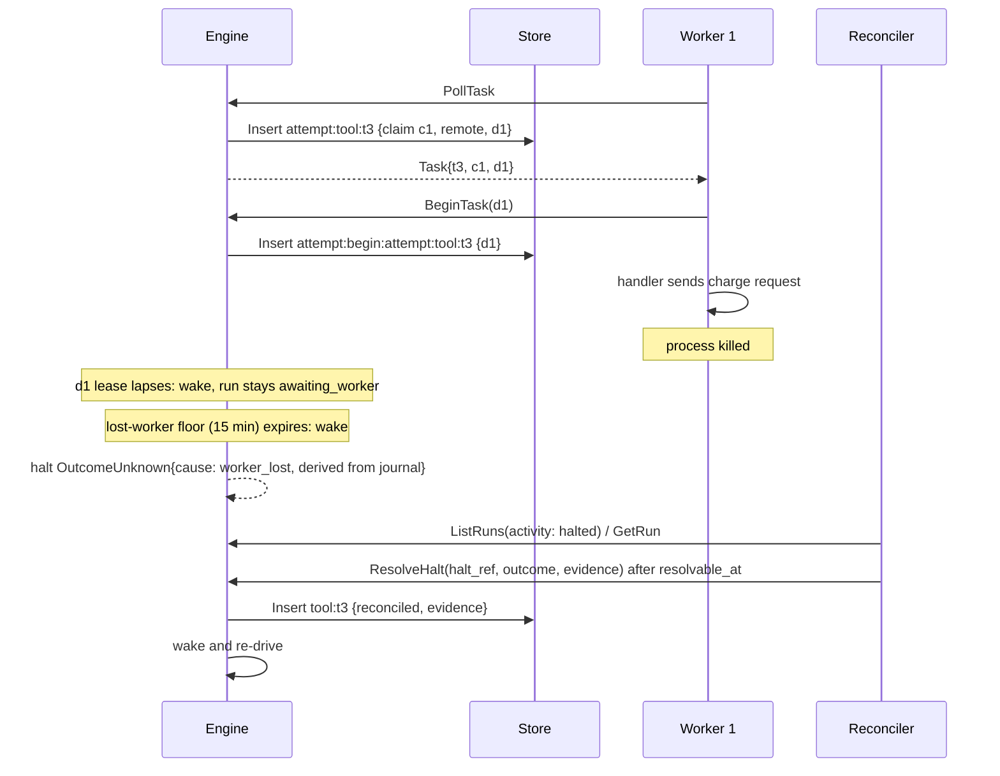
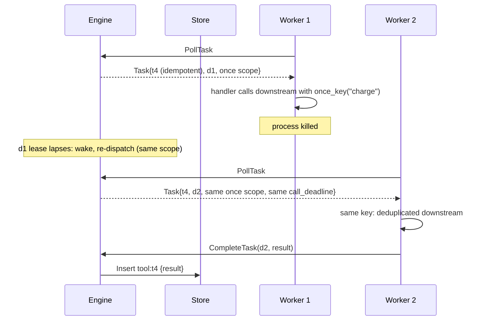
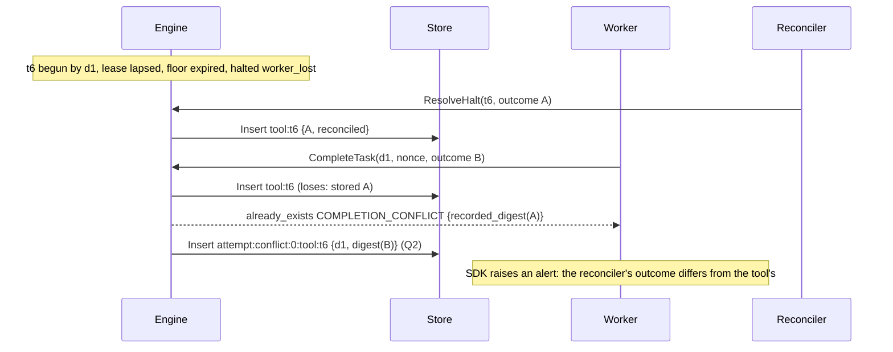
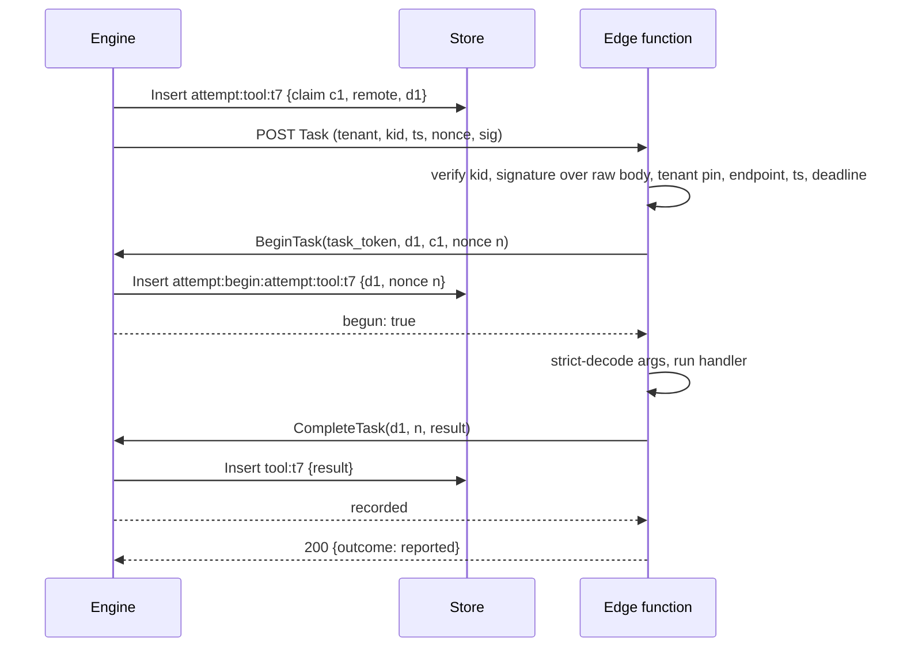

# Design: the bide protocol (`bide.protocol.v1`)

Status: **Accepted (design; not implemented).** The maintainer accepted revision 2 as the design;
nothing here is implemented, and the engine is unchanged. Implementation, and the SDKs built on it,
follow the engine hardening of the pre-1.0 API redesign (#64, "the redesign" below). The protocol's
claim rules have passed the formal model (section 18, [spec/tla/protocol](../../spec/tla/README.md#model-2-the-bide-protocols-claim-rules)),
which found two bugs in revision 2's text, fixed here (10.4 step 0, and 10.9). Revision 2 applies
the adversarial review of revision 1 and the maintainer's decisions on it; section 22 records the
disposition of every finding.

## 0. Scope

The bide protocol lets programs written in other languages (a Python SDK first, TypeScript next)
use a bide engine without reimplementing any of its guarantees. It has two named parts:

- **The client API**: start runs, read, list and stream them, cancel them, answer their pauses
  (approvals, m-of-n signed decisions, signals, interrupts, halts), administer tools, agents, push
  endpoints and approver keys, and export audit evidence.
- **The worker API**: deliver tool calls to workers, either by **pull** (a long-lived worker
  long-polls) or by **push** (the engine POSTs a signed task to a serverless or edge function), and
  accept their outcomes.

The Go engine is the **only writer** of the journal, attempt claims, leases and proofs. An SDK
never holds durable state: everything the protocol needs to survive a crash lives in the engine's
journal or in the engine's administrative store (6.6), and every protocol message that changes a
run becomes a journal operation that exists today or is marked below as engine work.

**v1 is single-node and delegates no model calls.** One engine process serves a deployment. A
second engine process over the same store is refused by the run lease, and routing across
processes (a shared dispatch table) is deferred to v1.x, as is model-call delegation (section 20).
Safety never depends on the dispatch table, so clustering can come later with no protocol change.

Also out of scope for v1: SDK-side durable steps (`Step`, `Parallel`) inside a worker's tool, pauses
raised inside a worker's tool (`Interrupt`, `Sleep`, `Await`), channels (`Enqueue`, `Ack`), flows
(`plan`) defined from an SDK, governance (`govern`), and sagas whose agent has a remote
`side_effect` tool (9.3). Section 20 sketches the deferred items.

### 0.1 Markers used in this document

- **[redesign]**: specified by the redesign (#64, open), not on `main`. The protocol depends on it.
- **[#92]**: the claim rules of #92 (P6a, open): a fresh claim ID per claim, not-started records
  keyed `attempt:not-started:<claim>:<marker>`, and no claim-held pin.
- **[engine work]**: new engine behavior this proposal requires. Section 19 collects every item.
- Everything else describes `main` at 8d01ce1, which includes #90 (the sealed `Pause` contract,
  `HaltCause` with `crashed` and `contended`, `ResolveHaltRef`, `SubmitDecision`,
  `AnswerInterrupt`, the failing `Waker`) and #99 (docs/design/formal-models.md).
- Journal writes are written as `Insert` (insert-if-absent, the redesign's `Store` port). On `main`
  the same writes go through `Durable.Do`, which has the same single-winner semantics.

### 0.2 Conventions

The key words MUST, MUST NOT, REQUIRED, SHALL, SHOULD, SHOULD NOT, RECOMMENDED, MAY and OPTIONAL
are to be interpreted as described in RFC 2119 and RFC 8174 when, and only when, they appear in all
capitals. Examples are JSON as it appears on the wire. Field names are snake_case everywhere.

---

## 1. Roles

| Role | Speaks | Holds durable state | Examples |
|---|---|---|---|
| **Engine** | serves both APIs; calls push endpoints | yes: the journal, run leases, the administrative store (6.6) | `bide serve` [engine work] |
| **Client** | client API, role `client` | no | a web backend starting runs; a CLI |
| **Admin** | client API, role `admin` | no | a deploy pipeline registering tools and endpoints |
| **Worker** | worker API (pull), role `worker` | no | a Python process with `@tool` functions |
| **Push endpoint** | receives signed task POSTs; calls back with a task token | no | a Cloudflare Worker, a Lambda function |
| **Approver** | client API, role `approver`; holds a signing key | its own key only | a human through an approval UI |
| **Reconciler** | client API, role `reconciler` | no | an operator console reading provider records |
| **Auditor** | nothing (offline) | no | `bide-audit` verifying exported evidence |

A single SDK process MAY act in several roles, each with its own credential.

---

## 2. Design principles and the invariants the protocol preserves

The protocol is a transport for the engine's existing guarantees (docs/GUARANTEE.md), not a new
execution model. Each invariant is stated normatively and tied to the journal operation that
enforces it. Section 18 requires every one of them to be checked in the formal model before the
message set is frozen.

**I1. Claim at assignment, before any byte leaves.** For a call whose effective safety is
`side_effect` (5.3), the engine creates the dispatch with no journal write, and claims the call only
when it **assigns** the dispatch to one worker or endpoint: while serving that worker's `PollTask`,
or immediately before the push POST. The claim is an `Insert` of the attempt marker
(`attempt:tool:<enc id>`, or `attempt:retry:<n>:tool:<enc id>`; `agent/keys.go`) with a fresh claim
ID [#92], and the task leaves the engine only if the stored marker carries that ID. The marker is
tagged `dispatch: "remote"` and names the `delivery_id` and the assigned principal [engine work].

**I2. At most one execution per claim.** Transport can still duplicate a task (a proxy retry, a
replayed push, a response lost after it was read). Before its handler runs, the worker MUST win
`BeginTask`, which inserts the **begin record** `attempt:begin:<marker key>` [engine work]. The
begin key holds exactly one record, written either by a worker (it names a delivery) or by the
engine as **abandoned**. The rules, exactly (10.4):

- The worker sends a **begin nonce**: 128 random bits it generates for this delivery and keeps in
  memory while it retries. A delivery `d` has begun, for the caller holding nonce `n`, if and only
  if the stored begin record has `abandoned == false`, `delivery_id == d` and `begin_nonce == n`.
  The answer comes from the stored record, never from whether this call's insert was the one that
  landed. So a worker retrying its own `BeginTask` after a lost response is answered `true` again,
  and a second holder of the same delivery (a duplicated or replayed push) is answered `false`.
- A not-started record for the attempt MAY be written if and only if the stored begin record has
  `abandoned == true`, whoever wrote it. Nothing a worker reports after a begin can void the attempt.
- The begin key is never in a shared in-process flight, and no caller derives "won" from a shared
  `inserted` flag (the double-fire class of #92's shared-flight bug; section 18 checks the bad
  reading as a `Bug` configuration).

**I3. The amended voiding rule.** #92 states that "nothing but its own holder can void the attempt".
The protocol amends it for remote markers only: a remote attempt is voided by its holder's
not-started record, or by a not-started record written under I2's rule after the begin key holds
an abandon. An effect runs only under a begin record naming its delivery, and a begin key that
holds an abandon can never name a delivery, so the claim remains executed at most once. In-process
markers (no `dispatch: "remote"`) keep #92's rule unchanged: their effect runs inside the driver
with no begin record, so the absence of one proves nothing.

**I4. Idempotent completion; conflicting completion rejected.** The call's outcome is the record
`tool:<enc id>` (`ToolResultStep`), inserted if absent. A completion byte-equal to the recorded
outcome succeeds (`already_recorded`); a different one is rejected (`COMPLETION_CONFLICT`) and
never overwrites (store requirement A6 [redesign]).

**I5. A lost worker is an unknown outcome, handled per tool safety.** When a delivery's lease lapses
without an outcome:

- `read_only` or `idempotent`: the engine re-dispatches under the same once-key scope until the
  call deadline (10.9).
- `side_effect`, no begin: the engine abandons (I2), records not-started, and dispatches afresh,
  up to `max_attempts` (10.9).
- `side_effect`, begun: the outcome is unknown. The engine records nothing, waits for a late
  completion, and after the lost-worker floor (default 15 minutes, 8.5) halts with cause
  `worker_lost`, derived from the journal (8.5).

**I6. No SDK-side durability.** An SDK MUST NOT be required to persist anything for correctness. Any
deduplication an SDK does is an optimization; correctness comes from I1 to I4. An SDK process can
be killed at any instruction.

**I7. The journal is the only truth for outcomes.** The in-memory dispatch table, SSE cursors and
delivery leases are derived state. Losing all of them (an engine restart) MUST NOT change any run's
outcome: the restarted engine re-drives runs (`RecoverLoop`) and decides each call from the journal
(6.3).

**I8. Replay and proofs.** Everything a remote call contributes is journaled by the engine, so
`Replay` needs no workers. Tool results keep the in-process record shape (`StepToolResult`). The new
records (remote markers, begin, unknown reports, conflicts) are new leaf kinds for the audit
package, so evidence that discloses them needs a proof-format bump (3.4) [engine work]; existing
verifiers keep verifying everything they verify today.

**I9. Nothing live is trusted as recorded.** Configuration that is live in-process stays live over
the protocol (tool set, safety of calls not yet claimed, approval policy of undecided calls,
limits); everything the journal records stays authoritative.

---

## 3. Versioning

### 3.1 The protocol tag

The protocol version is **`bide.protocol.v1`**. It appears in the header `Bide-Protocol` on every
request and response, in the field `protocol` of every task and push request body, and as the
Protobuf package `bide.protocol.v1`.

### 3.2 Compatibility rules within v1

1. Changes within v1 MUST be additive: new fields, RPCs, closed-set values, event types, error
   conditions, features. Field numbers and names are never reused. CI runs `buf breaking` at the
   `WIRE_JSON` level against the last released schema [engine work].
2. **Closed sets are machine-checked.** Every closed-set string field lists its values in
   `proto/bide/protocol/v1/closed_sets.json`; a Go test asserts the engine's constants equal it, and
   the conformance suite asserts SDKs handle every listed value [engine work].
3. A receiver MUST ignore unknown fields. The default Protobuf JSON parsers do the opposite, so the
   parser configuration is normative (4.6).
4. Unknown closed-set values: an unknown **event type** is skipped (7.5); an unknown **task kind** is
   refused (`not_started`, `UNSUPPORTED_TASK`); an unknown **pause kind** is surfaced as an opaque
   pause; an unknown **error condition** is handled by its category; an unknown **effective safety**
   is `side_effect` (5.3). No closed-set field may gain a value that an older peer would handle
   less safely under these rules; such a change is a new protocol version.
5. **Fail closed on absence.** Proto3 JSON omits default values, so no field's absence may relax a
   safety rule. Every rule that requires an action (begin, strict decoding, signature checks) is
   derived from fields whose absence means the stricter reading (5.3, 10.2).
6. A new protocol version is required for any change that removes a field, changes a field's
   meaning, or changes an invariant of section 2. An engine SHOULD serve the current and the previous
   protocol version for at least one minor release (the N-1 window the redesign recommends for
   journal formats).

### 3.3 Negotiation

Pull workers and clients call `MetaService/Hello` before any other call and cache the answer per
connection pool:

```json
{"protocols": ["bide.protocol.v1"], "sdk": "bide-python/0.1.0", "role": "worker",
 "features": ["push_async_ack"]}
```

```json
{
  "protocol": "bide.protocol.v1",
  "features": [],
  "engine": {
    "version": "v0.9.0",
    "journal_formats": ["bide.journal.v1-dev.1"],
    "proof_formats": ["bide.audit.proof.v3", "bide.audit.evidence.v5", "bide.audit.sth.v5"]
  },
  "limits": {
    "max_message_bytes": 4194304,
    "max_poll_wait": "30s",
    "delivery_lease_ttl": "30s",
    "heartbeat_interval": "10s",
    "clock_skew": "300s",
    "max_push_timeout": "300s"
  }
}
```

- The engine picks the first protocol in the list that it serves, else `unimplemented`/
  `PROTOCOL_UNSUPPORTED` with `supported`. `features` in the response is the intersection.
- **Push endpoints do not call `Hello`**: they are servers. `PutPushEndpoint` declares the endpoint's
  protocol range (`protocols: ["bide.protocol.v1"]`), and the engine sends only a protocol in it.
- Pre-1.0 the engine advertises `bide.protocol.v1-dev.<n>` and accepts only an exact match. The dev
  tag is bumped **only on wire-incompatible changes**, not on every schema change, because each bump
  forces a coordinated redeploy of every worker and endpoint.

### 3.4 Relation to journal and proof format versions

| Axis | Tag | Pinned where | Who reads it |
|---|---|---|---|
| protocol | `bide.protocol.v1` | per connection or endpoint | SDKs, engine |
| journal format | `bide.journal.v1-dev.N` [redesign] | per run, in the `@journal` header | engine only |
| proof formats | `bide.audit.evidence.v5`, ... [redesign] | per artifact, in its `format` field | auditors only |

- The three axes are independent; none implies another.
- **Journal keys in the protocol are opaque.** `task_id` and `attempt.key` are journal keys under the
  run's pinned format. SDKs MUST NOT parse or build them and MUST echo them verbatim.
- This proposal changes the journal: remote markers, begin records, unknown reports and conflict
  records are new record shapes, so they bump the journal dev tag [engine work].
- It also changes proofs: evidence actions are a closed set today (`tool`, `step`, `grant`, `call`,
  `approval`, `approval-tally`; `EvidenceAction.Kind`, audit/evidence.go), and `bide-audit`'s leaf
  decoding is strict. Disclosing who began a side effect, an unknown report or a conflict needs new
  kinds and a new evidence format (`bide.audit.evidence.v6` or later) [engine work]. The protocol
  version does not change when a proof format does.
- Evidence crosses the protocol as opaque bytes (`ExportEvidence`); SDKs MUST NOT re-encode it.

---

## 4. Transport, encoding and authentication

### 4.1 Decision: Protobuf schema, Connect protocol, JSON on the wire

**Source of truth:** a Protobuf schema (`proto/bide/protocol/v1/*.proto`) [engine work], served
through the **Connect protocol** (connect-go). **Normative wire encoding for SDKs:** Connect unary
over HTTP/1.1 or HTTP/2, `Content-Type: application/json`, bodies in the proto3 JSON mapping with
original (snake_case) field names. Run streaming uses Server-Sent Events (7.5).

Why:

- **It works wherever `fetch` works.** A Connect unary call is a plain `POST
  /<package>.<Service>/<Method>` with a JSON body. It needs no HTTP/2 trailers, so it runs from edge
  runtimes, Lambda, `curl`, and browsers through the application's backend. Raw gRPC does not. The
  same handler also serves gRPC and gRPC-Web.
- **One schema, checked evolution.** Field numbers plus `buf breaking` make 3.2 a CI gate. OpenAPI
  has no equally precise wire-compatibility check, and its `oneOf` generators are uneven; tasks,
  pauses and events are unions.
- **Generators exist for the first two SDKs** (`protobuf-es`/`connect-es`; the Python protobuf
  runtime). Hand-written types are allowed; the conformance suite is the arbiter.
- **OpenAPI 3.1 is generated** from the schema for documentation, non-normative, checked in CI.

Costs accepted:

- **JSON whose bytes matter travels as strings** (`args_json`, `result_json`, `message_json`,
  `payload_json`). The journal keeps a `json.RawMessage` byte for byte except insignificant
  whitespace (`EncodeRecord`, `agent/record.go`), and approvals bind a digest of the canonical
  arguments (5.6). `google.protobuf.Struct` would turn numbers into float64 and reorder keys.
- **int64 fields are JSON strings** in proto3 JSON (token counts). Parsers MUST accept a string or a
  number. Times use `google.protobuf.Timestamp`, durations `google.protobuf.Duration`.
- **Closed sets are strings, not Protobuf enums**, with the engine's values (`"stop"`,
  `"crashed"`, `"read_only"`), machine-checked (3.2 item 2).

### 4.2 Services and paths

| Service | Part | Methods |
|---|---|---|
| `MetaService` | both | `Hello`, `GetSigningKeys` |
| `RunService` | client | `StartRun`, `GetRun`, `ListRuns`, `StreamRun`, `CancelRun`, `SendSessionMessage`, `ExportEvidence` |
| `PauseService` | client | `Approve`, `SubmitDecision`, `Signal`, `AnswerInterrupt`, `ResolveHalt` |
| `AdminService` | client | `PutTools`, `GetTools`, `PutAgent`, `GetAgent`, `PutPushEndpoint`, `VerifyPushEndpoint`, `PutApproverKeys`, `PutLocalToolAllowlist`, `PutApiKey`, `RevokeApiKey` |
| `WorkerService` | worker | `PollTask`, `BeginTask`, `Heartbeat`, `CompleteTask`, `FailTask` |

All services are in package `bide.protocol.v1`. A unary method is `POST
/bide.protocol.v1.<Service>/<Method>`. `StreamRun` is also served as SSE at `GET
/v1/runs/{run_id}/events`.

### 4.3 Authentication

The engine MUST authenticate every request. It supports:

- **API keys**: `Authorization: Bearer bide_<kind>_<random>`, bound server-side to one tenant, a key
  ID and a set of roles. Keys are stored hashed and never logged.
- **mTLS** (RECOMMENDED for pull workers): the certificate's SPIFFE ID or subject maps to a tenant and
  roles. It MAY be combined with an API key.
- **Task tokens** (4.5): scoped to one delivery; the only credential a push endpoint needs.

The authenticated principal (key ID or certificate identity) is recorded on the claim, the begin
record, the result, every unknown report and every pause answer [engine work], so evidence names
the credential behind each act.

### 4.4 Authorization: methods by role

This table is normative. A call not allowed to any of the caller's roles fails with
`permission_denied` before any effect.

| Method | client | approver | reconciler | worker | admin | task token |
|---|---|---|---|---|---|---|
| `Hello`, `GetSigningKeys` | yes | yes | yes | yes | yes | no |
| `StartRun`, `SendSessionMessage`, `CancelRun` | yes | no | no | no | yes | no |
| `GetRun`, `ListRuns`, `StreamRun` | yes | yes | yes | no | yes | no |
| `ExportEvidence` | yes | no | yes | no | yes | no |
| `Approve`, `SubmitDecision` | no | yes | no | no | no | no |
| `Signal`, `AnswerInterrupt` | yes | no | no | no | yes | no |
| `ResolveHalt` | no | no | yes | no | no | no |
| every `AdminService` method | no | no | no | no | yes | no |
| `PollTask` | no | no | no | yes | no | no |
| `BeginTask`, `Heartbeat`, `CompleteTask`, `FailTask` | no | no | no | yes, own deliveries only (10.8) | no | yes, its delivery only |

Admin-only registration closes the path in which a leaked `client` key registers an attacker URL
declaring a real tool's digest and receives its tasks. Browsers MUST NOT hold any credential in v1;
a browser talks to the application's backend (browser-scoped tokens are deferred, section 20).

### 4.5 Task tokens

A task token is stateless, so it survives engine restarts, and is verified only by the engine:

```
bide_tt_<base64url(payload)>.<base64url(HMAC-SHA256(key[kid], "bide.tasktoken.v1\n" || payload))>
```

`payload` is the canonical JSON (5.6) of:

```json
{"v": 1, "kid": "tt-2026-09", "tenant": "acme", "run_id": "acme/order-1234",
 "task_id": "tool:toolu_03ZZ", "delivery_id": "dlv_01J9Q2W8X4K6",
 "begin_until_ms": 1790690611500, "complete_until_ms": 1790777011500}
```

- `begin_until_ms` is the delivery's deadline: after it, `BeginTask` is refused.
- `complete_until_ms` is `deadline + late_completion_grace` (default 24 h): `Heartbeat`,
  `CompleteTask` and `FailTask` for the delivery are accepted until then, and only for a delivery
  that has begun (or, for a retry-safe task, was assigned).
- Both limits are enforced on the **engine clock**, for every credential, not only for task tokens:
  a worker using its API key gets the same cutoffs.
- The HMAC key is held in the engine's secret store (6.6), never in the journal database, and
  rotated by `kid` with an overlap of at least `complete_until_ms` minus issue time. HMAC is right
  here because only the engine ever verifies these tokens; push signatures are asymmetric (12.2)
  because endpoints verify them.

### 4.6 Parser configuration (normative)

Default Protobuf JSON parsers reject unknown fields. SDKs MUST configure them to ignore unknown
fields: Python `json_format.Parse(..., ignore_unknown_fields=True)`, `protobuf-es`
`fromJson(..., {ignoreUnknownFields: true})`, Go `protojson.UnmarshalOptions{DiscardUnknown: true}`.
The engine does the same for requests. Conformance tests W15 and C10 check it.

### 4.7 Tenancy

- Every credential maps to exactly one tenant ID matching `[a-z0-9][a-z0-9-]{0,62}`.
- Every run ID of a tenant MUST begin with `<tenant>/`, else `permission_denied`/`TENANT_MISMATCH`.
  This is the redesign's run-ID prefix convention (D4). The protocol uses the full journal run ID
  everywhere, because the run ID is bound into approval signatures and proofs.
- Run IDs otherwise follow `checkRunID`: non-empty, no `>` (only derived IDs carry it: a sub-agent's
  `<parent>><enc tool id>`, `SubRunID`; a session turn `<session>>@turn/<n>`).
- Tool registrations, agents, push endpoints, approver keys and task queues are namespaced by
  tenant. The engine MUST NOT deliver a task to another tenant's worker or endpoint, and MUST NOT
  accept any call about a run of another tenant.

### 4.8 Common headers

| Header | Direction | Meaning |
|---|---|---|
| `Bide-Protocol` | both | 3.1 |
| `Bide-Request-Id` | request | OPTIONAL, echoed in logs and errors |
| `traceparent`, `tracestate` | both | W3C trace context, propagated into tasks (10.1) [engine work] |
| `Retry-After` | response | seconds, on `unavailable` and `resource_exhausted` |

---

## 5. Common types

### 5.1 Message

The engine's `Message` wire form (`agent/message.go`):

```json
{"role": "user", "parts": [{"type": "text", "text": "Refund order 1234"},
                           {"type": "image", "mime": "image/png", "data": "iVBORw0KGgo="}]}
```

Part types: `text`, `reasoning`, `tool_use` (`id`, `name`, `args`, `signature`), `tool_result`,
`image`. A `Message` travels as a `message_json` string holding exactly this JSON.

### 5.2 Usage

`{"input_tokens": "812", "output_tokens": "96", "cache_read_tokens": "0", "cache_write_tokens": "0"}`.
`usage` covers recorded responses; `spend` every request billed (#69).

### 5.3 Safety, approval policy, effective safety

```json
{"safety": {"read_only": false, "idempotent": false},
 "approval": {"need": 2, "approvers": ["finance", "legal"]}}
```

- `safety` is `agent.Safety{ReadOnly, Idempotent}`, plain data with exactly these two fields, as
  journaled on each tool result (`{"read_only": ..., "idempotent": ...}`).
- `approval` is the tool's approval gate, `ToolSpec.Approval`: an `ApprovalPolicy{Need, Approvers}`,
  kept apart from `safety`. `{"need": 1, "approvers": []}` is the 1-of-1 gate on the wire, and
  an SDK maps it to `agent.SingleApproval()`. The Go API never infers that gate from a policy's
  shape: an `ApprovalPolicy` literal with no approvers is `ErrConfig`, and only
  `SingleApproval()` asks for one decision. Any other policy MUST pass `ApprovalPolicy.Validate`. An absent `approval` is an ungated tool.
- Naming follows redesign P12 (#117), which split the approval gate from `Safety` into
  `ToolSpec.Approval` and removed the per-tool idempotency-key function. The names here were
  updated to match; the wire semantics of this section are unchanged.
- **Effective safety** is computed by the engine per call: `read_only`, `idempotent` or
  `side_effect`. A call with a marker is `side_effect` whatever its tool says now.
- **Fail closed:** an SDK MUST treat any `effective_safety` value other than exactly `read_only` or
  `idempotent` (including absent, empty or unknown) as `side_effect`, and MUST require a won
  `BeginTask` for every `side_effect` task whatever other fields say. There is no flag that
  disables begin for a `side_effect` task. Conformance test W19 checks it.

### 5.4 Pause

The union of `main`'s sealed pause types (`agent/pause.go`, `agent/halt.go`), tagged by `kind`:

| `kind` | Go type | Fields |
|---|---|---|
| `approval` | `ApprovalPending` | `ref`, `tool_use_id`, `tool_name`, `args_json`, `subject`, `quorum` |
| `interrupt` | `InterruptPending` | `ref`, `name`, `prompt_json` |
| `signal` | `SignalPending` | `ref`, `name` |
| `timer` | `TimerPending` | `ref`, `name`, `fire_at` |
| `outcome_unknown` | `OutcomeUnknown` | `ref`, `halt_ref`, `attempted_at`, `cause`, `resolvable_at` |

`ref` is `RunRef{run_id, root_run_id}`: `run_id` is the journal an answer goes to (a sub-run for a
gate inside a sub-agent); `root_run_id` is the run the engine re-drives. `halt_ref` is
`{run_id, op: {kind: "tool"|"step", id, tool_name}}` with **no cause**: the engine derives the cause
from the journal (8.5). `cause` is shown for information: `crashed`, `contended`, or `worker_lost`
[engine work]. `resolvable_at` is when `ResolveHalt` will first be accepted.

`subject` for an approval is 8.2's approval subject: the **dispatched** arguments (after tool
middleware) and the tool's spec digest.

### 5.5 Error

Every error response is a Connect error whose details include one `bide.protocol.v1.ErrorInfo`; the
engine MUST also put its proto3 JSON in the detail's `debug` field:

```json
{"code": "failed_precondition",
 "message": "run acme/order-1234 was started with a different input",
 "details": [{"type": "bide.protocol.v1.ErrorInfo", "value": "CgZjb25maWcS...",
              "debug": {"category": "config", "condition": "RUN_START_MISMATCH",
                        "run_id": "acme/order-1234", "retryable": false}}]}
```

`category` is one of `config`, `model`, `tool`, `storage`, `protocol`, `budget` (`agent/errors.go`),
or empty for conditions with no category. Section 14 maps every condition.

### 5.6 Canonical JSON (`bide.cjson.v1`)

Approval signatures, spec digests and task tokens hash **canonical JSON**. It is specified byte by
byte so that Go, Python and TypeScript produce identical bytes. It deliberately does not follow
`encoding/json` (whose escaping differs between Go versions and between the v1 and v2 JSON
implementations) nor RFC 8785 (which rewrites number literals and sorts by UTF-16 code units).

Input acceptance. The input MUST be exactly one JSON value (RFC 8259) in valid UTF-8, with optional
insignificant whitespace around tokens. It MUST NOT contain an object with two members of the same
name (after unescaping), or a `\u` escape of a lone surrogate. Anything else is rejected, never
repaired: there is no fallback to raw bytes and no U+FFFD substitution.

Output:

1. No insignificant whitespace.
2. `true`, `false`, `null` as themselves.
3. **Numbers:** the input literal, byte for byte (it already matches the JSON number grammar).
4. **Strings:** `"`, then each code point of the unescaped value, then `"`. A code point is written
   as: U+0022 as `\"`; U+005C as `\\`; U+0008 as `\b`; U+0009 as `\t`; U+000A as `\n`; U+000C as
   `\f`; U+000D as `\r`; any other code point below U+0020 as `\u00` plus two lowercase hex digits;
   U+2028 as `
`; U+2029 as `
`; every other code point (including `/`, `<`, `>`, `&`,
   U+007F and all non-ASCII) as its UTF-8 bytes.
5. **Objects:** `{`, members sorted by name in ascending order of the names' **UTF-8 byte
   sequences** (equivalently, code point order; not UTF-16 code unit order, so JavaScript MUST NOT
   use the default string comparison), each written as the canonical name string, `:`, the canonical
   value, separated by `,`, then `}`.
6. **Arrays:** `[`, canonical elements in input order separated by `,`, then `]`.

The conformance fixtures (17.3) include vectors for each rule: escapes in names and values, U+2028,
U+007F, supplementary-plane characters (whose UTF-16 order differs from code point order), `\/` in
the input, number literals such as `1.50`, `1e20`, `-0`, `1E+2`, and each rejection (duplicate name,
lone surrogate, invalid UTF-8, trailing data).

`ApprovalDecisionBytes` v2 on `main` uses `canonicalArgs`, which is `encoding/json` based and has the
behaviors listed above as rejected. Approval bytes v3 (8.2) use `bide.cjson.v1` [engine work].

### 5.7 Spec digests

A spec digest is `sha256:` plus the lowercase hex SHA-256 of the canonical JSON of the `ToolSpec`
with `timeout` written as the integer `timeout_ms` and the embedded schemas parsed and embedded as
JSON values (not strings). **The engine computes digests; SDKs never do.** `PutTools` returns every
tool's digest, and a worker declares the digests it was given. An SDK that computed its own could
disagree over an escaping detail and receive `SPEC_MISMATCH` on every task.

---

## 6. The drive model

This section specifies how the engine executes a run whose tools are remote. It replaces
revision 1's unstated model. A drive never blocks on a worker.

### 6.1 Drives and suspension

A **drive** is one execution of the agent loop for a root run under its run lease (`Lease`,
`agent/lease.go`), from `Load` to one of: a terminal record, a pause, a halt, an error, or a
**suspension**. The engine runs at most one drive per root run at a time.

Within a drive, each model turn's tool calls are handled as today (approval pre-pass, parallel
execution) with one change for a remote tool: instead of calling it, the drive ensures a dispatch
exists for the call (6.3) and treats the call as **pending**. When every in-process call of the turn
has recorded its outcome and at least one remote call is pending, the drive ends with a suspension:
it records nothing, releases the run lease, and sets the run's `activity` to `awaiting_worker`. No
goroutine and no lease is held while a worker runs.

A suspension is not a `Pause`: it needs no answer from a person, it is not returned to a client as a
pause, and it is not journaled. It is visible only as `activity` and through `dispatch_waiting`
events.

### 6.2 Wake events and re-drive

A suspended run is re-driven when any of these happens:

1. an outcome is recorded for one of its pending calls (`CompleteTask`, `FailTask` with `failed`, a
   push response);
2. a pending call's worker reports `not_started` or `unknown`;
3. a delivery's lease lapses, a delivery's deadline passes, a call deadline passes, or a
   lost-worker floor expires (engine timers);
4. a pause answer or a `CancelRun` for the run;
5. engine startup (`RecoverLoop` re-drives every non-terminal run).

Wakes are coalesced per root run: a wake while a drive is running sets a `dirty` flag, and the drive
is repeated once when it ends if the flag is set; otherwise the wake schedules a drive. A wake never
races a drive: both run on the run's single scheduler slot. Timers are in memory; after a restart,
item 5 re-derives every timer from the journal and the delivery table's absence (6.3).

A re-drive replays the journal as any resume does (one `Load`, no point reads: begin records and
unknown reports are journal entries read in that `Load`, so the redesign's resume budget row "no
point reads for markers" holds).

### 6.3 The resume gate for remote calls

For each remote call of the current turn with no recorded result, the re-drive decides from the
journal and the in-memory dispatch table:

| Journal state | Dispatch table | Decision |
|---|---|---|
| no marker (retry-safe, or side effect not yet assigned) | dispatch exists | pending |
| no marker | none (restart, or first drive) | create dispatch; pending |
| retry-safe, unknown report journaled, call deadline not passed | any | re-dispatch under the same once-key scope (10.9); pending |
| retry-safe, deliveries exhausted or call deadline passed | any | `read_only`: record `is_error` with condition `DELIVERY_EXHAUSTED` if no delivery ever reported `unknown`, otherwise halt with cause `crashed`. `idempotent`: halt, with cause `crashed` if an unknown report is journaled and `worker_lost` otherwise; never `DELIVERY_EXHAUSTED` (10.9) |
| remote marker, no begin record, its delivery live (lease not lapsed) | yes | pending (never abandon a delivery that looks live; the begin key still decides) |
| remote marker, no begin record, delivery lapsed or unknown to this process | none, or lapsed | abandon: insert the begin key as `abandoned`; read the stored record. Stored abandon: insert `attempt:not-started:<claim>:<marker>` [#92] and create a new dispatch, unless `max_attempts` is reached, then record `is_error` with `DELIVERY_EXHAUSTED`. Stored begin: continue with the next row |
| remote marker, begin names delivery `d`, no result, `d` live or within the lost-worker floor | any | pending (`activity: awaiting_worker`) |
| remote marker, begin names `d`, no result, floor expired | any | halt: `OutcomeUnknown{cause: worker_lost}` |
| remote marker, begin names `d`, unknown report from `d` journaled | any | halt: `OutcomeUnknown{cause: crashed}` |
| in-process marker (no `dispatch: "remote"`), no result | n/a | today's rule: halt (`crashed` or `contended`) |

`max_attempts` (default 5) and `max_deliveries` (default 10) are per call and configurable per tool
(`ToolSpec.max_attempts`, `ToolSpec.max_deliveries`) [engine work]. A capped call records a tool
error, which is truthful: a side-effect call is capped only through abandons, each proving no worker
began, so no effect ran.

### 6.4 Pause answers and cancellation

A pause answer writes its record, then wakes the root run (6.2 item 4). In v1 there is one engine
process, so the answer and the drive are on the same scheduler; routing an answer to a lease held by
another node is a v1.x concern (section 20).

`CancelRun` writes `run:cancelled` [redesign]. The next drive sees it before starting any claim:
unassigned dispatches are withdrawn (nothing was journaled for them), assigned but unbegun deliveries
are left to lapse (a late `BeginTask` for them is refused because the run is cancelled, and the
re-drive abandons them), and begun deliveries finish and record their outcomes.

---

## 7. Client API: runs

### 7.1 StartRun

Starts a run, or returns the existing run with that ID. Idempotent through `run:start` (#70).

```json
{
  "run_id": "acme/order-1234",
  "agent": "support",
  "input_json": "{\"role\":\"user\",\"parts\":[{\"type\":\"text\",\"text\":\"Refund order 1234\"}]}",
  "options": {
    "max_turns": 12,
    "token_budget": "200000",
    "tools": ["lookup_order", "issue_refund"],
    "saga": false
  },
  "principal": {"on_behalf_of": "user:42", "authority_ref": "ticket:SUP-991"},
  "wait": {"until": "pause_or_end", "timeout": "20s"}
}
```

- The engine validates the run ID (4.7) and agent, writes `@journal` [redesign] and `run:start` if
  absent, and wakes the run.
- `run:start` records the settings (`RunSettings`, `Tools`, `Saga` [redesign]), the asserted
  `principal` [redesign], and **`started_by`**: the authenticated key ID or certificate identity of
  the caller [engine work]. `principal` is what the client asserts; `started_by` is what the engine
  verified. Tasks carry both, separately (10.1), so a tool never mistakes an assertion for
  authentication.
- A matching retry returns `created: false`. A differing input, saga flag, output mode, tool filter,
  system prompt, sampling, tool choice or principal fails with `failed_precondition`/`config`/
  `RUN_START_MISMATCH`. Differing `max_turns` or `token_budget` is an amendment (`run:limits:<n>`
  [redesign]), reported as `amended: true`.
- `saga: true` for an agent with any remote `side_effect` tool fails with `failed_precondition`/
  `config`/`SAGA_REMOTE_UNSUPPORTED` until remote compensation is designed (section 20).
- `wait.until`: `none` (default) or `pause_or_end` (long-poll up to `max_poll_wait`).

Response (`Run`, shared with `GetRun` and `ListRuns`):

```json
{
  "run": {
    "run_id": "acme/order-1234",
    "agent": "support",
    "journal_format": "bide.journal.v1-dev.1",
    "status": "started",
    "activity": "awaiting_worker",
    "pause": null,
    "pending_tasks": [{"task_id": "tool:toolu_03ZZ", "tool": "charge_card", "state": "begun"}],
    "result": null,
    "usage": {"input_tokens": "1650", "output_tokens": "210"},
    "spend": {"input_tokens": "1650", "output_tokens": "210"},
    "records": 7,
    "updated_at": "2026-09-30T14:03:11.204Z"
  },
  "created": true,
  "amended": false
}
```

- `status` is `RunState` [redesign]: `not_started`, `started`, `completed`, `aborted`, `cancelled`.
  It comes from the journal.
- `activity` is engine state: `running`, `awaiting_worker`, `paused`, `halted`, `failed`, `idle`. It
  is exact on a single node except after a restart, until the run is re-driven (6.2 item 5).
- `result` for `completed`: `{"message_json", "output_json", "usage", "spend", "turns"}`.

### 7.2 GetRun

`{"run_id": "...", "wait": {"until": "change", "after_records": 7, "timeout": "20s"}}` returns
`{"run": Run}`, long-polling until the record count exceeds `after_records` or `activity` changes.
A run with no `run:start` is `not_found`/`RUN_NOT_FOUND`.

### 7.3 ListRuns

`{"prefix": "acme/", "activity": ["halted", "paused"], "status": ["started"], "page_size": 100,
"page_token": ""}` returns `{"runs": [Run], "next_page_token": "..."}` [engine work]. The prefix
MUST be within the caller's tenant. Reconcilers use it to find halted runs; it pushes filters to the
store through `RunFilter` [redesign].

### 7.4 SendSessionMessage

Maps `Session.SendOnce` (`agent/session.go`):

```json
{"session_id": "acme/chat-77", "agent": "support",
 "input_json": "{\"role\":\"user\",\"parts\":[{\"type\":\"text\",\"text\":\"and the other order?\"}]}",
 "once_key": "msg-5f1c-7a2e", "wait": {"until": "pause_or_end", "timeout": "20s"}}
```

`once_key` is **REQUIRED**. Every write in this protocol is safe to retry (14.4), and a session send
without a key is not: a retry after a lost response would start a second user turn whose tool calls
get new IDs and new once scopes, so a side effect could happen twice for one intent. The SDK
generates one key per logical send (a UUIDv7 or the application's message ID) and reuses it on
every retry. The turn run is `<session>>@event/<enc key>` (`sessionEventRunID`).

### 7.5 StreamRun (SSE)

`GET /v1/runs/{run_id}/events` with `Accept: text/event-stream`, `Authorization`, `Bide-Protocol`,
optionally `Last-Event-ID`; also the Connect server-streaming method `RunService/StreamRun`.

```
id: j:5
event: tool_completed
data: {"v":1,"run_id":"acme/order-1234","type":"tool_completed","tool_completed":{"tool_use_id":"toolu_01H8","name":"lookup_order","result_json":"{\"status\":\"paid\"}","is_error":false}}
```

| `type` | Durable | Source | Payload |
|---|---|---|---|
| `turn_started` | no | `TurnStarted` | `seq` |
| `model_delta` | no | `ModelEvent` | `text`, `reasoning` or `tool_call` fragment |
| `turn_restarted` | no | `TurnRestarted` | `seq`; discard deltas since the last start or restart |
| `assistant_turn` | yes | `AssistantTurn` | `message_json`, `replayed` |
| `tool_started` | no | `ToolStarted` (for a remote call: its begin) | `tool_use_id`, `name`, `args_json` |
| `tool_completed` | yes | `ToolCompleted` | `tool_use_id`, `name`, `result_json`, `is_error` |
| `approval_required` | no | `ApprovalRequired` | `tool_use_id`, `name`, `args_json`, `quorum` |
| `dispatch_waiting` | no | a dispatch has no live worker [engine work] | `task_id`, `tool` |
| `suspended` | no | the drive suspended (6.1) | `pending_tasks` |
| `paused` | no | the drive returned a pause | `pause` |
| `halted` | no | the drive returned `OutcomeUnknown` | `pause` |
| `finished` | yes | `Finished` | `message_json`, `output_json` |
| `run_failed` | no | the drive ended in an error | `error` |
| `run_cancelled` | yes | `run:cancelled` [redesign] | `reason` |
| `run_aborted` | yes | `run:aborted` | none |

1. **Ignore unknown types.** A consumer MUST skip an unknown `type` without error.
2. **Durable events** are those `ProjectEvents` derives from the journal plus terminal records. Their
   `id` is `j:<index>` (position in `Load` order). They are delivered exactly once, in journal order,
   per stream; a reconnect with `Last-Event-ID: j:<k>` resumes after `k`. A stream with no
   `Last-Event-ID` starts at position 0.
3. **Live events** have `id` `l:<drive>:<n>`, are best effort and are not replayed. A `Last-Event-ID`
   of the `l:` form resumes after the last durable ID sent before it on that stream if the engine
   still holds the mapping, else at `j:0`.
4. `data` carries `v: 1` and `run_id`. Sub-run events are not forwarded in v1.
5. A comment `: ping` is sent at least every 15 s. The stream stays open across suspensions (they
   are not the end of a drive the client can act on) and ends after a terminal event, a pause, a halt
   or a failure.
6. SDKs MUST use a fetch-based SSE reader; `EventSource` cannot send `Authorization`, and credentials
   MUST NOT go in the query string.

### 7.6 CancelRun

`{"run_id": "acme/order-1234", "reason": "customer withdrew"}` writes `run:cancelled {reason, by}`
[redesign D1; `by` is engine work] and wakes the run (6.4). Idempotent; the first reason is kept.
Cancelling a finished run fails with `failed_precondition`/`RUN_FINISHED`.

### 7.7 ExportEvidence

`{"run_id": "...", "kind": "evidence"}` (or `run_certificate`, or `proof` with `record_names`)
returns `{"format": "bide.audit.evidence.v6", "artifact": "<base64>"}`, the bytes the audit package
produced, unmodified. Verification is offline with `bide-audit` (only exit code 0 means verified).

---

## 8. Client API: pause answers

Every answer writes one journal record through the engine's existing verb, records the answering
principal [engine work], and wakes `ref.root_run_id` unless `resume: false`. Resubmitting an
identical answer succeeds with `recorded: false`; a different answer to an answered pause fails with
`already_exists`/`ALREADY_ANSWERED` carrying the recorded answer's digest [engine work: `Signal`
and `AnswerInterrupt` keep the first record silently today]. Answers go to `ref.run_id`, which for
a pause inside a sub-agent is the sub-run.

### 8.1 Approve (1-of-1)

`{"run_id": "acme/order-1234", "tool_use_id": "toolu_02QQ", "approved": true}` writes
`approval:<enc id>` (`Approve`, `agent/halt.go`) with the approver credential's key ID
[engine work]: an unsigned decision is attributable only to the credential that submitted it, so
the journal names it. A recorded denial is final (#70). `Approve` and `SubmitDecision` never satisfy
each other's gate. Errors: `not_found`/`NO_SUCH_CALL`, `already_exists`/`ALREADY_ANSWERED`.

### 8.2 SubmitDecision (m-of-n, signed)

```json
{"run_id": "acme/order-1234", "tool_use_id": "toolu_02QQ", "approver_id": "legal",
 "approved": true, "alg": "ed25519", "signature": "3q2+7w...=="}
```

**Approvals bind what is dispatched.** On `main`, the gate signs the model's arguments
(`ApprovalPending.Args`, `agent/loop.go`) and tool middleware may change them afterwards. The
protocol binds the arguments the worker will receive, after tool middleware, and the spec digest the
task will carry [engine work: tool middleware's argument rewriting runs before the gate for remote
tools, and the gate's subject is its output]. The approval subject is:

```json
{"run_id": "acme/order-1234", "tool_use_id": "toolu_02QQ", "tool_name": "issue_refund",
 "args_json": "{\"order\":\"1234\",\"amount_cents\":1250}", "spec_digest": "sha256:91aa..."}
```

The approver signs **approval bytes v3** [engine work]:

```
"bide.approval.v3\n"
len32(run_id) run_id
len32(tool_use_id) tool_use_id
len32(tool_name) tool_name
SHA-256(bide.cjson.v1(args_json))          32 bytes
len32(spec_digest) spec_digest
len32(approver_id) approver_id
1 byte: 1 approve, 0 deny
```

`len32` is a 4-byte big-endian length. Arguments that are not valid canonical-JSON input (5.6) are
refused before the gate (`TOOL_ARGS`), so there is no fallback form.

- The SDK MUST compute these bytes itself from the pause's `subject`, MUST show the approver the
  tool name, the arguments and the spec's description, and MUST NOT sign bytes supplied by the
  engine. Golden vectors are in the fixtures (17.3).
- The engine always runs the decision check (`SubmitDecision` with `WithDecisionCheck`) against the
  tenant's approver keys (`PutApproverKeys`, 9.5): `invalid_argument`/`config`/`INVALID_APPROVAL`,
  `already_exists`/`config`/`ALREADY_DECIDED`.
- The response carries the `quorum` tally (`ApprovalTally`) and `passed`/`unreachable`.
- `alg`: `ed25519` (REQUIRED in SDKs); `ml-dsa-65` and the hybrid (OPTIONAL).
- **The task carries the approval reference** (10.1): the decision and tally record names, the
  approved `args_digest` and the `spec_digest`. A worker SHOULD check that its `args_json` hashes to
  `args_digest` and that `spec_digest` matches its handler, and otherwise report `not_started`/
  `APPROVAL_MISMATCH` before `BeginTask`.

### 8.3 Signal

`{"run_id": "...", "name": "payment_confirmed", "payload_json": "{\"txn\":\"t_9\"}"}` writes
`signal:<name>` (`Signal`, `agent/pause.go`). A signal to a run with no `run:start` is refused
(`not_found`/`RUN_NOT_FOUND`) unless `allow_before_start: true` [engine work].

### 8.4 AnswerInterrupt

`{"run_id": "...", "name": "confirm_address", "value_json": "{\"ok\":true}"}` writes
`interrupt:<name>` (`AnswerInterrupt[T]`, `agent/pause.go`).

### 8.5 ResolveHalt

```json
{"halt_ref": {"run_id": "acme/order-1234", "op": {"kind": "tool", "id": "toolu_03ZZ", "tool_name": "charge_card"}},
 "outcome": {"result_json": "{\"charge\":\"ch_77\"}", "is_error": false,
             "evidence_json": "{\"stripe_charge\":\"ch_77\"}"},
 "min_halt_age": "120s"}
```

Writes the reconciled result under `tool:<enc id>` (`ResolveHaltRef`, `agent/halt.go`, which on
`main` takes the cause from the caller's `HaltRef.Cause`). Over the protocol:

- **The cause and floor are derived from the journal, never from the request** [engine work]. The
  wire `halt_ref` has no `cause`. The engine reads the call's records: a remote marker with a begin
  record and no unknown report means `worker_lost`; a journaled unknown report, or an in-process
  marker with no live driver, means `crashed`; an in-process marker another driver won means
  `contended`.
- **Floors.** `worker_lost`: not accepted until `lost_worker_floor` after the later of the begin
  record's `attempted_at` and the delivery's last heartbeat, measured on the engine clock. The floor
  is configurable per engine and per tool (`ToolSpec.lost_worker_floor`) and defaults to **15
  minutes**. `contended`: `WithMinHaltAge` as on `main`, with `min_halt_age` from the request and an
  engine minimum. Too early: `failed_precondition`/`HALT_TOO_YOUNG` with `resolvable_at`.
- **`WithoutLiveDriverCheck` is never reachable over the wire.**
- `ResolveHaltRef` must accept `worker_lost` and the unknown-report anchor for retry-safe calls
  (10.9) [engine work].
- A late completion after a resolution with a different outcome is rejected (`COMPLETION_CONFLICT`)
  and recorded as a conflict (Q2).

---

## 9. Client API: administration

All methods here require the `admin` role (4.4).

### 9.1 PutTools

```json
{
  "task_queue": "payments",
  "tools": [{
    "name": "charge_card",
    "title": "Charge a card",
    "description": "Charge a saved card for an order.",
    "input_schema_json": "{\"type\":\"object\",\"properties\":{\"customer\":{\"type\":\"string\"},\"amount_cents\":{\"type\":\"integer\"}},\"required\":[\"customer\",\"amount_cents\"]}",
    "output_schema_json": "{\"type\":\"object\"}",
    "safety": {"read_only": false, "idempotent": false},
    "approval": {"need": 1, "approvers": []},
    "timeout": "20s",
    "max_attempts": 5,
    "lost_worker_floor": "900s"
  }],
  "mode": "merge",
  "if_match": "sha256:7c1d..."
}
```

- This is `ToolSpec` [redesign] plus the protocol's per-tool limits. Validation mirrors `New`: unique
  names valid for every provider adapter, not `final_answer`, an input schema in the supported subset
  (10.3), a valid approval policy, a positive timeout. Failures: `invalid_argument`/`config`.
- `if_match` is the queue's current `tool_set_digest`. A mismatch fails with `failed_precondition`/
  `TOOL_SET_CHANGED`. It is REQUIRED for `mode: "replace"`, so a replace built by an older SDK that
  does not know newer fields cannot silently drop them.
- The response returns every `spec_digest` (5.7) and the new `tool_set_digest`.

**In-flight runs when tools change** (the in-process "live by design" rules at defined points):

1. Model-visible specs are read per model turn; each turn journals `ToolsDigest` [redesign].
2. A call's spec is fixed when its dispatch is created; the task carries that `spec_digest`.
3. A dispatch is offered only to workers or endpoints serving that exact digest.
4. A dispatch whose digest no live worker serves for `dispatch_timeout` (default 60 s) is re-created
   under the current spec. An unassigned side-effect dispatch has no marker, so this writes nothing;
   an assigned one is handled by 6.3.
5. Safety changes apply to calls not yet claimed; a claimed call stays `side_effect`.
6. Approval changes apply to calls with no recorded decision; a recorded denial stays final. A spec
   change after approval changes the spec digest, so an approval over the old digest no longer
   matches the task and the gate asks again [engine work].
7. A removed tool: a pending call with no marker fails with `ErrUnknownTool`; a call with a marker
   and no result follows 6.3.

### 9.2 GetTools

Returns specs, digests, the `tool_set_digest`, and per digest the live workers and endpoints.

### 9.3 PutAgent

```json
{
  "name": "support",
  "model": {"provider": "anthropic", "model": "claude-sonnet-4-5"},
  "system_prompt": "You are the refunds agent.",
  "tools": [{"task_queue": "payments", "names": ["charge_card", "issue_refund"]},
            {"task_queue": "@local", "names": ["lookup_order"]}],
  "defaults": {"max_turns": 20, "token_budget": "500000", "max_concurrency": 4},
  "sub_agents": [{"tool_name": "research", "agent": "researcher"}]
}
```

- Agent settings are live by design (redesign item 1 rule 4); model records journal `PromptDigest`
  and `ToolsDigest`.
- Model calls are made by the engine with provider credentials from its secret store. Delegation to
  workers is v1.x (section 20).
- `task_queue: "@local"` names Go tools compiled into the engine binary. A tenant may reference only
  those on its allowlist (`PutLocalToolAllowlist`, default empty) [engine work]; otherwise
  `permission_denied`/`LOCAL_TOOL_NOT_ALLOWED`.
- An agent with a remote `side_effect` tool cannot run as a saga in v1 (7.1).

### 9.4 PutPushEndpoint and VerifyPushEndpoint

```json
{
  "task_queue": "payments",
  "endpoint_id": "cf-payments",
  "url": "https://payments.example.workers.dev/bide/task",
  "protocols": ["bide.protocol.v1"],
  "tools": [{"name": "charge_card", "spec_digest": "sha256:4b1e..."}],
  "max_concurrency": 50,
  "response_timeout": "25s"
}
```

- `endpoint_id` is scoped to the tenant; the pair `(tenant, endpoint_id)` names the endpoint.
- `url` MUST be `https` with a DNS name (not an IP literal); plain `http` only for `localhost` in
  development mode. See 12.7 for the address rules applied on every send.
- `response_timeout` MUST be at most `limits.max_push_timeout` (default 300 s), and every tool served
  by a push endpoint MUST have `timeout` at most `response_timeout`. Longer tools belong on pull
  workers.
- **Proof of ownership.** A new or changed endpoint is inactive until `VerifyPushEndpoint` succeeds:
  the engine POSTs a signed challenge (12.2 signature, body `{"protocol", "tenant", "endpoint_id",
  "challenge": "<random>"}`), and the endpoint answers `200 {"challenge": "<same>", "tenant":
  "<its pinned tenant>"}`. The SDK answers only if the signed tenant equals its pinned tenant and the
  signature verifies under that tenant's keys. The registering tenant thereby proves it controls a
  function configured for it.
- There is no `begin_mode`: every push task requires `BeginTask` (12.3).

### 9.5 PutApproverKeys

`{"keys": [{"approver_id": "legal", "alg": "ed25519", "public_key": "<base64>", "not_after":
"..."}]}` stores approver public keys in the administrative store (6.6); the gate resolves
`ApproverVerifierFor` from it [engine work].

### 9.6 The administrative store

The registries (tools, agents, endpoints, local allowlists, approver keys), tenants, API keys (hashed),
push signing keys and task-token keys must survive a restart, because `RecoverLoop` re-drives runs
with no SDK connected. None of it fits the journal `Store` port (A1 to A8: append-only, per run).
v1 keeps it in separate tables of the same database (`bide_admin_*`), with private keys in a secret
store or KMS reference rather than in rows [engine work]. Changes to it are logged with the admin
principal.

---

## 10. Worker API: the task

### 10.1 Annotated example

```json
{
  "protocol": "bide.protocol.v1",
  "kind": "tool",
  "tenant": "acme",
  "task_id": "tool:toolu_03ZZ",
  "run_id": "acme/order-1234",
  "root_run_id": "acme/order-1234",
  "tool_use_id": "toolu_03ZZ",
  "turn": 3,
  "task_queue": "payments",
  "delivery_id": "dlv_01J9Q2W8X4K6",
  "attempt": {"key": "attempt:tool:toolu_03ZZ", "claim_id": "c5d0a7e19b2f44e1", "generation": 0},
  "tool": {"name": "charge_card", "spec_digest": "sha256:4b1e0c5f7a...", "effective_safety": "side_effect"},
  "args_json": "{\"customer\":\"cus_42\",\"amount_cents\":1250}",
  "approval": {"kind": "single", "records": ["approval:toolu_03ZZ"],
               "args_digest": "sha256:e3b0...", "spec_digest": "sha256:4b1e0c5f7a..."},
  "once_key": {"scope": "acme/order-1234>toolu_03ZZ", "next": 0},
  "identity": {"actor": "engine:prod-eu-1", "started_by": "key:ak_7f3a",
               "on_behalf_of": "user:42", "authority_ref": "ticket:SUP-991"},
  "saga": false,
  "deadline": "2026-09-30T14:03:31.500Z",
  "call_deadline": "2026-09-30T14:06:51.500Z",
  "lease": {"ttl": "30s", "heartbeat_interval": "10s", "expires_at": "2026-09-30T14:03:41.500Z"},
  "task_token": "bide_tt_eyJ2Ijox...",
  "issued_at": "2026-09-30T14:03:11.500Z",
  "traceparent": "00-4bf92f3577b34da6a3ce929d0e0e4736-00f067aa0ba902b7-01"
}
```

| Field | Meaning and source |
|---|---|
| `protocol`, `kind` | 3.1; `kind` is `tool` in v1. Unknown values: `not_started`/`UNSUPPORTED_TASK` |
| `tenant` | the run's tenant; a push endpoint MUST refuse a task whose `tenant` differs from its pinned tenant |
| `task_id` | the journal key of the outcome, `tool:<enc id>` (`ToolResultStep`); opaque. A task is identified by `(run_id, task_id)` |
| `run_id`, `root_run_id` | the call's journal (a sub-run for a sub-agent's call) and the top-level run |
| `tool_use_id` | the model's call ID, raw; untrusted provider data (15.3) |
| `delivery_id` | fresh per delivery; every later call about it carries it |
| `attempt` | the claim, present for `side_effect`: marker key, claim ID, generation. Its absence never disables begin (5.3) |
| `tool.effective_safety` | 5.3; fail closed |
| `args_json` | the dispatched arguments (after tool middleware; the #67 accepted arguments), valid UTF-8 and one JSON value, checked before any claim |
| `approval` | present when a gate passed: decision and tally record names, approved `args_digest` and `spec_digest` (8.2) |
| `once_key` | 10.6 |
| `identity` | live `actor`, verified `started_by`, asserted `on_behalf_of` and `authority_ref` |
| `saga` | the call runs inside a saga (retry-safe remote tools only in v1) |
| `deadline` | this delivery's deadline: now plus `ToolSpec.Timeout`, capped by `call_deadline` |
| `call_deadline` | the whole call's deadline, across re-dispatches of a retry-safe call (10.9) |
| `lease` | 11.3; for push, 12.5 |
| `task_token` | 4.5 |
| `traceparent` | W3C trace context of the drive that dispatched the call |

### 10.2 Worker obligations, in order

For every task, an SDK MUST, in this order:

1. Refuse an unknown `protocol` or `kind` (`not_started`, `UNSUPPORTED_TASK`). A push endpoint first
   verifies the request (12.2) and refuses a `tenant` other than its pinned one.
2. Refuse if it has no handler for `tool.name` with that `spec_digest` (`not_started`,
   `SPEC_MISMATCH`), or if the `approval` reference does not match (`not_started`,
   `APPROVAL_MISMATCH`).
3. Refuse if `deadline` has passed (`not_started`, `DEADLINE_EXPIRED`).
4. Drop the task if `(run_id, task_id, delivery_id)` is already executing in this process.
5. Call `BeginTask` if the effective safety is `side_effect` (5.3) or the task came by push (12.3),
   with a fresh begin nonce, and proceed only if it answers `begun: true`.
6. Decode `args_json` strictly (10.3); on failure report `failed`/`TOOL_ARGS`.
7. Run the handler with a context exposing the once-key source, identity, `saga`, the deadline, the
   trace context and a cancellation signal.
8. Report exactly one outcome (10.7).

### 10.3 Strict argument decoding

The engine has no JSON Schema validator; `Func` decodes strictly into its Go type (`decodeArgs`,
`agent/tool.go`). Across languages, strictness is defined over a **JSON Schema subset** that
`PutTools` accepts and that SDK decoders MUST implement exactly:

- `type`: `object`, `array`, `string`, `integer`, `number`, `boolean`, `null`, or a two-element list
  of one of those and `null` (nullable).
- `object`: `properties`, `required`; additional properties are always rejected (the subset has no
  `additionalProperties: true`). A member name that differs from a property only by case is
  rejected.
- `array`: `items`.
- `string`: `enum`, `format` in {`date-time` (RFC 3339), `byte` (standard base64 with padding, in
  canonical form)}.
- `integer`: a JSON number literal matching `-?(0|[1-9][0-9]*)` (no fraction, no exponent), within
  the signed 64-bit range.
- `number`: any JSON number literal whose value is finite as an IEEE 754 double.

The decoder MUST reject, as `TOOL_ARGS`: a missing required member; `null` for a member whose type
does not admit it; an unknown member; a duplicate member; data after the value; invalid UTF-8; an
escaped lone surrogate; a value outside its type rules above. Empty arguments are `{}`. Lenient
default libraries MUST be configured for this (Pydantic `strict=True` with `extra="forbid"` plus the
duplicate and case checks on the raw parse; Zod `.strict()` with an integer refinement on the raw
literal). The fixtures (17.3) are the strictjson vectors translated to this subset.

The engine separately refuses arguments that are not valid UTF-8, not one JSON value, or contain a
lone-surrogate escape before any claim, recording a `TOOL_ARGS` error the model sees
(`ErrToolArgs`; `ErrTruncatedToolArgs` for a truncated value).

### 10.4 BeginTask and the begin record

`BeginTask` request `{"run_id", "task_id", "delivery_id", "claim_id", "begin_nonce"}`; response
`{"begun": true}` or `{"begun": false, "reason": "abandoned" | "begun_by_other" | "unknown_delivery"
| "run_cancelled"}`. `begin_nonce` is 128 random bits, base64url, generated by the worker once per
delivery it holds and reused on every retry of that `BeginTask`.

Engine side, for a `side_effect` task [engine work]:

0. Authenticate (4.3), then read the begin key. If it holds a begin (not an abandon) whose
   `delivery_id` and `begin_nonce` equal the request's, answer `begun: true` and stop. This is a
   worker retrying a begin that landed and whose answer it lost; the delivery's lease may have
   lapsed, the run may have been cancelled, or the engine may have restarted since, and none of
   that may refuse it: the attempt is begun, no abandon can win the key, and refusing would halt
   the call `worker_lost` for an effect that never started (the model's finding P1, section 18).
1. Authorize (4.4, 10.8). Refuse if the run is cancelled, if the delivery is not in the dispatch
   table as assigned and unlapsed (`unknown_delivery`: after a restart every unbegun delivery is
   unknown, and the re-drive abandons it), or if `claim_id` differs from the stored marker's claim.
   These refusals apply only to a first begin (step 0 found none for this delivery and nonce).
2. `Insert(run_id, "attempt:begin:" + attempt.key, {kind: "begin", delivery_id, begin_nonce,
   principal, attempted_at_ms})` outside any shared flight.
3. Read the stored record (the insert's returned entry, or a `Get` if the insert errored). Answer
   `begun: true` if and only if `abandoned == false`, `delivery_id` equals the request's, and
   `begin_nonce` equals the request's. Each caller compares its own nonce, so even if two calls
   shared one store round trip, at most one of them is answered `true`.
4. If the insert errored and the read also fails, answer `unavailable`. The worker retries with the
   same nonce, and the answer is always read from the stored record. A worker that gives up without
   a definitive answer MUST NOT run the handler and sends nothing; if its begin had landed, the call
   halts `worker_lost` after the floor, which is the in-process outcome of a driver that dies between
   its claim and its call.

Every later `Heartbeat`, `CompleteTask` and `FailTask` for a begun `side_effect` delivery carries the
begin nonce, and the engine refuses one whose nonce differs (`NOT_BEGUN_BY_DELIVERY`).

The engine's **abandon** inserts `{kind: "begin", abandoned: true, by: <engine instance>}` under the
same key and then reads the stored record: only a stored abandon (from this or any earlier engine
instance) permits the not-started record (I2). An abandon that finds a stored begin continues as a
begun delivery (6.3).

For a retry-safe task delivered by push, `BeginTask` is answered from the in-memory dispatch table
(the first begin for a delivery wins; unknown deliveries are refused) and writes nothing to the
journal: it exists only to make a replayed push lose (12.3).

Key design: `attempt:begin:<marker key>` is under the reserved `attempt:` prefix. Its segment after `attempt:` is `begin`, which
is not `tool`, `step`, `retry`, `not-started`, `unknown` or `conflict`, so it meets no other attempt
key; the new `attempt:unknown:` and `attempt:conflict:` keys are distinct by the same argument (the argument in `agent/keys.go` extends unchanged). Budget: a remote
side-effect call costs three inserts (claim, begin, result) instead of two; section 19 adds the row.

### 10.5 Why the begin record

A lease tells the engine a worker is alive, not whether it started. Without a single-winner record,
the engine could not tell "the task never reached a worker" from "a worker is running it", and every
lost poll response or dropped push on a side-effect call would halt for a person. With it, the only
halts left are the ambiguous ones, and a replayed or duplicated delivery cannot run.

### 10.6 Once keys

`NextOnceKey(ctx)` (`agent/oncekey.go`) numbers a call's exactly-once operations: the call's scope,
`#`, then a counter from 0 per execution. For a top-level tool call the scope is `SubRunID(run_id,
tool_use_id)`. The task carries `once_key.scope` (computed by the engine; SDKs MUST NOT recompute it)
and `once_key.next` (0 in v1). Every delivery and every re-dispatch of a call carries the same scope.

SDKs MUST offer:

- `next_once_key()`: `scope + "#" + n` for `n = next, next+1, ...`, reset per delivery. It is stable
  only if the handler requests keys in the same order every time, which concurrent code (`asyncio.
  gather`, `Promise.all`) does not guarantee.
- `once_key(name)`: `scope + "#" + name`, where `name` matches `[A-Za-z_][A-Za-z0-9_.-]{0,63}`. A name
  never starts with a digit, so named and numbered keys never collide. Concurrent code MUST use named
  keys. The engine gains the same `OnceKey(ctx, name)` for in-process tools [engine work].
- `hashed(key)`: `"bide1-" + ` the first 32 lowercase hex digits of SHA-256 of the key, for
  downstreams that should not see tenant and run IDs, or that limit key length.

### 10.7 Outcomes

`CompleteTask`:

```json
{"run_id": "acme/order-1234", "task_id": "tool:toolu_03ZZ", "delivery_id": "dlv_01J9Q2W8X4K6",
 "result_json": "{\"charge\":\"ch_77\",\"status\":\"succeeded\"}"}
```

`FailTask`:

```json
{"run_id": "acme/order-1234", "task_id": "tool:toolu_03ZZ", "delivery_id": "dlv_01J9Q2W8X4K6",
 "error": {"outcome": "unknown", "category": "tool", "condition": "OUTCOME_UNKNOWN",
           "message": "connection reset after request was sent"}}
```

Response: `{"status": "recorded" | "already_recorded" | "noted"}`.

| `outcome` | Meaning | `side_effect` | `read_only` / `idempotent` |
|---|---|---|---|
| `failed` | the call failed and its effect did not happen, or failed definitively | record `tool:<id>` with `is_error: true` and the error text through the engine's redactor; the model sees it | same |
| `unknown` | the call may or may not have taken effect (`ErrToolOutcomeUnknown`) | journal `attempt:unknown:<claim>:<marker>` with delivery and principal, record no result; the run halts with cause `crashed` | journal the unknown report under `attempt:unknown:<n>:tool:<enc id>`; re-dispatch under the same once-key scope until `call_deadline` or `max_deliveries` (10.9) |
| `not_started` | the handler never ran | only before a begin: abandon, not-started, new dispatch (6.3) | re-dispatch after `retry_after` |

- `not_started` from a delivery that has begun is rejected (`failed_precondition`/`ALREADY_BEGUN`)
  and the outcome stays unknown. Once a begin record names a delivery, only a recorded outcome or a
  resolution settles the call (see 22, H1, for why the review's `BEGIN_UNCONFIRMED` is not adopted).
- Conditions a worker sends: `TOOL_ARGS`, `TOOL_ERROR` (default), `OUTCOME_UNKNOWN`,
  `UNSUPPORTED_TASK`, `SPEC_MISMATCH`, `APPROVAL_MISMATCH`, `DEADLINE_EXPIRED`, `DRAINING`,
  `OVERLOADED`.
- **Too large.** `result_json` over `max_message_bytes` is refused (`resource_exhausted`/
  `RESULT_TOO_LARGE`) and the worker MUST then report `failed` with condition `RESULT_TOO_LARGE`. The
  engine records `is_error: true` with the text "the tool completed, but its result (N bytes) exceeded
  the limit", never a text implying the effect failed. This is permanent; it is never re-dispatched.
- An invalid `result_json` (not one JSON value) is refused (`invalid_argument`/`INVALID_RESULT_JSON`)
  and the worker MAY resend valid JSON.
- Completion checks: for `side_effect`, the delivery must be the begun one
  (`failed_precondition`/`NOT_BEGUN_BY_DELIVERY`). For retry-safe tasks, any delivery of the task
  that was assigned to the caller may complete it; the first wins and a differing later one gets
  `COMPLETION_CONFLICT`, which an SDK MUST treat as benign (log at debug). For a side-effect task it
  is an alert.

### 10.8 Completion binding

Every `BeginTask`, `Heartbeat`, `CompleteTask` and `FailTask` MUST be authenticated either by the
delivery's task token, or by a worker credential whose principal is the one the delivery was
**assigned** to (recorded on the marker for side-effect tasks, in the dispatch table otherwise). A
worker of another queue, or a caller who read a `delivery_id` from a log, cannot complete a task.

### 10.9 Deadlines and re-dispatch of retry-safe calls

- `deadline` bounds a delivery as `ToolSpec.Timeout` bounds an in-process call. The SDK SHOULD cancel
  the handler at the deadline.
- A **result** after the deadline is still recorded while no outcome is recorded, until
  `complete_until_ms` (4.5), on the engine clock: a known outcome is never discarded.
- An **error** raised after the deadline or after a cancel request MUST be reported as `unknown`,
  not `failed` (an in-process call that errors after its context is done takes the unknown-outcome
  path, #57).
- **Retry-safe unknown outcomes are re-dispatched** (maintainer decision). A retry-safe call whose
  delivery reports `unknown` or is lost is dispatched again, under the same once-key scope, until
  `call_deadline` (first dispatch plus `ToolSpec.retry_window`, default ten times `timeout`) or
  `max_deliveries`. Recording an error instead would invite the model to call the tool again under a
  new call ID, whose new once scope defeats downstream deduplication. When the window closes, a call
  with a journaled unknown report halts (cause `crashed`, anchored on its last unknown report). A
  `read_only` call whose deliveries were only lost records `DELIVERY_EXHAUSTED`; an `idempotent`
  call halts (cause `worker_lost`) instead (maintainer decision on the model's finding P2): a lost
  delivery may have run its handler (its lease lapsed while the worker ran, or the worker died or
  its report was lost after the downstream effect), and a refusal proves nothing either, since a
  duplicate of the refused delivery may run. An error would tell the model the effect did not
  happen, and its next call, under a new once-key scope, would apply the downstream effect again. A
  `read_only` tool has no downstream effect, so its error is truthful.
- **This changes in-process semantics too** [engine work]: today an in-process idempotent tool that
  returns `ErrToolOutcomeUnknown` is recorded as an error the model sees (`agent/errors.go`). Under
  this decision the engine re-runs it under the same once scope until its retry window closes, then
  halts. Remote and in-process tools must behave alike.

---

## 11. Worker API: pull delivery

### 11.1 PollTask

```json
{"worker_id": "py-payments-7f9c", "task_queue": "payments",
 "tools": [{"name": "charge_card", "spec_digest": "sha256:4b1e0c5f7a..."}],
 "max_tasks": 4, "wait": "30s"}
```

- The engine returns up to `max_tasks` dispatches for the listed `(name, spec_digest)` pairs, or an
  empty list after `wait` (capped at `max_poll_wait`). A worker is live for a digest while it has
  polled within `2 * max_poll_wait`.
- **Assignment and claim (I1).** For each `side_effect` dispatch it hands out, the engine inserts the
  remote marker (fresh claim ID [#92], `dispatch: "remote"`, `delivery_id`, the poller's principal)
  and includes the task only if the stored marker carries that claim. A failed marker insert follows
  #92's claim rules (the attempt records its own not-started under its own claim ID) and the dispatch
  stays unassigned. Retry-safe dispatches are assigned with no journal write.
- A dispatch with no live worker for `dispatch_timeout` emits `dispatch_waiting`; the run stays
  `awaiting_worker`. An infrastructure outage never becomes a tool error in the journal.
- If a poll response is lost, the delivery's lease lapses, the re-drive abandons it (no begin), and
  the call is dispatched afresh with no halt.

### 11.2 Long-poll behavior

One outstanding poll per free concurrency slot; re-poll immediately after a response; on
`unavailable`, back off with jitter (250 ms doubling to 30 s) and honor `Retry-After`.

### 11.3 Heartbeat

`{"run_id", "task_id", "delivery_id", "progress_json"}` returns `{"lease_expires_at", "cancel":
{"requested", "reason"}, "outcome_recorded": false}`.

- A worker MUST heartbeat every `heartbeat_interval` while a task runs. SDKs MUST send heartbeats
  from a thread or task that user code cannot block (16.1).
- A heartbeat for a begun delivery renews its lease, also after it lapsed, which pushes back the
  lost-worker floor. Once the run has halted `worker_lost`, the halt stands until an outcome is
  recorded: heartbeats do not withdraw it, so the halt a client sees never flaps. A completion then
  records the outcome and wakes the run.
- `outcome_recorded: true` (with `cancel.requested: true`) tells a worker that the call's outcome
  was already recorded, for example by `ResolveHalt`; the worker SHOULD stop, and any outcome it sends
  follows I4.
- `cancel.requested` also mirrors the in-process cancellation of a tool's context (a saga sibling
  failed). The handler's later error is reported as `unknown`.
- A heartbeat for an abandoned or unknown delivery returns `failed_precondition`/
  `DELIVERY_ABANDONED`; such a worker never began, so it never ran a side-effect handler.

### 11.4 Draining

A draining worker stops polling, finishes begun tasks, and reports `not_started`/`DRAINING` for
received tasks it has not begun. Never for a begun task.

---

## 12. Worker API: push delivery

### 12.1 The push request

```
POST /bide/task HTTP/1.1
Host: payments.example.workers.dev
Content-Type: application/json
Bide-Protocol: bide.protocol.v1
Bide-Signature: v=1, kid=acme-2026-09, alg=ed25519, ts=1790777011500, nonce=Yk3v8b0cQ2m1sP0Z, sig=6kR7...
```

Body: `{"protocol": "bide.protocol.v1", "tenant": "acme", "endpoint_id": "cf-payments", "task":
Task}`. For a `side_effect` task the engine has claimed the call (I1) immediately before sending.

### 12.2 Signature

The signed message is the UTF-8 bytes of these lines, each ended by `\n` except the last:

```
bide.push.v1
<tenant>
<endpoint_id>
<METHOD>
<the endpoint's registered URL, exactly as registered>
<ts, Unix ms>
<nonce>
<task.deadline, RFC 3339 as sent>
<lowercase hex SHA-256 of the exact body bytes>
```

- **Per-tenant keys.** Each tenant has its own Ed25519 push signing key pair, with `kid`s named per
  tenant. An endpoint pins its tenant ID and that tenant's public keys; a task signed for another
  tenant fails verification even if it reaches the endpoint. Private keys live in the secret store or
  a KMS (9.6), never in the database.
- **The registered URL, not the `Host` header**, is signed and verified: platforms rewrite hosts and
  paths (API Gateway stages, rewrites), so the endpoint verifies against its own configured URL.
- The endpoint MUST, before acting on the body:
  1. look up `kid` among its pinned keys (bundled at build or deploy time; not fetched on a cold
     start);
  2. verify the signature over the reconstructed message, using the raw request body bytes;
  3. check the signed `tenant` equals its pinned tenant, and `endpoint_id` equals its own;
  4. check `|now - ts| <= clock_skew` (default 300 s);
  5. check `task.deadline` has not passed;
  6. check `nonce` against a shared cache if it has one (RECOMMENDED, not relied on).
- Replay protection does not rest on the nonce cache: every push task requires a won `BeginTask`
  (12.3), which a replay loses. The timestamp and deadline bound how long a captured request is useful.
- A rejected request gets `401` with a condition: `BAD_SIGNATURE`, `UNKNOWN_KID`, `WRONG_TENANT`,
  `WRONG_ENDPOINT`, or `STALE` (with the endpoint's clock in `endpoint_time_ms`). `STALE` does not
  count toward the circuit breaker (12.6); the engine alerts with the measured skew.
- Ed25519 only. HMAC push signatures are excluded because any HMAC scheme requires the engine to store
  the verifying secret in a form it can use, which makes the engine's database a forging oracle for
  every endpoint; an Ed25519 private key can stay in a KMS.

**Key rotation.** `GetSigningKeys` returns the tenant's keys `{kid, alg, public_key, not_before,
not_after}`. The engine publishes a new key at least 7 days before signing with it, signs with one key
at a time, and lists a retired key until every task it signed is past its deadline. Revocation
removes a key from the list; endpoints that bundle keys must redeploy, which is the price of not
fetching keys on a cold start.

### 12.3 Begin for every push task

A push endpoint MUST call `BeginTask` with the task token before running any handler, whatever the
safety. For `side_effect` the begin record is journaled (10.4). For retry-safe tasks it is answered
from memory and written nowhere (10.4), so a replayed `read_only` push cannot return the tool's output
(which may be personal data) to the replayer. This costs one round trip per push task. There is no
mode that skips it.

### 12.4 Response

| Status | Body | Engine action |
|---|---|---|
| `200` | retry-safe: `{"outcome": "completed", "result_json": "..."}` or a `failed`/`unknown`/`not_started` outcome; `side_effect`: `{"outcome": "reported"}` | record the outcome; for `reported`, the outcome was already recorded through `CompleteTask`/`FailTask` |
| `202` | `{"accepted": true}` (feature `push_async_ack`) | the endpoint reports later with the task token and heartbeats; valid only when a queue or durable function stands behind the endpoint, since Lambda and Vercel freeze a function after it responds |
| `409` | `{"condition": "BEGIN_LOST"}` | the endpoint did not run the handler; nothing for this delivery |
| `401` | condition (12.2) | not started; alert |
| `413` | none | permanent: the task's size exceeds the platform's limit; the call records `TASK_TOO_LARGE`, never re-dispatched |
| `429`, `503`, others, timeout, connection error | none | ambiguous: 12.5 |

**Side-effect results are confirmed before the 200** (M2). For a `side_effect` task the SDK MUST
report the outcome with `CompleteTask` or `FailTask` and receive `recorded` or `already_recorded`
before returning `200 {"outcome": "reported"}`. If the engine dies after the handler finished, the
endpoint's report fails, the SDK retries it until `complete_until_ms`, and the outcome is not lost in
a response body the engine never read.

### 12.5 Retries and ambiguity

- **Connect-phase failure** (DNS, TCP refused, TLS handshake failure before the request is written):
  nothing reached the endpoint; for a `side_effect` task the begin key is still empty, so the re-drive
  abandons and re-dispatches (6.3).
- **Retry-safe task:** retried with exponential backoff and jitter, a new `delivery_id` each time,
  within `call_deadline` and `max_deliveries`.
- **Side-effect task, any other failure** (including `503`: a platform may kill a function after it
  sent a charge and answer 503, so a 503 is never taken as "not started"): the engine consults the
  begin key through the re-drive. Empty or abandoned: abandon, not-started, re-dispatch (bounded by
  `max_attempts`). Begun by this delivery: the endpoint is running or ran the handler; the engine
  waits for its `CompleteTask`, and halts `worker_lost` after the floor.
- **Sync push lease.** The delivery lease starts when the POST is sent, with TTL `response_timeout`
  plus `delivery_lease_ttl`; `BeginTask` and `Heartbeat` from the endpoint extend it as in pull mode.

### 12.6 Endpoint health

A per-endpoint circuit breaker opens after 5 consecutive ambiguous or 5xx failures and half-opens
after 30 s. While open, its digests are not live (dispatches go elsewhere or wait). `max_concurrency`
bounds in-flight pushes.

### 12.7 Outbound request rules (SSRF)

On every push (and the ownership challenge), the engine MUST:

- resolve the URL's host, refuse the send if any resolved address is loopback, private (RFC 1918,
  RFC 4193), link-local, carrier-grade NAT, multicast, unspecified or a cloud metadata address, unless
  the deployment's egress allowlist names it explicitly;
- connect to the address it checked (pin it for the connection), so DNS rebinding between check and
  connect cannot redirect the request;
- never follow redirects: a 3xx is an ambiguous failure (a 307 would resend the body and task token
  to another host);
- apply the deployment's egress allowlist of host patterns, when configured.

---

## 13. Sequence diagrams

### 13.1 Normal tool call (pull, side effect)

```mermaid
sequenceDiagram
    participant C as Client
    participant E as Engine
    participant S as Store (journal)
    participant W as Worker
    C->>E: StartRun(run_id, agent, input)
    E->>S: Insert @journal, run:start
    E-->>C: Run{status: started}
    E->>S: Insert @llm/0 (tool_use toolu_03ZZ)
    Note over E: dispatch created (nothing journaled); drive suspends, lease released
    W->>E: PollTask(queue, tools+digests)
    E->>S: Insert attempt:tool:toolu_03ZZ {claim c5d0, remote, d1, principal}
    E-->>W: Task{tool:toolu_03ZZ, claim c5d0, delivery d1}
    W->>E: BeginTask(d1, c5d0)
    E->>S: Insert attempt:begin:attempt:tool:toolu_03ZZ {d1}
    E-->>W: begun: true (read from the stored record)
    W->>W: strict-decode args, run handler
    W->>E: Heartbeat(d1)
    W->>E: CompleteTask(d1, result_json)
    E->>S: Insert tool:toolu_03ZZ {result}
    E-->>W: recorded
    Note over E: wake: re-drive the run
    E->>S: Insert @llm/1 (final answer), run:complete
```

### 13.2 Worker crash mid-effect: side-effecting tool



If the crash happens after `PollTask` and before `BeginTask`, the lapsed delivery has no begin
record: the re-drive inserts the begin key as abandoned, reads a stored abandon, writes
`attempt:not-started:c1:attempt:tool:t3`, and creates a new dispatch, claimed as
`attempt:retry:1:tool:t3` on its next assignment. No halt.

### 13.3 Worker crash mid-effect: retry-safe tool



### 13.4 Duplicate or replayed push delivery

Both copies of a duplicated push present the same `delivery_id`, so the delivery ID alone cannot tell
them apart; each instance generates its own begin nonce, and only the nonce stored in the begin record
is answered `true`.

```mermaid
sequenceDiagram
    participant E as Engine
    participant P as Proxy or attacker
    participant F1 as Function instance A
    participant F2 as Function instance B
    E->>P: signed POST Task{t5, claim c1, delivery d1}
    P->>F1: POST (original)
    P->>F2: POST (duplicate, same signature)
    F1->>E: BeginTask(d1, c1, nonce nA)
    F2->>E: BeginTask(d1, c1, nonce nB)
    Note over E: one insert lands (say nA); each answer compares the caller's nonce with the stored one
    E-->>F1: begun: true
    E-->>F2: begun: false, begun_by_other
    F2-->>E: 409 BEGIN_LOST (handler not run)
    F1->>F1: run handler once
    F1->>E: CompleteTask(d1, nA, result)
    E-->>F1: recorded
    F1-->>E: 200 {outcome: reported}
```

If F1's `BeginTask` response is lost, F1 retries with `nA` and is answered `true` again. Section 18's
`DeliveryIdOnly` configuration checks that the delivery-ID-only rule double-fires here.

### 13.5 Conflicting completion



### 13.6 Approval pause and resume

```mermaid
sequenceDiagram
    participant C as Client
    participant E as Engine
    participant S as Store
    participant A1 as Approver finance
    participant A2 as Approver legal
    participant W as Worker
    C->>E: StartRun(wait: pause_or_end)
    E->>S: Insert @llm/0 (tool_use issue_refund, 2-of-2)
    Note over E: tool middleware rewrites args; subject = dispatched args + spec digest
    E-->>C: Run{activity: paused, pause: approval, subject, quorum 0/2}
    A1->>A1: sign approval bytes v3 over the subject
    A1->>E: SubmitDecision(finance, sig)
    E->>S: Insert approval:toolu_02QQ:finance:<digest>
    A2->>E: SubmitDecision(legal, sig)
    E->>S: Insert approval:toolu_02QQ:legal:<digest>, approval-tally:toolu_02QQ
    Note over E: wake; dispatch created with approval reference
    W->>E: PollTask
    E->>S: Insert attempt:tool:toolu_02QQ {claim, remote}
    E-->>W: Task{approval: records, args_digest, spec_digest}
    W->>W: check args_digest and spec_digest
    W->>E: BeginTask, CompleteTask
    E->>S: Insert tool:toolu_02QQ
    C->>E: GetRun(wait: change) -> completed
```

### 13.7 Push-mode serverless call



### 13.8 Engine restart

```mermaid
sequenceDiagram
    participant E1 as Engine (old)
    participant E2 as Engine (restarted)
    participant S as Store
    participant W as Worker
    W->>E1: PollTask
    E1->>S: Insert attempt:tool:t8 {claim c1, remote, d1}
    W->>E1: BeginTask(d1, nonce n) -> begun
    Note over E1: engine dies; dispatch table and timers lost
    E2->>S: RecoverLoop: Load run (marker + begin d1, no result)
    Note over E2: gate: begun, no heartbeat yet since restart; floor measured from begin; pending
    W->>E2: Heartbeat(d1, n)
    E2->>S: Get begin record (names d1, nonce n)
    E2-->>W: lease renewed (delivery re-adopted)
    W->>E2: CompleteTask(d1, n, result)
    E2->>S: Insert tool:t8 {result}
    E2->>E2: wake, drive continues
```

After a restart: unassigned dispatches are recreated from the journal; assigned, unbegun deliveries
are unknown to the new process, so their late `BeginTask` gets `unknown_delivery` and the re-drive
abandons them; begun deliveries are re-adopted by their first heartbeat or completion, and halt only
after the floor.

---

## 14. Error model

### 14.1 Categories

Every engine error wraps exactly one category (`agent/errors.go`). SDKs expose one exception class
per category with each condition as a subclass:

| Category | Go sentinel | Python | TypeScript |
|---|---|---|---|
| `config` | `ErrConfig` | `bide.ConfigError` | `ConfigError` |
| `model` | `ErrModel` | `bide.ModelError` | `ModelError` |
| `tool` | `ErrTool` | `bide.ToolError` | `ToolError` |
| `storage` | `ErrStorage` | `bide.StorageError` | `StorageError` |
| `protocol` | `ErrProtocol` | `bide.ProtocolError` | `ProtocolError` |
| `budget` | `ErrBudget` | `bide.BudgetError` | `BudgetError` |
| none | `ErrLeaseLost`, `ErrRunCancelled` [redesign] | `bide.BideError` subclasses | same |

All derive from `bide.BideError` (`category`, `condition`, `run_id`, `retryable`, Connect `code`).

### 14.2 Conditions

| Condition | Category | Connect code | Go source | Python exception |
|---|---|---|---|---|
| `RUN_START_MISMATCH` | config | `failed_precondition` | `holdToStart` | `RunStartMismatch(ConfigError)` |
| `SAGA_REMOTE_UNSUPPORTED` | config | `failed_precondition` | [engine work] | `SagaRemoteUnsupported(ConfigError)` |
| `UNKNOWN_AGENT` | config | `not_found` | [engine work] | `UnknownAgent(ConfigError)` |
| `INVALID_APPROVAL` | config | `invalid_argument` | `ErrInvalidApproval` | `InvalidApproval(ConfigError)` |
| `ALREADY_DECIDED` | config | `already_exists` | `ErrAlreadyDecided` | `AlreadyDecided(ConfigError)` |
| `HALT_TOO_YOUNG` | config | `failed_precondition` | `*HaltTooYoung` | `HaltTooYoung(ConfigError)` |
| `TOOL_SET_CHANGED` | config | `failed_precondition` | [engine work] | `ToolSetChanged(ConfigError)` |
| `SPEC_MISMATCH`, `APPROVAL_MISMATCH` | config | (worker-reported) | [engine work] | `SpecMismatch`, `ApprovalMismatch` (`ConfigError`) |
| `LOCAL_TOOL_NOT_ALLOWED` | none | `permission_denied` | [engine work] | `PermissionDenied(BideError)` |
| `JOURNAL_VERSION` | protocol | `failed_precondition` | `ErrJournalVersion` [redesign] | `JournalVersionError(ProtocolError)` |
| `UNKNOWN_TOOL` | tool | `not_found` | `ErrUnknownTool` | `UnknownTool(ToolError)` |
| `TOOL_ARGS` | tool | (worker-reported, or engine pre-claim) | `ErrToolArgs` | `ToolArgsError(ToolError)` |
| `OUTCOME_UNKNOWN` | tool | (worker-reported) | `ErrToolOutcomeUnknown` | `OutcomeUnknown(ToolError)` |
| `TOOL_ERROR` | tool | (worker-reported) | a tool's error | `ToolError` |
| `DELIVERY_EXHAUSTED`, `TASK_TOO_LARGE`, `RESULT_TOO_LARGE` | tool | recorded | [engine work] | `DeliveryExhausted`, `TaskTooLarge`, `ResultTooLarge` (`ToolError`) |
| `COMPLETION_CONFLICT` | tool | `already_exists` | [engine work] | `CompletionConflict(ToolError)` |
| `NOT_BEGUN_BY_DELIVERY`, `ALREADY_BEGUN`, `DELIVERY_ABANDONED` | protocol | `failed_precondition` | [engine work] | `DeliveryStateError(ProtocolError)` |
| `INVALID_RUN_ID`, `INVALID_MESSAGE`, `INVALID_RESULT_JSON` | protocol | `invalid_argument` | `checkRunID`, [engine work] | `InvalidRequest(ProtocolError)` |
| `PROTOCOL_UNSUPPORTED`, `UNSUPPORTED_TASK` | protocol | `unimplemented` | [engine work] | `ProtocolUnsupported(ProtocolError)` |
| `MAX_TURNS`, `BUDGET_EXCEEDED` | budget | `resource_exhausted` | `ErrMaxTurns`, `ErrBudgetExceeded` | `MaxTurnsExceeded`, `BudgetExceeded` |
| `STORAGE` | storage | `unavailable` | `ErrStorage` | `StorageError` (retryable) |
| `RUN_CANCELLED`, `RUN_FINISHED` | none | `failed_precondition` | `ErrRunCancelled` [redesign] | `RunCancelled`, `RunFinished` |
| `RUN_NOT_FOUND`, `NO_SUCH_CALL` | none | `not_found` | [engine work] | `NotFound(BideError)` |
| `ALREADY_ANSWERED` | none | `already_exists` | [engine work] | `AlreadyAnswered(BideError)` |
| `TENANT_MISMATCH` | none | `permission_denied` | [engine work] | `PermissionDenied(BideError)` |

Conditions that wrap two categories in Go (`ErrStreamProtocol`, `ErrToolUseIDReused`,
`ErrNegativeUsage`) arise only from model calls, which v1 does not delegate; they surface as a run's
`error` with `category: "model"` and `also: ["protocol"]`.

### 14.3 Pauses are results, not exceptions

A pause is a normal run state, returned in `run.pause`. SDKs SHOULD offer `run.result()` raising a
`RunPaused` subclass (`ApprovalPending`, `InterruptPending`, `SignalPending`, `TimerPending`,
`OutcomeUnknownHalt`) carrying the pause.

### 14.4 Retry rules for SDKs

- `unavailable` and `resource_exhausted`: retry with backoff, honoring `Retry-After`. Every client
  write is idempotent (`StartRun` by `run:start`; `SendSessionMessage` by its required `once_key`;
  answers by insert-if-absent keys; `CancelRun` by `run:cancelled`), so SDKs MAY retry any of them
  unchanged.
- `BeginTask`, `CompleteTask` and `FailTask` MUST be retried until a definitive answer or until the
  token's limit (4.5).
- Everything else is not retried.

---

## 15. Security considerations

### 15.1 Forged push requests

Defense: per-tenant Ed25519 keys held in a KMS, endpoints pinned to their tenant and its keys, a
signature over tenant, endpoint, registered URL, time, nonce, deadline and body digest (12.2). Even
with a signature bypass, a `side_effect` handler runs only after a won `BeginTask` for a claim the
engine holds in its journal.

### 15.2 Replayed or duplicated tasks

Every push task needs a won `BeginTask` (12.3). For `side_effect`, the begin record plus the begin
token (13.4) make a replay lose; for retry-safe push tasks, the in-memory begin does. Task tokens bind
one delivery and expire on the engine clock (4.5).

### 15.3 Argument injection

Arguments are model output and therefore attacker-influenced.

- SDKs MUST decode strictly (10.3) and MUST NOT evaluate, template or shell-interpolate arguments.
  Tools authorize the values themselves.
- `tool_use_id` is provider data; the engine encodes it in keys (`encodeID`), and SDKs MUST NOT use it
  in file paths, URLs or headers.
- The engine never puts argument text in headers or URLs.
- Worker error texts reach the model and journal through the engine's redactor
  (`toolErrorText`, `agent/redact.go`); SDKs SHOULD redact their own secrets first.
- Approvers sign the dispatched arguments and spec digest they are shown (8.2), and workers check the
  approval reference before beginning.

### 15.4 Cross-tenant confused deputy

Tenant B registering tenant A's function URL gets nowhere: registration is admin-only (4.4); the
endpoint stays inactive until it answers an ownership challenge signed for B, which A's function
refuses because it pins tenant A (9.4); and every task B's runs produce is signed with B's key and
names tenant B, which A's function rejects (12.2).

### 15.5 Tenant isolation

Credentials map to one tenant; run IDs carry the tenant prefix, checked on every call; dispatch,
polling, begin, completion, heartbeats, pause answers, `@local` tools and approver keys are all
per tenant; task tokens are bound to one tenant, run, task and delivery.

### 15.6 Credentials never sent to the engine for tools

A worker's tool credentials stay in the worker; no message carries them. The engine holds its store
credentials, push signing keys, task-token keys and model provider keys, in its secret store. SDKs MUST
NOT include environment variables, request headers or configuration in reported errors or results.

### 15.7 Identity is not authorization by assertion

`on_behalf_of` and `authority_ref` are asserted by the client; `started_by` is verified. Tools that
authorize on identity MUST use `started_by` or a signed grant (the audit package's grants), never
`on_behalf_of` alone.

### 15.8 Worker accountability

The marker, begin record, result and unknown report carry the authenticated principal, so evidence
(once its format is bumped, 3.4) shows which credential executed each effect. A compromised worker
credential can report false outcomes for tasks assigned to it; it cannot begin tasks of another
tenant or queue, and cannot rewrite recorded outcomes.

### 15.9 Outbound requests and denial of service

SSRF rules in 12.7. Long-polls and payloads are capped; per-key rate limits return
`resource_exhausted`. Retry and re-dispatch are bounded by `max_attempts`, `max_deliveries` and
`call_deadline`, so no poison task loops forever. Conflict records are capped per call (Q2).

---

## 16. SDK implementation notes

### 16.1 Python

- Heartbeats run on a dedicated thread, not on the asyncio event loop: a blocking call inside an async
  handler would starve the loop, lapse the lease and cause a false `worker_lost`.
- JSON that is hashed or signed (approval subjects) MUST be parsed with a duplicate-rejecting
  `object_pairs_hook` and a number-preserving parser (`parse_float=decimal.Decimal`, and integers kept
  as literals), and canonicalized with the SDK's own `bide.cjson.v1` encoder, never `json.dumps`.
- Sync and async handler styles both work; the SDK owns the heartbeat and outcome-reporting threads.

### 16.2 TypeScript

- Push handlers need the raw request body for the body hash; frameworks that parse bodies first
  (Next.js route handlers, Express `json()`) must be configured to expose the raw bytes.
- Bundle signing keys at build time; do not fetch them on a cold start.
- Verify against the registered URL (12.2), not the `Host` header.
- `push_async_ack` (202) only works with a queue behind the function (12.4).
- JavaScript's default string sort is by UTF-16 code units; `bide.cjson.v1` needs code point order.

### 16.3 Long-running tools

Tools that can run longer than `max_push_timeout` belong on pull workers. Pull workers heartbeat and
may run until `call_deadline`.

---

## 17. Conformance suite

### 17.1 The fake engine

`bide-conformance` [engine work] is a Go binary in this repository that serves `bide.protocol.v1`
over a MemStore-backed engine with fault injection. An SDK's harness starts it, registers the fixture
tools, runs its worker and client against it, and reads per-test verdicts as JSON. An SDK release MUST
pass every REQUIRED test for the features it advertises.

| Fixture tool | Safety | Behavior |
|---|---|---|
| `echo` | read_only | returns its arguments |
| `charge` | side_effect | increments an effect counter held by the fake engine, then returns |
| `keyed_charge` | idempotent | calls the fake engine's dedup endpoint with named once keys, concurrently |
| `slow` | read_only | sleeps past its deadline, honoring cancellation |
| `crash` | side_effect | increments the counter, then exits the worker process |
| `strict` | read_only | an input covering every rule of the schema subset |
| `raise_unknown` | side_effect and idempotent variants | raises the SDK's outcome-unknown exception |

### 17.2 Tests

Worker tests (REQUIRED unless marked):

| ID | Injection | Pass condition |
|---|---|---|
| W1 | none | `charge` completes; counter 1; result recorded once |
| W2 | duplicate delivery of one side-effect delivery to two pollers | counter 1; the loser sends no outcome |
| W3 | same push delivered twice | counter 1; second response `409 BEGIN_LOST` |
| W4 | worker killed after `BeginTask` | counter 1; halts `worker_lost` only after the floor; no re-dispatch |
| W5 | worker killed after `PollTask`, before `BeginTask` | counter 1 after re-attempt; not-started recorded; no halt |
| W6 | `keyed_charge` killed and re-dispatched, keys requested concurrently | same named keys on both deliveries |
| W7 | deadline already passed | `not_started`/`DEADLINE_EXPIRED` |
| W8 | `slow` past deadline, handler raises on cancel | reported `unknown` |
| W9 | `CompleteTask` response dropped | SDK retries; `already_recorded`; no error |
| W10 | `COMPLETION_CONFLICT` on a retry-safe task | logged, no exception |
| W11 | `COMPLETION_CONFLICT` on a side-effect task | alert hook called |
| W12 | schema-subset vectors on `strict` | every rejection `failed`/`TOOL_ARGS`; every acceptance decoded as expected |
| W13 | unknown `kind`; unknown `protocol` | `not_started`/`UNSUPPORTED_TASK` |
| W14 | spec digest mismatch; approval reference mismatch | `not_started` with the matching condition |
| W15 | unknown fields in the task | ignored |
| W16 | `raise_unknown`, side-effect variant | `unknown`; halt `crashed`; unknown report journaled |
| W17 | `raise_unknown`, idempotent variant | re-dispatched with the same scope until `call_deadline`, then halt |
| W18 | heartbeat `cancel.requested` or `outcome_recorded` | handler observes cancellation within one interval |
| W19 | side-effect task with `effective_safety` absent, empty, or `"exotic"`, and `attempt` absent | SDK calls `BeginTask` before the handler |
| W20 | `BeginTask` answer lost; SDK retries | same nonce reused; answered `begun: true`; counter 1 |
| W21 | engine restarted while a begun task runs | heartbeat re-adopts; completion recorded |
| W22 | draining with an unbegun task | `not_started`/`DRAINING` |
| W23 | a blocking handler in async mode | heartbeats keep the lease |

Push tests (REQUIRED for push-capable SDKs):

| ID | Injection | Pass condition |
|---|---|---|
| P1 | bad signature; body altered after signing | `401 BAD_SIGNATURE`, handler not run |
| P2 | unknown `kid` | `401 UNKNOWN_KID` |
| P3 | `ts` outside skew | `401 STALE` with `endpoint_time_ms` |
| P4 | request for another endpoint; another tenant (valid signature under that tenant's key) | `401 WRONG_ENDPOINT`; `401 WRONG_TENANT` or `BAD_SIGNATURE` |
| P5 | Host header rewritten by a proxy | verified against the registered URL; accepted |
| P6 | key rotation, two keys listed | accepted with either unexpired key |
| P7 | engine dies between handler end and report | SDK retries `CompleteTask`; returns 200 only after `recorded`; counter 1 |
| P8 | ownership challenge for the pinned tenant, and for another | answered; refused |
| P9 | replayed `read_only` push | second copy gets `BEGIN_LOST`; no result body returned |

Client tests:

| ID | Injection | Pass condition |
|---|---|---|
| C1 | `StartRun` retried after a dropped response | one run, `created: false` |
| C2 | `StartRun` with a different input | `RunStartMismatch` |
| C3 | SSE with unknown event types | ignored; order kept |
| C4 | SSE cut mid-run | reconnect; each durable event exactly once |
| C5 | `turn_restarted` after deltas | accumulator cleared |
| C6 | `bide.cjson.v1` and approval bytes v3 vectors | byte-equal |
| C7 | pause whose `subject.args_json` differs from its shown `args_json` | SDK refuses to sign |
| C8 | every condition in 14.2 | mapped to the right class and category |
| C9 | int64 as JSON strings and numbers | both parsed |
| C10 | unknown fields in every response type | ignored |
| C11 | `SendSessionMessage` retried after a dropped response | same `once_key`; one turn |

### 17.3 Shared fixtures

Under `proto/bide/protocol/v1/testdata/` [engine work]: `bide.cjson.v1` vectors (5.6), approval bytes
v3 vectors, schema-subset acceptance and rejection vectors, once-key sequences (numbered, named,
hashed), task-token vectors, push signature vectors (key, request, signed message, signature), and
SSE transcripts. Generated from the Go implementation.

---

## 18. Model before freeze

Revision 1 was to be modelled after acceptance (formal-models.md, model 2 "deferred until #95 is
accepted"). That order is reversed: the three historical double fires were claim-rule changes, and
this proposal changes the claim rules. **Before this specification is accepted**, the protocol's
claim rules MUST be added to **model 1** (`spec/tla`, being built for #92, formal-models.md section
4) and pass.

Additions to model 1:

| Addition | Modelled as |
|---|---|
| Remote markers | a `remote[c][g]` flag set at `Assign`, with the assigned delivery and principal |
| Assignment (claim at assignment) | `Assign(d, w)`: a marker insert with three replies (4.3 of formal-models.md), only when a worker polls |
| Transport | `Deliver` may lose, duplicate or delay a task, including to a second worker presenting the same delivery ID |
| Begin | `Begin(w, d, n)`: insert-if-absent of the begin key with three replies; worker `w` holds delivery `d` with its own nonce `n` and retries with it; the answer is computed from the stored record (10.4), never from an `inserted` flag |
| Abandon | `Abandon(e)` by any engine instance, including one that crashes between the abandon and the not-started record, and a second instance that finds a stored abandon |
| Not-started after abandon | enabled if and only if the stored begin record is an abandon |
| Worker effect | `Run(w)`: enabled only after `Begin` answered `true`; `fired[c]` and `firedAt[c][g]` as in model 1 |
| Worker reports | `Complete` (possibly late, after the lease and after a resolution), `ReportUnknown`, `ReportNotStarted` |
| Engine crash | empties the dispatch table and timers; drivers restart at `Open` |
| Lease lapse and floor | untimed: `Resolve` on a `worker_lost` halt is enabled only when no worker is between `Run` and the end of `Complete` (the assumption the floor stands for, as `WithMinHaltAge` is in model 1) |
| Resolver | `Resolve` with the cause derived from the journal state |
| Retry-safe re-dispatch | a delivery counter bounded by `MaxDeliveries`; same scope |

Properties, in addition to model 1's:

- `AtMostOnce` and `NotStartedExclusive` hold with a **non-holder voider** (the abandon path).
- `BeginExclusive`: at most one worker is ever in `Run` for one marker.
- `BeginIdempotent`: a live worker whose nonce is in the stored begin record is never answered
  `false`.
- `NoRunAfterAbandon`: no worker runs under a marker whose begin key holds an abandon.
- `ResultStable` and `NoLiveOverride` extended to workers (a resolution never lands while a begun
  worker is between `Run` and `Complete`).
- `Progress`: a call whose deliveries never begin reaches a result (`DELIVERY_EXHAUSTED` counts)
  within its bounds; caps are budgeted as in model 1's `BoundNotHit`.

Bug configurations that MUST fail:

| Config | Rule it breaks | Must violate |
|---|---|---|
| `Bug = "InsertedFlagWon"` | "won" from a shared `inserted` flag through a shared flight (review H1, second reading) | `AtMostOnce` |
| `Bug = "DeliveryIdOnly"` | begin answered `true` to any caller presenting the delivery ID, with no nonce (review H1's proposed rule) | `BeginExclusive`, then `AtMostOnce` |
| `Bug = "NotStartedFromBegun"` | not-started accepted from the begun delivery (review H1's `BEGIN_UNCONFIRMED`) while a duplicate holder runs | `AtMostOnce` |
| `Bug = "ByteEqualWon"` | begin answered from byte equality of the caller's own freshly built record (review H1, first reading) | `BeginIdempotent` (a live worker whose begin landed is refused on retry, so the call halts on an effect that never started) |
| `Bug = "AbandonWithoutKey"` | not-started written on lease lapse without winning the begin key | `NotStartedExclusive` |
| `Bug = "CallerCause"` | the resolver's cause taken from the request | `NoLiveOverride` |

Acceptance gate: every addition above is modelled, the configurations pass within the CI budget,
and every `Bug` configuration fails with a counterexample. The results go into
`spec/tla/README.md`.

Status (maintainer decision: a model of its own, [`spec/tla/protocol/Protocol.tla`](../../spec/tla/protocol/Protocol.tla),
model 2, described in [spec/tla/README.md](../../spec/tla/README.md#model-2-the-bide-protocols-claim-rules), not an
addition inside model 1). The bounds that fit, with the lost-worker floor as an assumption:

| Configuration | Workers, engine instances | Attempts, deliveries | Faults | Where |
|---|---|---|---|---|
| `remote` | 2, 1 | 2, 3 | 1 lost and 1 duplicated task, 1 ambiguous insert | every pull request |
| `remote-restart` | 2, 2 (one crash) | 2, 3 | 1 lost task, 1 ambiguous insert | every pull request |
| `remote-resolve` | 2, 2 | 2, 3 | 1 lost task, 1 ambiguous insert, 1 worker crash, a resolver | every pull request |
| `deep-remote-two` | 2, 2 | 2, 3 | every fault above together | nightly |
| `deep-remote` | 2, 2 | 3, 4 | 1 lost task, 1 ambiguous insert | nightly |
| `deep-remote-a2` | 2, 2 | 2, 3 | 2 ambiguous inserts, 1 lost task | nightly |

The `ci-remote` bounds first proposed here (4 attempts and 2 ambiguous replies with every other
fault) do not fit: 3 attempts with 2 ambiguous replies passed 215 million states without
converging. Every `Bug` configuration above fails as required. The model found one bug in revision
2's text, P1: `BeginTask` checked the dispatch table before reading the stored begin record, so a
worker whose begin landed and whose answer was lost was refused on its retry once the lease lapsed
or the engine restarted, and never ran (`BeginIdempotent`); step 0 of 10.4 is the model-checked
fix. It found a second, P2: a retry-safe call whose deliveries were only lost recorded
`DELIVERY_EXHAUSTED`, though a lost delivery (or a duplicate of a refused one) may have run its
handler; 10.9 now records it only for `read_only` tools and halts an `idempotent` one.

---

## 19. Engine work required (summary)

| Item | Section |
|---|---|
| Protobuf schema, connect-go server, `bide serve`, `buf breaking`, `closed_sets.json` check, generated OpenAPI | 3, 4 |
| `MetaService` (Hello, per-tenant signing keys) | 3.3, 12.2 |
| Authorization table, admin role, API key administration | 4.3, 4.4 |
| Task tokens (stateless, HMAC, rotation, engine-clock limits) | 4.5 |
| Tenancy: run-ID prefix enforcement everywhere | 4.7 |
| W3C trace-context propagation into drives and tasks | 4.8, 10.1 |
| `bide.cjson.v1`, spec digests, approval bytes v3 | 5.6, 5.7, 8.2 |
| **The drive model**: suspension, wake events, coalescing, timers re-derived at startup | 6 |
| **The resume gate** for remote calls: `liveAttempts` consults begin records, the `remote` tag and the dispatch table, and waits instead of halting | 6.3 |
| `max_attempts`, `max_deliveries`, `retry_window`, `lost_worker_floor` per tool; `DELIVERY_EXHAUSTED` | 6.3, 9.1, 10.9 |
| Claim at assignment in `PollTask` and before each push | 11.1, 12.1 |
| Remote marker fields (`dispatch`, `delivery_id`, principal); begin record kind with begin nonce; abandon; unknown and conflict records; journal dev-tag bump | 10.4, 10.7, 3.4 |
| Principal on markers, begin, results, unknown reports and every pause answer; key ID on unsigned `Approve`; `started_by` in `run:start` | 4.3, 7.1, 8.1 |
| **`ResolveHaltRef` changes**: accept `worker_lost`; derive cause and floor from the journal; anchor on unknown reports for retry-safe calls; `WithoutLiveDriverCheck` unreachable over the wire | 8.5 |
| Approval gate over post-middleware arguments and spec digest; task approval reference; re-gate on spec change | 8.2, 9.1 |
| `ALREADY_ANSWERED` for differing answers; signal before start refused | 8 |
| Retry-safe unknown outcomes re-run under the same once scope, **in-process too** | 10.9 |
| `OnceKey(ctx, name)` in-process | 10.6 |
| `ListRuns`; run `activity`; long-poll `GetRun`; SSE with durable cursors | 7 |
| Saga refusal with remote side-effect tools; per-tenant `@local` allowlist | 7.1, 9.3 |
| **The administrative store** (registries, approver keys, tenants, keys, secrets) outside the journal | 9.6 |
| `PutApproverKeys` feeding `WithDecisionCheck` | 9.5 |
| Push client: signing, ownership challenge, retries, ambiguity rules, SSRF rules, circuit breaker | 12 |
| **Proof formats**: new evidence kinds (begin, unknown, conflict, principal), evidence format bump, `bide-audit` strict leaf decoding updated | 3.4 |
| A redaction API over `Redactor` (redesign D2) exposed to admins | 20 |
| **Model 1 extension** with the protocol's claim rules and `Bug` configs | 18 |
| `bide-conformance` binary and fixtures | 17 |

Everything marked [redesign] or [#92] is a prerequisite, not part of this work.

---

## 20. Deferred to v1.x

- **Clustering.** A shared advisory dispatch table (`bide_dispatch`) using the database clock for
  leases, with coarse heartbeat writes (at TTL/2), so any node can serve any poll; routing pause
  answers and completions to the node that holds a run's lease. Safety does not read the table, so this
  needs no protocol change.
- **Model-call delegation.** A `model` task kind, validated as the engine validates an adapter's
  stream (#68 finish reasons, tool-use ID reuse, negative usage). The review's trust points must be
  addressed first: a model worker chooses the tool calls, their arguments and the reported usage
  (which feeds budgets), so the role carries the model's authority and must be documented as such;
  deltas are forwarded only from the current delivery, by a unary `ReportModelDeltas` with sequence
  numbers (client streaming does not work from fetch-based runtimes).
- **Browser-scoped tokens**, with audience binding and revocation.
- **Sub-run events** in `StreamRun` (`include_sub_runs`).
- **Large payloads** by content-addressed reference.
- **Steps and pauses inside worker tools** (named once keys cover most needs meanwhile).
- **Saga compensation for remote tools** (`compensate_with`), with its own design note and a model 5
  extension; until then sagas with remote side-effect tools are refused.
- **Redaction** exposed over the admin API once redesign D2 is decided.

---

## 21. Open questions, with recommendations

**Q1. Generated OpenAPI.** Recommendation: generate it, non-normative, checked in CI.

**Q2. Conflict records.** Recommendation: journal a rejected side-effect completion as
`attempt:conflict:<n>:tool:<enc id>` (reserved `attempt:` prefix, a new evidence kind), capped at 3 per
call, while the run is not terminal. After a terminal record, appending to the run would extend a tree
that run certificates already cover; instead the engine writes it to the tenant's audit run
`<tenant>/@conflicts` and raises an alert. Run certificates stay valid because the run's journal is
not appended after its terminal record.

**Q3. The begin nonce.** Revision 2 adds a worker-generated begin nonce because a delivery ID alone
does not distinguish two holders of one duplicated delivery (13.4), and the nonce also makes a
worker's own retries idempotent. Recommendation: accept; the model's `DeliveryIdOnly` and
`NotStartedFromBegun` configurations demonstrate the need.

**Q4. Default floors and windows.** `lost_worker_floor` 15 minutes (maintainer decision),
`late_completion_grace` 24 h, `retry_window` ten times `timeout`, `max_attempts` 5, `max_deliveries`
10. Recommendation: ship these defaults, all configurable per tool.

**Q5. Pre-1.0 dev tag.** Recommendation: `bide.protocol.v1-dev.<n>`, bumped only on wire-incompatible
changes, frozen to `bide.protocol.v1` at the engine's 1.0.

**Q6. Approver algorithms in SDKs.** Recommendation: Ed25519 REQUIRED; ML-DSA-65 and the hybrid
OPTIONAL behind `pq_approvals`.

**Q7. In-process retry-safe re-run on unknown outcome.** The maintainer decided remote and in-process
behave alike (10.9). Recommendation: land the in-process change first, as its own PR with its own
tests, since it changes behavior for existing users.

---

## 22. Disposition of the review

| Finding | Disposition | Where |
|---|---|---|
| C1 `begin_mode: engine` double fires | Adopted, stronger: `begin_mode` removed entirely, also for retry-safe push (keeping it there would reopen M5); begin derived from effective safety, failing closed; 503 never "not started" | 5.3, 9.4, 12.3, 12.5 |
| C2 cross-tenant confused deputy | Adopted: tenant signed and in the task, per-tenant keys, tenant pin, ownership challenge, admin-only registration | 9.4, 12.2, 15.4 |
| H1 `won` rule | Adopted in substance: the answer is read from the stored record, not-started is allowed after any stored abandon (whoever wrote it), and the begin key stays out of shared flights. **Two disagreements.** (a) "Begun iff the stored `delivery_id` equals the request's" double-fires on a duplicated push: both copies carry the same delivery ID and both would be told `true`. A worker-generated begin nonce is compared instead. It also keeps retries idempotent, which was the reason for the review's rule. (b) `not_started` from the begun delivery (`BEGIN_UNCONFIRMED`) is not adopted. The engine cannot tell the worker whose begin response was lost from a duplicate that lost its begin while the holder runs, so accepting it would let the engine re-attempt an effect that is running. The nonce makes it unnecessary: a retry is answered `true`. Both rejected rules become `Bug` configurations in section 18 | 2 (I2), 10.4, 13.4, 18 |
| H2 invariant change, model order | Adopted: amended voiding rule stated; #92 key format; model before freeze | 2 (I3), 18 |
| H3 unbounded loops | Adopted: claim at assignment, no abandon of live deliveries, caps, 413 permanent. **Nuance:** an oversized result is a permanent failure of reporting, not of the effect, so the recorded text says the tool completed | 6.3, 10.7, 11.1, 12.4 |
| H4 cause from caller or memory | Adopted: cause and floor from the journal, unknown reports journaled, engine-clock cutoffs for all credentials, no `WithoutLiveDriverCheck` over the wire | 4.5, 8.5, 10.7 |
| H5 registry authorization | Adopted: role table, admin-only, `if_match` | 4.4, 9.1 |
| H6 forged completions | Adopted: task token or assigned principal, plus the begin nonce | 10.4, 10.8 |
| H7 fail-open defaults | Adopted; `begin_required` removed from the schema | 3.2, 5.3, W19 |
| H8 session retries | Adopted: `once_key` REQUIRED | 7.4 |
| M1 idempotent unknown | Maintainer decision: re-dispatch under the same scope until the call deadline, in-process too | 10.9 |
| M2 lost push result | Adopted | 12.4 |
| M3 approval binding | Maintainer decision: post-middleware args plus spec digest, reference in the task | 8.2 |
| M4 canonicalization | Adopted: `bide.cjson.v1` byte-level with vectors; engine-computed digests | 5.6, 5.7 |
| M5 replayed read-only push | Adopted: begin for every push task | 12.3 |
| M6 SSRF | Adopted | 12.7 |
| M7 task token | Adopted | 4.5 |
| M8 once-key ordering | Adopted: named and hashed keys | 10.6 |
| M9 asserted principal | Adopted: `started_by`; key ID on `Approve` | 7.1, 8.1, 15.7 |
| M10 strict decoding | Adopted: schema subset with numeric rules; engine refuses invalid UTF-8 before claim | 10.3 |
| M11 unknown fields | Adopted: normative parser configuration and tests | 4.6, C10 |
| M12 sagas | Adopted: refused in v1 | 7.1, 9.3 |
| M13 delegation trust | Moot for v1 (maintainer: no delegation); carried into section 20 | 20 |
| M14 `@local` | Adopted: per-tenant allowlist | 9.3 |
| L1 drift | Fixed: #92 key format, #90 on `main`, #64 cited as open, references | throughout |
| L2 clocks | Adopted: engine clock for cutoffs; `STALE` excluded from the breaker; database clock noted for v1.x clustering | 4.5, 12.2, 20 |
| L3 heartbeats after resolution | Adopted: `outcome_recorded`; halts do not flap | 11.3 |
| L4 budget table | Adopted: begin records come from the resume `Load` | 6.2 |
| Feasibility items | All added to section 19 | 19 |
| SDK practicality | Added as section 16; push timeout ceiling; sync push lease defined | 9.4, 12.5, 16 |
| Versioning gaps | Adopted: closed-set check, fail-closed rule, dev tag bump rule, endpoint protocol range, proof-format independence and bump | 3 |
| Q5 reason | Adopted the review's reason (a stored HMAC secret makes the database a forging oracle) | 12.2 |
| Q7 limits | Adopted: cap, reserved prefix, terminal-run rule | 21 Q2 |
| Q13 | Maintainer decision: v1 single-node | 0, 20 |

---

## Appendix A. Schema sketch

Illustrative; the checked-in `.proto` files will be normative.

```proto
syntax = "proto3";
package bide.protocol.v1;

import "google/protobuf/duration.proto";
import "google/protobuf/timestamp.proto";

message Safety {
  bool read_only = 1;
  bool idempotent = 2;
}

message ApprovalPolicy {
  int32 need = 1;
  repeated string approvers = 2;
}

message ToolSpec {
  string name = 1;
  string title = 2;
  string description = 3;
  string input_schema_json = 4;
  string output_schema_json = 5;
  Safety safety = 6;
  ApprovalPolicy approval = 7;
  google.protobuf.Duration timeout = 8;
  int32 max_attempts = 9;
  int32 max_deliveries = 10;
  google.protobuf.Duration retry_window = 11;
  google.protobuf.Duration lost_worker_floor = 12;
}

message Attempt {
  string key = 1;                      // marker journal key (opaque)
  string claim_id = 2;
  int32 generation = 3;
}

message TaskTool {
  string name = 1;
  string spec_digest = 2;
  string effective_safety = 3;         // read_only | idempotent | anything else: side_effect
}

message ApprovalRef {
  string kind = 1;                     // single | quorum
  repeated string records = 2;
  string args_digest = 3;
  string spec_digest = 4;
}

message OnceKey {
  string scope = 1;
  int64 next = 2;
}

message Identity {
  string actor = 1;
  string started_by = 2;
  string on_behalf_of = 3;
  string authority_ref = 4;
}

message Lease {
  google.protobuf.Duration ttl = 1;
  google.protobuf.Duration heartbeat_interval = 2;
  google.protobuf.Timestamp expires_at = 3;
}

message Task {
  string protocol = 1;
  string kind = 2;                     // tool
  string tenant = 3;
  string task_id = 4;
  string run_id = 5;
  string root_run_id = 6;
  string tool_use_id = 7;
  int32 turn = 8;
  string task_queue = 9;
  string delivery_id = 10;
  Attempt attempt = 11;
  TaskTool tool = 12;
  string args_json = 13;
  ApprovalRef approval = 14;
  OnceKey once_key = 15;
  Identity identity = 16;
  bool saga = 17;
  google.protobuf.Timestamp deadline = 18;
  google.protobuf.Timestamp call_deadline = 19;
  Lease lease = 20;
  string task_token = 21;
  google.protobuf.Timestamp issued_at = 22;
  string traceparent = 23;
}

message BeginTaskRequest {
  string run_id = 1;
  string task_id = 2;
  string delivery_id = 3;
  string claim_id = 4;
  string begin_nonce = 5;              // worker-generated, reused on retries
}

message BeginTaskResponse {
  bool begun = 1;
  string reason = 2;                   // abandoned | begun_by_other | unknown_delivery | run_cancelled
}

message TaskError {
  string outcome = 1;                  // failed | unknown | not_started
  string category = 2;
  string condition = 3;
  string message = 4;
  google.protobuf.Duration retry_after = 5;
}

message CompleteTaskRequest {
  string run_id = 1;
  string task_id = 2;
  string delivery_id = 3;
  string begin_nonce = 4;
  string result_json = 5;
}

message FailTaskRequest {
  string run_id = 1;
  string task_id = 2;
  string delivery_id = 3;
  string begin_nonce = 4;
  TaskError error = 5;
}

message OutcomeResponse {
  string status = 1;                   // recorded | already_recorded | noted
}

message ErrorInfo {
  string category = 1;
  repeated string also = 2;
  string condition = 3;
  string run_id = 4;
  bool retryable = 5;
  string recorded_digest = 6;
  repeated string supported = 7;
  google.protobuf.Timestamp resolvable_at = 8;
}

service WorkerService {
  rpc PollTask(PollTaskRequest) returns (PollTaskResponse);
  rpc BeginTask(BeginTaskRequest) returns (BeginTaskResponse);
  rpc Heartbeat(HeartbeatRequest) returns (HeartbeatResponse);
  rpc CompleteTask(CompleteTaskRequest) returns (OutcomeResponse);
  rpc FailTask(FailTaskRequest) returns (OutcomeResponse);
}
```
